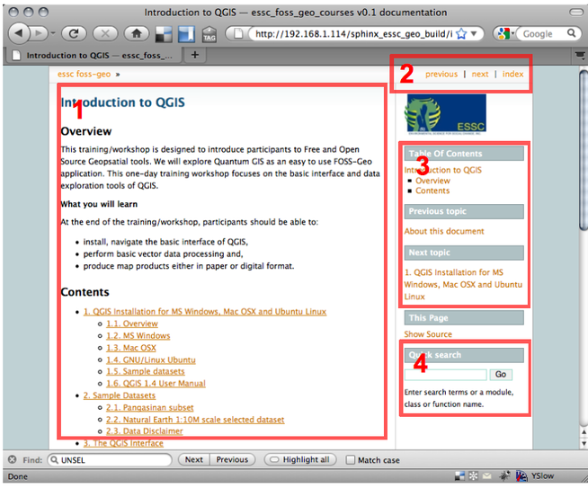

=====================
About this document
=====================

This document was designed as a supplementary material for the 
"Free and Open Source Geospatial Workshop for Conservationists".

Users of this material encouraged to use it as as a reference in 
using the provided FOSS-Geo applications and 
sample datasets.

About ESSC 
----------
The **Environmental Science for Social Change** (ESSC) is a Jesuit research 
institute with a 20-year history of engagement in local, national and regional 
research and dialogue that contribute to an understanding and sustainability of 
community-based environmental management through the development of a 
"science for social change".

ESSC's approach to environmental mapping makes significant contribution to 
building people's capacities to collectively manage and plan towards an 
improvement of their way of life through a more responsive management of the 
environment.

More information about ESSC: http://www.essc.org.ph

About FFI
-----------------------
The **Fauna & Flora International** is the world's longest-established 
international conservation body founded in 1903. FFI is supporting conservation 
initiatives and organizations through partnerships, technical support and 
direct funding.

In the Philippines, FFI is working closely with local conservation 
organizations to develop sustainable livelihoods for communities and contribute 
in exploring strategies on how to improve forest governance in the country 
particularly in southern Sierra Madre and Palawan.

More information about FFI-Philippines: 
http://www.fauna-flora.org/explore/philippines/

About the CLP partnership
---------------------------
The general aim of this event is to build the capacity of the participants in 
using Free and Open-Source Software for Geospatial (FOSS-Geo) technologies and 
other related technologies and maximize the application of it in biodiversity 
monitoring, management and conservation. 

Specific objectives and expected outputs:

* Development of a series of FOSS-Geo learning modules that will address the 
  specific geospatial needs of conservationists. 
* Conduct of training workshop to CLP Alumni  and other interested groups.
* Post event skill sharing through the CLP Ning Social Media platform. 

How to Use 
-----------

* **1** -  This section gives you an overview of exercises.  You can proceed 
  to any topic by selecting any of the links in the table of contents.

* **2** and **3** - The sidebar navigation allows you to go to the previous or 
  next topic.

* **4** - You can quickly search any word or term.  Search results will direct 
  you to the appropriate section.

Conventions used
-----------------

* Menu and toolbar commands are shown as italic letters and (if available) 
  preceded by an icon image, for example, :menuselection:`File` 
  or |mActionFilePrint| :guilabel:`Composer Manager`.

* A series of commands are written with :menuselection:`-->`. 
  For example: :menuselection:`File -->` 
  |mActionFileNew| :guilabel:`New Project`.

* Keystroke combinations are shown as :kbd:`Ctrl+B`, which means press and hold 
  the :kbd:`Ctrl` key and then press the :kbd:`B` key.

* Code or variables are indicated by a fixed-width font, for example::

      some commands or variables here

.. note::
   Text within this box indicates a tip, suggestion, warning or caution.

Corrections and feedback
------------------------
For corrections and feedback, contact Maning Sambale 
``emmanuelsambale@essc.org.ph``

License of this document
------------------------
Copyright (c)  2013  Environmental Science for Social Change

Permission is granted to copy, distribute and/or modify this document under 
the terms of the GNU Free Documentation License, Version 1.3 or any later 
version published by the Free Software Foundation; with no Invariant Sections, 
no Front-Cover Texts, and no Back-Cover Texts.

A copy of the license is included in the section entitled "Document License".

.. raw:: latex
   
   \pagebreak[4]
