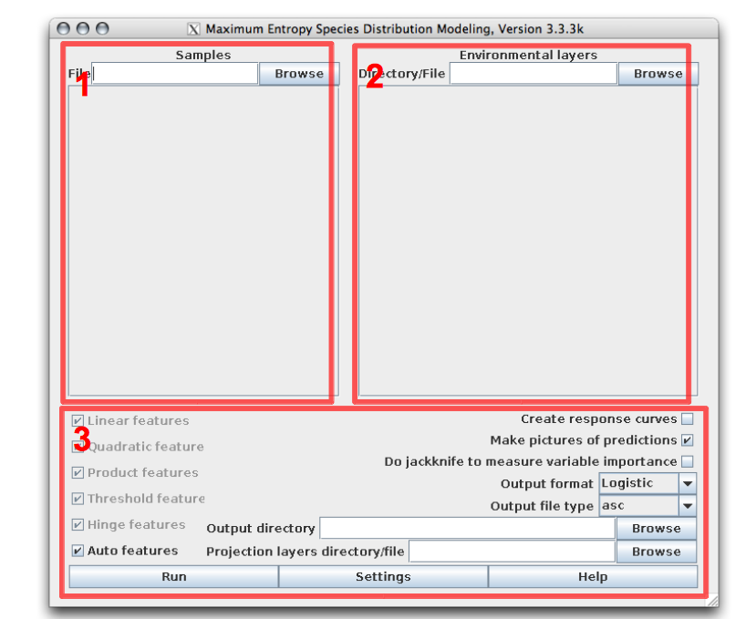
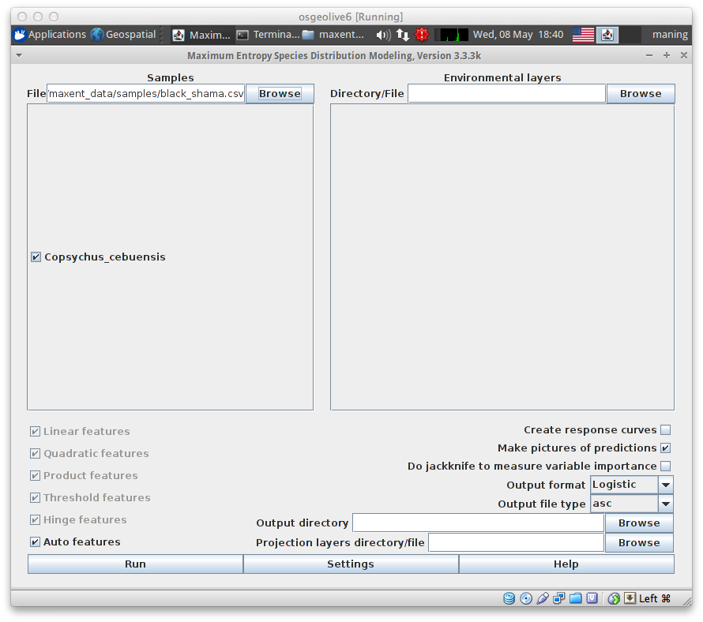
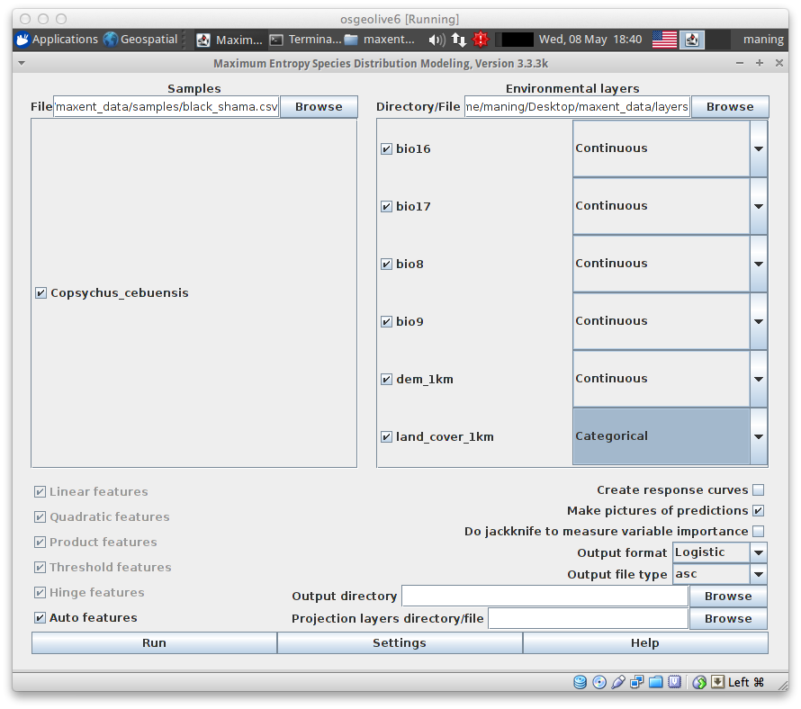
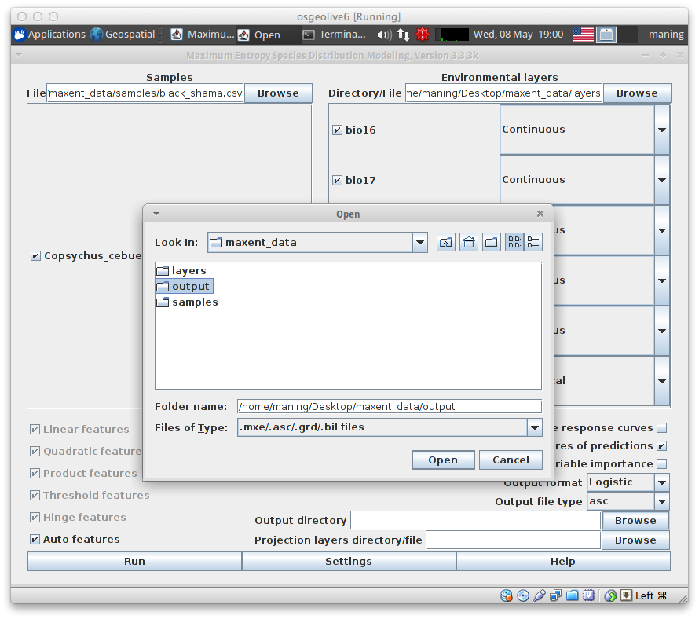
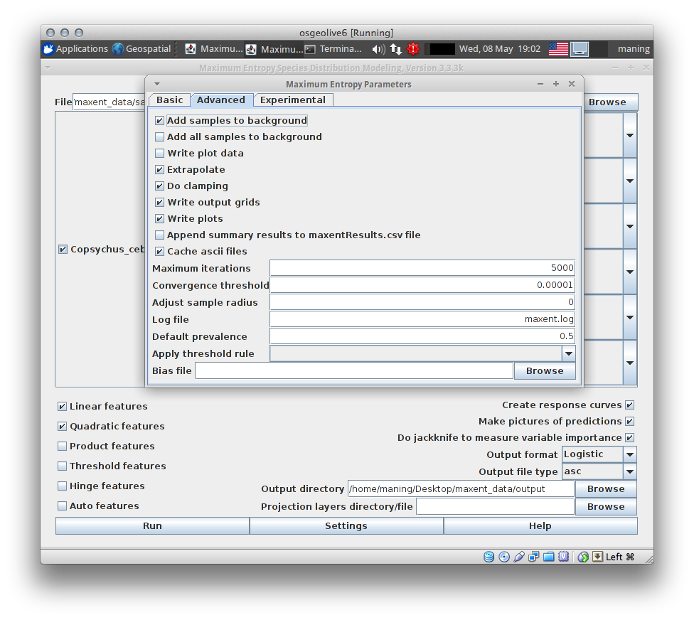
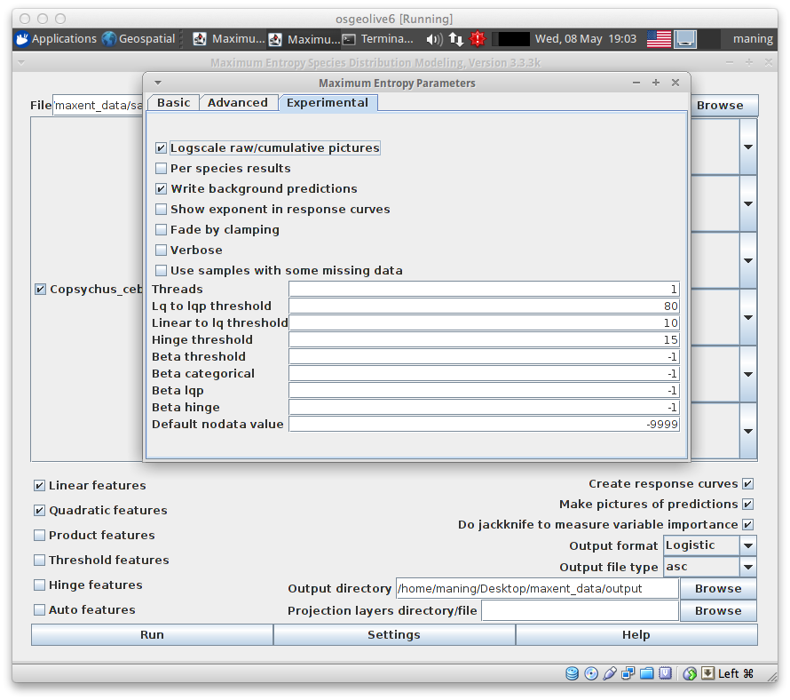
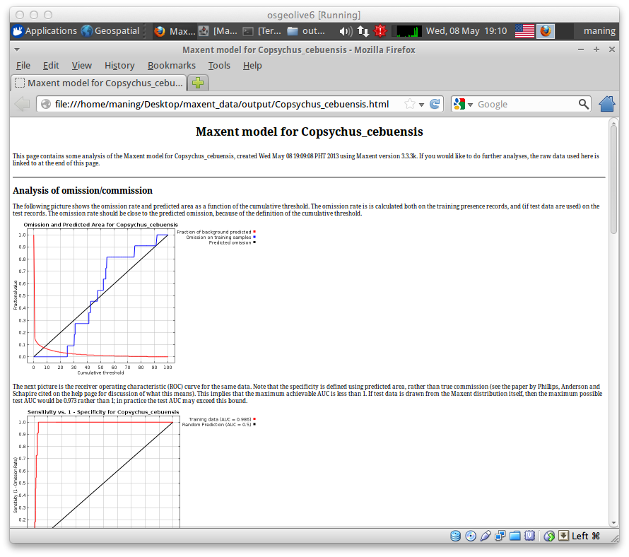

.. draft (mark as complete when complete)
.. model fails when adding landcover_1km.asc

=======================
Using MaxEnt 
=======================

`MaxEnt <http://www.cs.princeton.edu/~schapire/maxent>`_ is a Java program for 
maximum entropy  modelling of species geographic distributions, written by 
Steven Phillips, Miro Dudik and Rob Schapire, with support from AT&T 
Labs-Research, Princeton University, and the Center for Biodiversity and 
Conservation, American Museum of Natural History.  

MaxEnt Interface
-----------------------

To run MaxEnt, simply click the file ``maxent.bat``. 

* 1 - Samples panel - a list species presence location data.
* 2 - Environmental layers panel - a list of ESRI ASCII raster 
  layers that will be used for the modelling.
* 3 - Advance tools - the more advance tools, output directory and other 
  settings.

To perform a model, we need a sample CSV data (the 
``black_shama.csv`` in your ``samples`` directory); the 
environmental layers (in your ``layers`` directory) and; and output directory 
to save all the model results.

Loading species occurrences
------------------------------

1. To load the samples data, click the :guilabel:`Browse` button in the 
:guilabel:`Samples` panel.  

2. A new window will appear, open your ``samples`` directory and select the 
``black_shama.csv``.  Click :guilabel:`Open`.

Loading environmental covariates
-----------------------------------
1. To load the raster data, click the :guilabel:`Browse` button in the 
:guilabel:`Environmental layers` panel.

2. A new window will appear, select your ``layers`` directory and 
``Open``.

The main MaxEnt window will display the number environmental layers available 
in the directory. 

3. Define the data type for the environmental layers.  All the layers are 
``Continuous`` except for ``landcover_1km`` which is a ``Categorical`` data.

.. verify this one as it breaks in my own test - maning.

Defining output directory
----------------------------

1. To select the output directory, click the :guilabel:`Browse` button in the 
:guilabel:`Output directory` section.  Select the ``output`` directory and 
click :guilabel:`Open`.

Configuring Maxent features and settings
-------------------------------------------
Once the species occurrences and environmental covariates are loaded, it is 
important to know what appropriate MaxEnt parameters and features are 
needed to your sample. For instance, *Copsychus cebuensis* has only 12 
points of observation. Therefore, we need to find what specific feature of 
Maxent is best for this type of sample in order to have an accurate
 prediction.

1. In MaxEnt window, click :guilabel:`Help` option to view all the information 
about the features and settings.

2.  To find what feature is appropriate for *Copsychus cebuensis*, scroll 
down to `Regularization and feature class` section.

3. After finding the feature, go back to MaxEnt main window by closing the 
`Help` window.

4. In this exercise, we will use Linear and Quadratic features. To set these 
features and other necessary settings, uncheck `Auto features` and select 
`Linear and Quadratic features`. Check `Create response curve`, `Do Jackknife` 
and select `Logistic` as output format for the prediction.

5. Go also to :menuselection:`Settings --> Advance` tab and set the 
`Maximum iterations` to ``5000`` to 
give time for the model to converge. In the `Experimental tab` check 
`Write background predictions` to obtain the values of predicted background.

.. Note::
   * For further analysis, you can enable the Maxent to do replicates under 
     `Basic` tab of the settings.
   * Threshold rule can be applied also if you want to produce a thresholded 
     binary map.

6. Finally, close the :guilabel:`Settings` window and click :guilabel:`Run`.

Running model may take some time depending on the extent, number of 
environmental layers and replicates. Once finished, close the MaxEnt 
application.

Exploring MaxEnt outputs
---------------------------------------

The run produces multiple output files, to immediately view the result 
find the html file ``Copsychus_cebuensis.html`` and open it in your web browser.

.. raw:: latex
   
   \pagebreak[4]
