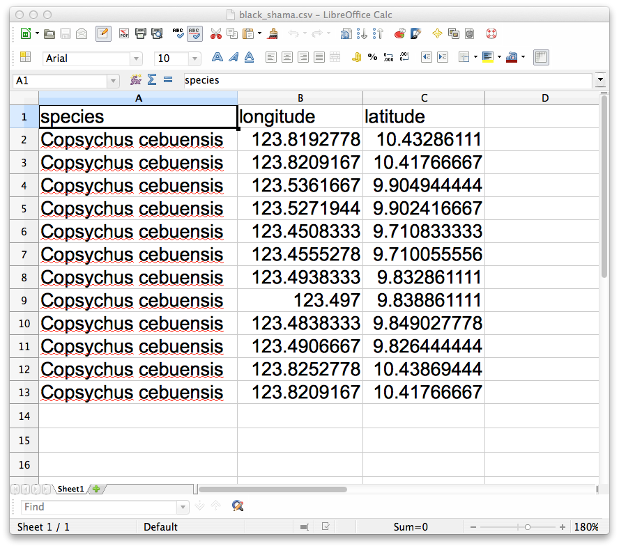
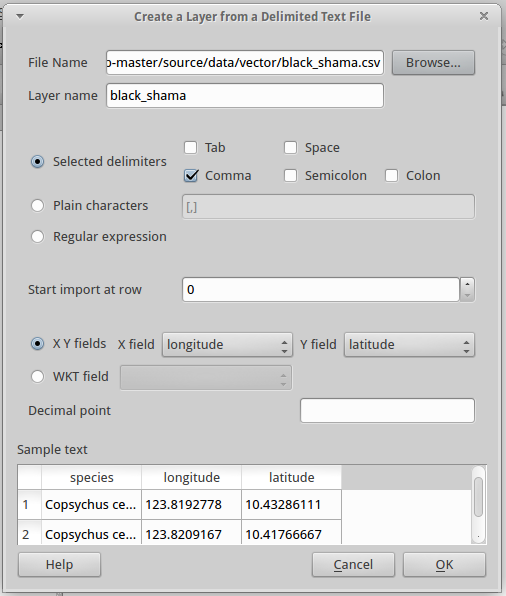
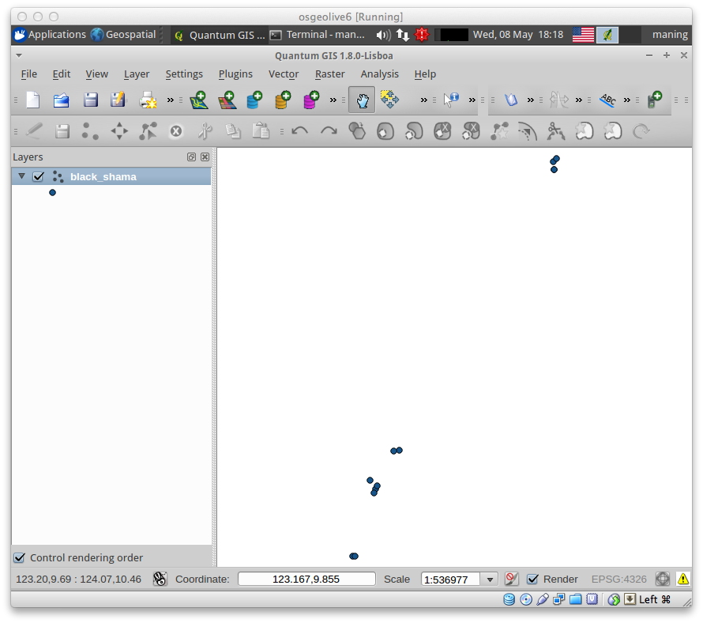
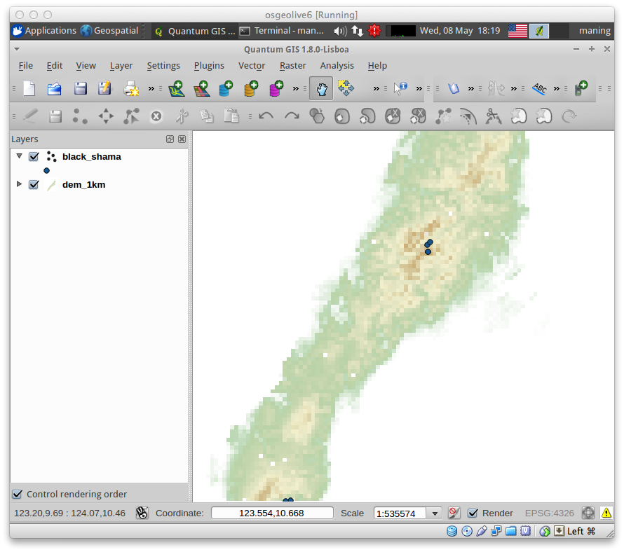
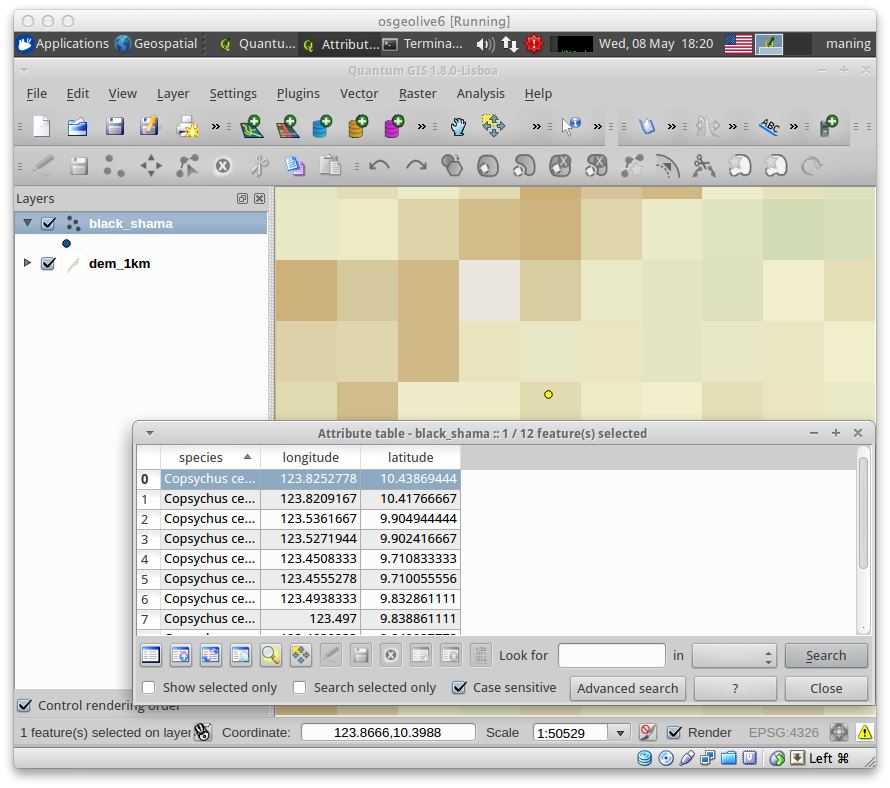
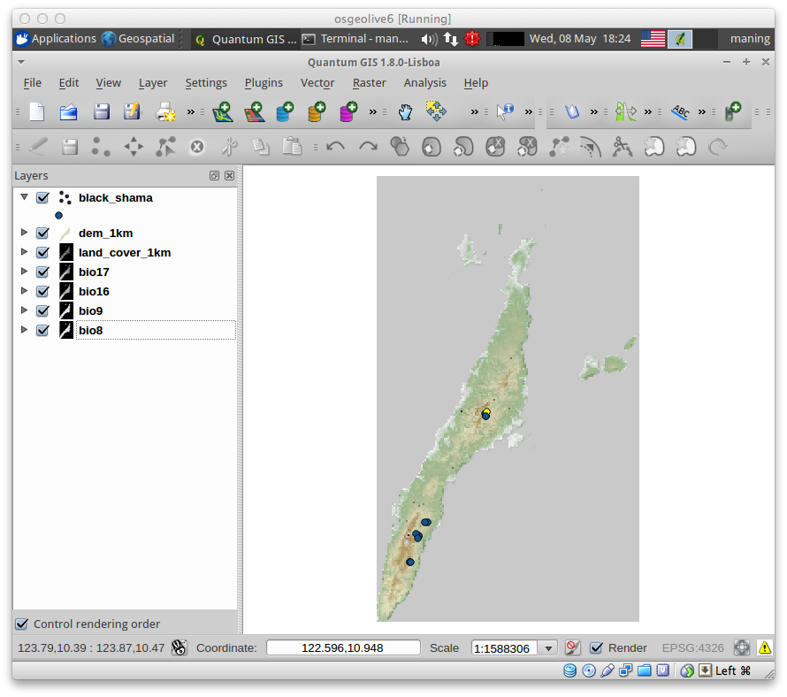
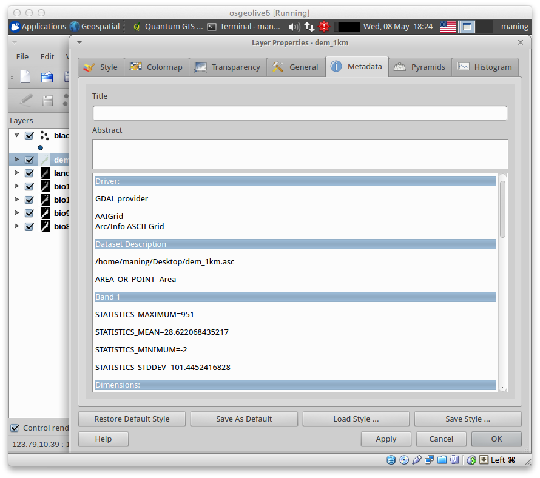

.. draft (mark as complete when complete)

===========================
Preparing data for MaxEnt 
===========================

There are two types of datasets required in MaxEnt; the species occurrence 
records and environmental covariates. Occurrence records are geographic 
points (i.e. coordinates) of species observation while environmental 
covariates are set of data that contains continuous or categorical values 
such as temperature, precipitation and land cover (*for details see* 
Pearson, 2007). To perform the modeling in MaxEnt, species occurrence 
should be in comma separated values (CSV) and covariates should be 
in raster Arc/Info ASCII Grid format.

The goal of this section is to guide you how to prepare these types of 
data using the occurrence records of Cebu black shama *Copsychus cebuensis* 
obtained from FFI and DENR field surveys on Cebu in 2012 and bioclimatic 
layers from WorldClim (http://www.worldclim.org/; Hijmans et al., 2005).

Species occurrence
-----------------------

Creating CSV file
,,,,,,,,,,,,,,,,,,

1. Use a spreadsheet application (e.g. MS Office Excel or LibreOffice Calc) 
to encode the occurrence record. Make sure that coordinates are in 
geographic coordinates in decimal degrees.

2. Format the occurrence record as shown below. Spreadsheet heading 
should be labeled as ``species``, ``longitude`` and ``latitude``.  

3. Convert the spreadsheet to CSV. In LibreOffice, select 
:menuselection:`File --> Save As` and choose ``Text CSV`` 
as the file type. Name the CSV file as ``Copsychus_cebuensis.csv`` 
and save it to your ``samples`` directory. The field delimiter should be 
comma (``,``).

.. image:: images/save_as_csv.png
   :align: center
   :width: 300 pt

The saved CSV file should look like the text below:

.. include:: data/vector/black_shama.csv
   :literal:

For multiple species, do the similar steps above and simply add other species 
after the first occurrence record.

.. Note::
   If data are recorded using a GPS device, it can be downloaded to QGIS using
   GPSBabel plugin and covert it directly to CSV format. 

Checking and filtering occurrences
,,,,,,,,,,,,,,,,,,,,,,,,,,,,,,,,,,,,,,,,,,
 
To ensure if the CSV file is working, it needs to be checked in QGIS.  The 
records should also be checked to avoid potential bias of clustered points 
(Hernandez et al., 2006) and this can be done by removing duplicate records 
on each pixel.

.. Explain bias further. 

1. Launch QGIS and load CSV using the |adddelimitedtext| 
:guilabel:`Add delimited text layer`. 

If the plugin is not enabled, 
go to :menuselection:`Plugins -->` 
|mActionShowPluginManager| :guilabel:`Manage Plugins`.
and check :guilabel:`Add delimited text layer`.

2. On :guilabel:`Create a Layer from a Delimited Text file` window, click 
:guilabel:`Browse` and select ``Copsychus_cebuensis.csv`` in the directory 
where the CSV is saved.

3. On the same window, choose :guilabel:`Selected delimiters` and check the 
:guilabel:`Comma` option.  In the 
:guilabel:`XY` fields, select ``longitude`` as X and ``latitude`` as Y. 

4. Click :guilabel:`OK`  Select ``WGS-84`` for the CRS and click 
:guilabel:`OK`, this should show the points in your 
:guilabel:`Map View`.

.. Note::
   The filtration of occurrences can be done depending on the resolution of 
   your covariate raster layers. In this case, 1km resolution will be used. 
   If you need a finer resolution for future studies, refer to image 
   resampling section.
	
5. After importing the CSV to QGIS, load the ``dem_1km.asc`` raster you 
created previously. The elevation raster will be used as reference for 
filtration.

6. Use the navigation tool to move around the map and find the clustered 
occurrences. A clustered occurrence are 2 or more points that 
are within a single raster pixel.

7. Once clustered occurrences are found, select the species occurrence layer. 
Use the selection tool to select the identified clustered occurrences. 
Go to :menuselection:`View --> Select -->` 
|mActionSelect| :guilabel:`Select single feature`.

8. After selecting all the clustered occurrences, right click to occurrence 
layer. Select :guilabel:`Properties` and  open |mActionUnselectAttributes| 
:guilabel:`Attribute Table`. 
 
Remember the selected occurrences and remove it in the ``CSV`` file by 
using either a text editor or a spreadsheet application.

Environmental Covariates
------------------------------

Data coming from various sources have different formats or spatial extent. 
For instance, many land cover (Hansen et al., 2000; Tateishia et al., 2001) 
or climate datasets (Hijmans et al.,) are done in global scale and because 
of data scarcity in local scale we tend to rely to what is available. 

It is important for each environmental covariate layer to be in a consistent 
spatial extent, pixel size and data format. 

Inspecting the raster environmental layers for data consistency
,,,,,,,,,,,,,,,,,,,,,,,,,,,,,,,,,,,,,,,,,,,,,,,,,,,,,,,,,,,,,,,,,,,,

1. Add the rater environmental layers in QGIS.  They are following::

      dem_1km.asc
      slope.asc
      bio8.asc
      bio9.asc
      bio16.asc
      bio17.asc 
      landcover_1km.asc

.. Note::
  After loading the environmental layers to QGIS, always check the data 
  information (i.e. metadata) because it will help you to understand how 
  the data can be transformed to your desired format.

2. To check the metadata, select ``dem_1km.asc`` layer and right-click and 
select :guilabel:`Properties` and select 
:guilabel:`Metadata` tab on the 
:guilabel:`Layer Properties` window.

3. Make sure all the raster layers have the same spatial extent, size 
(``1 km``) number of pixel rows and columns, coordinate reference system 
(``EPSG:4326`` or ``WGS-84`` and, data type (``Int32``).

4. If any layer is different, perform the resampling and format translation 
outlined in the previous section.

5.  Once all the layers are in a uniform format, size and data type, make sure 
all layers are in one directory.

.. raw:: latex
   
   \pagebreak[4]
