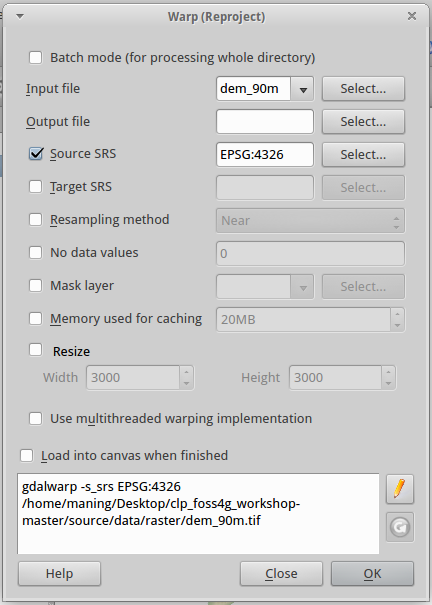
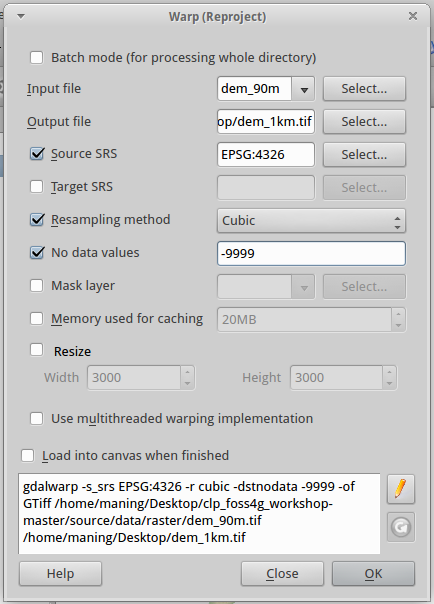
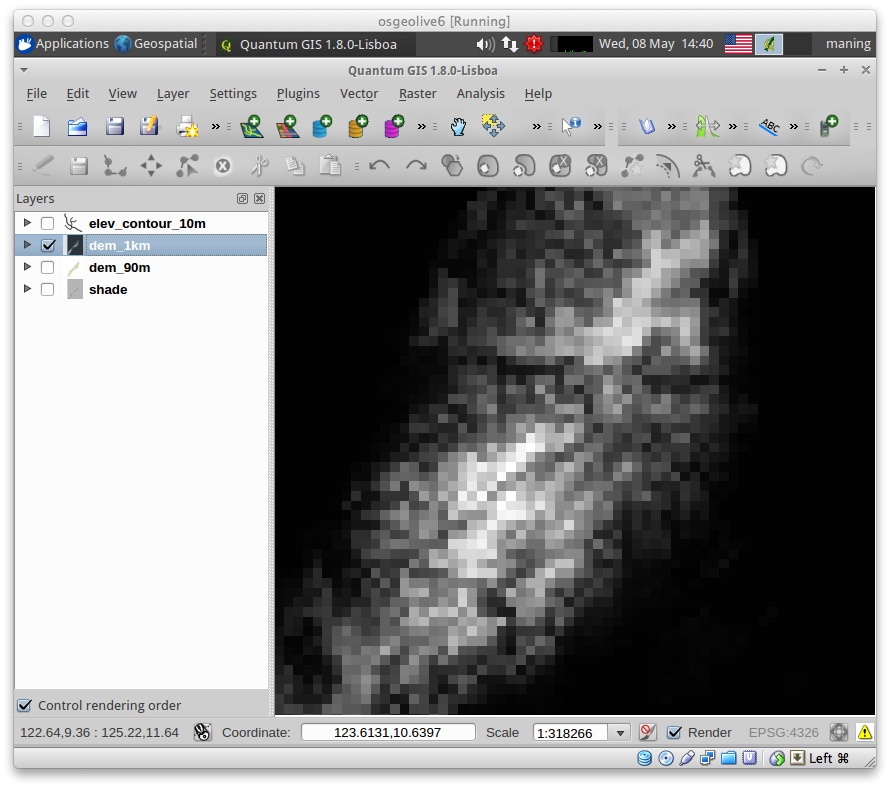
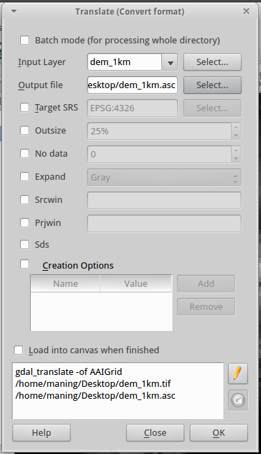
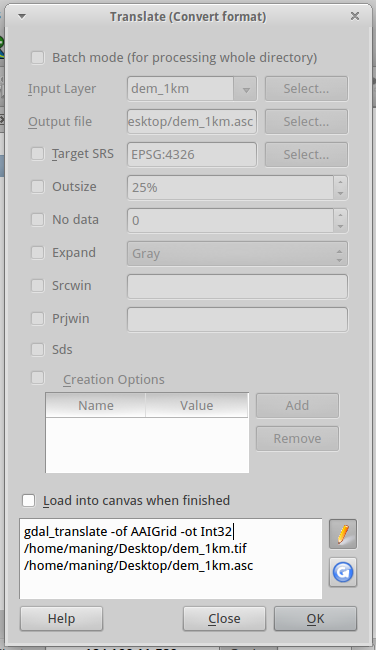

.. draft (mark as complete when complete)

===========================
Preparing data for MaxEnt 
===========================

Prior to using MaxEnt, your data should be prepared in a format useful as a 
MaxEnt input.  We will use a spreadsheet application in converting your 
sample data as a CSV.  We will also use QGIS to convert your environmental 
layers into a uniform format. The sample data are available in your 
``geodata`` directory.

Convert the spreadsheet to CSV
-------------------------------

1. Open the ``Gallirallus_calayanensis_raw.xls`` in a spreadsheet application 
   such MS Office Excel or LibreOffice Calc.

.. image:: images/Gallirallus_calayanensis_raw_xls.png
   :align: center
   :width: 300 pt

The spreadsheet file is the complete inventory data conducted by Isla 
Biodiversity in 2006.  We are only interested in survey stations where the 
species were recorded.   The column ``Type3`` lists the survey stations with 
recorded *Gallirallus calayanensis* marked as `P`.

2. Select all records except cells ``A1 to I1`` and sort by Column G 
   (``Type3``).

.. image:: images/sortby_colg.png
   :align: center
   :width: 300 pt
 
3. Select only the coordinates ``X`` and ``Y`` that are marked as ``P`` in 
   Column G.  Press ``Ctrl C``.

.. image:: images/copy_coordinates.png
   :align: center
   :width: 300 pt

4. Open Sheet2 of the same spreadsheet and paste the copied coordinates in 
   cell ``B2``.

.. image:: images/paste_coordinates.png
   :align: center
   :width: 300 pt

5. Still within Sheet2, in cell ``A1``, add the word ``species``.  In cell, 
   ``B1`` add the word ``lon``.  In cell, ``C1`` add the word ``lat``.  Finally
   , starting from cell ``A2``,  add the word ``Gallirallus calayanensis`` up 
   to cell ``A98``.  Sheet2 should look like below:

.. image:: images/sheet2.png
   :align: center
   :width: 300 pt

6. Save the spreadsheet as a CSV to convert Sheet2 as a comma separated value  
   (CSV) file.  In LibreOffice, select ``File > Save As`` and choose ``CSV`` 
   as the file format. A new CSV file will be created, save the file as 
   ``Gallirallus_calayanensis.csv`` in your ``samples`` directory. The field 
   delimiter should be comma (``,``).

.. image:: images/save_as_csv.png
   :align: center
   :width: 300 pt

The saved CSV file should be similar to the text below::

      "species","lon","lat"
      "Gallirallus calayanensis",121.45688,19.32200
      "Gallirallus calayanensis",121.45773,19.32093
      "Gallirallus calayanensis",121.45743,19.32000
      "Gallirallus calayanensis",121.45788,19.31847
      "Gallirallus calayanensis",121.46107,19.32158
      "Gallirallus calayanensis",121.46518,19.32260
      "Gallirallus calayanensis",121.43582,19.29742
      "Gallirallus calayanensis",121.43855,19.29642
      "Gallirallus calayanensis",121.51215,19.34263

Open QGIS
==============

1. Launch QGIS by clicking `Start` `>`  `All Programs` `>`  
   `Quantum GIS Wroclaw` `>`  `Quantum GIS Wroclaw`.

2. Create a new project.  `File` `>` |mActionFileNew|  
   `New Project`.

3. Open the project properties. In the  `Menu`, select  `Settings` `>`  
   `Project Properties`.

.. image:: images/project_properties.png
   :align: center
   :width: 300 pt

4. Select the  `Coordinate Reference System (CRS)` tab. Click the small  
   `plus/minus` sign on the left side of the  `Geographic Coordinate System`. 
    This shows another list of CRS. Choose  `WGS 84`.  Click  `Apply` then,  
   `OK`.

.. image:: images/set_crs.png
   :align: center
   :width: 300 pt

Loading additional plugins
=================================

1. Open the Plugin manager by selecting `Plugins >` |mActionShowPluginManager| 
   `Manage Plugins`.

The `Plugin Manager` lists all the available plug-ins and their status (loaded 
or unloaded), including all core plug-ins and all external plug-ins that have 
been installed and automatically activated using the Python Plugin Installer. 
Plug-ins that are already loaded have a check mark to the left of their name.

2. Activate/enable the `GalTools` plugin by clicking its check box or 
   description.

.. image:: images/plugin_manager_gdaltools.png
   :align: center
   :width: 300 pt

2. Activate/enable the `Add Delimited Text Layer` plugin by clicking its check 
   box or description.

.. image:: images/plugin_manager_adddelimitedtextlayer.png
   :align: center
   :width: 300 pt

3.  Close the `Plugin Manager` window by clicking `OK`.

Load your sample csv layer
===============================

1. Open the |adddelimtedtext|  `Add Delimited Text layer` window.

.. image:: images/delimited_text_window.png
   :align: center
   :width: 300 pt

2. In the `Create a Layer from a Delimited Text file` window, click the 
   `Browse...` to find delimited text file to be used.  Select the 
   ``Gallirallus_calayanensis.csv`` file. In the `Selected delimiters`, add a 
   checkmark to the `Comma`.  

3. The Latitude and Longitude coordinates in this table will be used to create 
   a new layer of point features that indicate the location of each record. 
   The drop down boxes now contain the fields properly parsed. Select ``lon`` 
   as the `X field` and ``lat`` as the  `Y field`.  

4. Type ``Locations`` as your  `Layer name`.  

.. image:: images/delimitedtext_calayanensis.png
   :align: center
   :width: 300 pt

5. Click  `OK`.  

Adding layer may take some time.  The layer ``Locations`` will appear in your 
`Map Legend` panel. 

.. image:: images/delimitedtext_mapview.png
   :align: center
   :width: 300 pt

Loading the raster environmental layers
=============================================

1. Add raster layers.  Add the elevation raster.  Select `Layer >` 
   |mActionAddRasterLayer| `Add Raster Layer` and load the ``elevation.tif`` 
   in your ``layers`` directory.  Click `OK`.

.. image:: images/load_elevation.png
   :align: center
   :width: 300 pt

2. Symbolize the raster layers 

.. image:: images/elevation_nostretch.png
   :align: center
   :width: 300 pt

When the elevation layer is first loaded, it may appear as an entirely grey.  
This can be fixed by adjusting the stretch of the contrast enhancement to scale 
the shades of black and white to the values found within the data.

3. To adjust the contrast enhancement, select the ``elevation`` layer in the 
   `Map Legend`, right-click and select `Properties`.

.. image:: images/elevation_layer_properties.png
   :align: center
   :width: 300 pt

4. In the `Style` tab, change click the `Load` button within the 
   `Load min / max values from band` section of the window dialog.  In the 
   `Contrast Enhancement` section choose `Stretch and Clip to MinMax` as the 
   `Current` value.  This takes the minimum  and maximum value found within the 
   data, and stretches the black to white gradient between the two values.

.. image:: images/elevation_style.png
   :align: center
   :width: 300 pt

A typical black to white gradient allows for 256 different levels of 
brightness, and stretching these 256 shades between the Min and Max values 
allows you to clearly view the different topography in the DEM data.  To keep 
this setting for all raster layers, simply click the save icon next to it to 
set it as the default value.

5. Click  `Apply` and `OK` to improve the contrast of the 
   ``elevation``.

.. image:: images/elevation_enhanced.png
   :align: center
   :width: 300 pt

6. Looking at the ``elevation`` data, you can see that there is a wide 
   variation of pixel brightness values across the grid area, with dark black 
   pixels representing areas of low elevation and bright white pixels 
   representing areas of high elevation. To get the values for each pixel, 
   use the :guilabel:`Identify` button.

7. Add all the following environmental layers listed below::

      slope_res.asc
      bio1_210_res.asc
      bio12_210_res.asc
      bio19_210_res.asc

8. Repeat the above procedure to enhance the display of each environmental 
   layer.

9. In the `File` menu, select |mActionFileSave| `Save Project`. In the 
   `Filename` field, type::

     sdmqgisproject.qgs

Click `Save`. You have saved your first QGIS 
project.

Converting the environmental layers as a resampled ASC raster format
----------------------------------------------------------------------

MaxEnt environmental layers should be in ESRI ASCII raster format and have a 
uniform pixel resolution.  The elevation layer we are using has a pixres of ~90 
meters (0.000848 decimal degrees) .  We will convert the data to 850 meters or 
(0.008 decimal degrees) similar to the other environmental layers.

Resampling raster layers
=============================

1. In the Menu, select `Raster > Projections >` |gdalwarp| 
  `Warp (Reproject)`.

2.  In the `Warp (Reproject)` window add the following 
    parameters::

      Input file - elevation
      Output file - elevation_res.tif 
      Target SRS - EPSG:4326
      Resampling method - Cubic
      No data values - -9999

3. The default `Warp` GUI does not include the pixel resolution resampling
   option.  In order to add the pixel resolution settings we will edit the 
   syntax shown at the bottom of the window.  Click the |gdaledit| `Edit` 
   button.

4. Add the text ``-tr 0.008 0.008`` right after the ``GTiff`` 
   command.

.. image:: images/gdalwarp_edit_syntax.png
   :align: center
   :width: 300 pt

The full syntax is shown below (the path to the directories may vary depending 
on where you saved your ``geodata`` directory)::

      gdalwarp -s_srs EPSG:4326 -t_srs EPSG:4326 -r cubic -dstnodata -999 -of GTiff -tr 0.008 0.008 
      ~/geodata/layers/elevation.tif 
      ~/geodata/layers/elevation_res.tif

.. Warning::
   Make sure that the output layer (i. e. ``elevation_res.tif``) is in the same 
   directory as the other raster files.
    

5. Click 
   `OK > Close`.

6. Load the newly created `elevation_res.tif` and perform contrast enhancement 
   similar to the previous section.

 
Convert the resampled elevation to ESRI ASCII raster 
======================================================

1. To convert the resampled elevation data to ESRI ASCII raster, in the Menu, 
   select `Raster > Conversion >` |gdaltranslate| `Translate (Convert format)`.

.. image:: images/gdaltranslate_window.png
   :align: center
   :width: 300 pt

2. In the `Translate (Convert format)` window, add the following 
   parameters::

      Input file - elevation_res.tif
      Output file - elevation_res.asc

3. Again, we will edit the syntax shown at the bottom of the window.  Click the 
   |gdaledit| `Edit` button. Change the text ``GTiff`` to ``AAIGrid``.

The full syntax is shown below (the path to the directories may vary depending 
on where you saved your ``geodata`` directory)::

      gdal_translate -of AAIGrid 
      ~/geodata/layers/elevation_res.tif 
      ~/geodata/layers/elevation_res.asc

4. Save you QGIS 
   project.

Now, all our input data are ready for MaxEnt processing.
