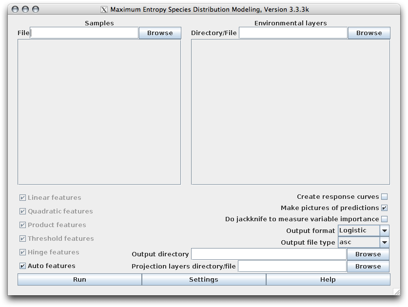

.. draft (mark as complete when complete)

==========================
MaxEnt Installation
==========================

This section will guide you through the installation process of required 
applications in the exercise.

Install Java6 in MS Windows
------------------------------

1. We need Java6 to use run the MaxEnt application.  To download Java6 JRE 
   installers for your OS, go to the 
   `Java6 website <http://www.oracle.com/technetwork/java/javase/downloads/index.html>`_.

2. To install Java6, double-click your downloaded installer file (i. e. 
   ``jre-7u3-windows-i586.exe``) and follow the succeeding instructions.

"Install" MaxEnt
-----------------------

1. To download, go to the 
   `MaxEnt website <http://www.cs.princeton.edu/~schapire/maxent/>`_ 

2. Uncompress the downloaded.  In your file manager, open your ``maxent`` 
   directory.  The directory contains at least the the following files::

      readme.txt
      maxent.jar
      maxent.bat

The jar file, ``maxent.jar``, is the main application which can be used on any 
computer running Java version 1.5 or later.

Start MaxEnt
---------------
If you are using Microsoft Windows, simply click on the file 
`maxent.bat`.  

