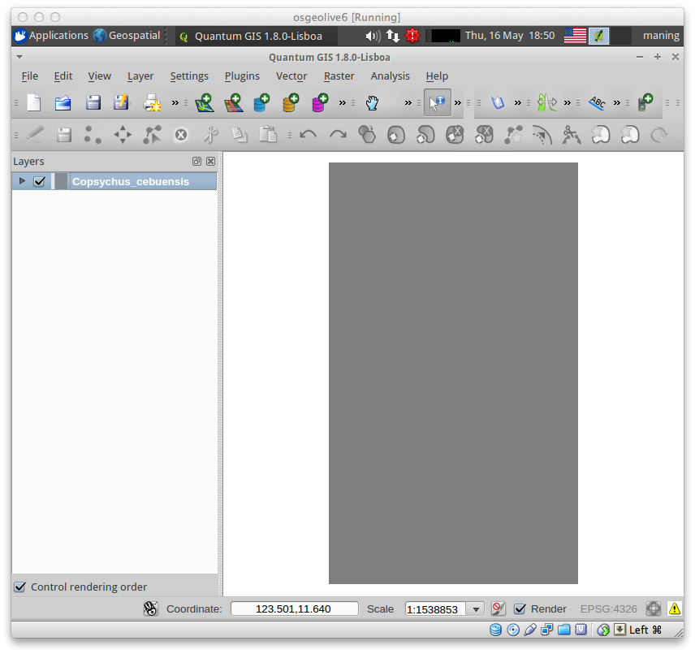
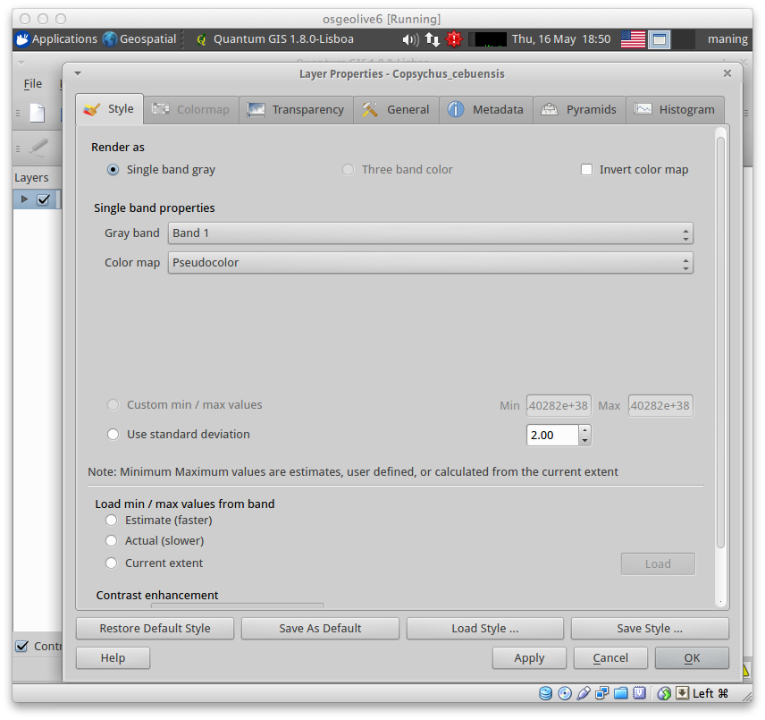
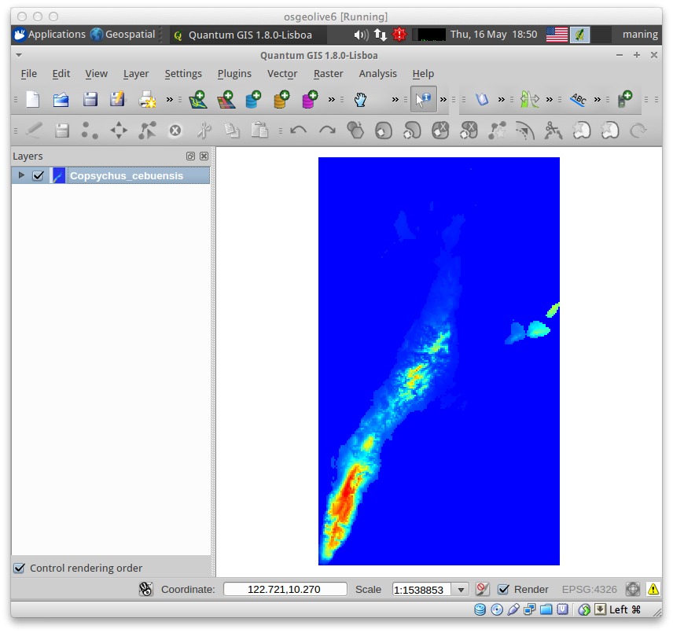
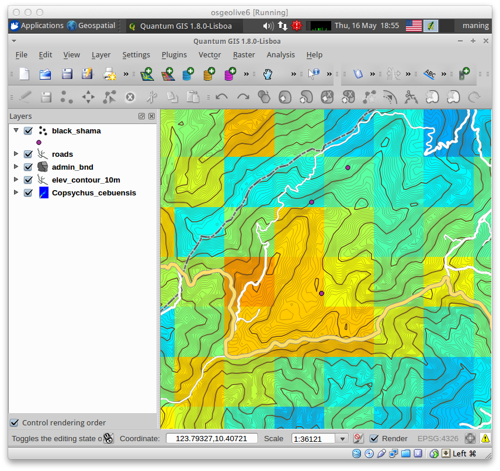

.. draft (mark as complete when complete)

=======================================
Using QGIS to view your model output
=======================================

You can improve the map design of your MaxEnt output in QGIS.

Load you model output
------------------------

1. To load your MaxEnt output map, select :menuselection:`Layer -->` 
|mActionAddRasterLayer| :guilabel:`Add Raster Layer`.

2. Click `Browse` and double-click to your directory. Select 
``Copsychus_cebuensis.asc``.  Click :guilabel:`OK`.

Similar to the previous section, perform the display contrast enhancement.  
But this time, select the `Pseudocolor` as the :guilabel:`Color map`.

3. Select the :guilabel:`Transparency` tab and adjust the 
:guilabel:`Global transparency` slider to 
``30%``. Click :guilabel:`Apply` then, :guilabel:`OK`.

Provide context by adding more data layers
----------------------------------------------

1. Add more geographical context in your map by adding the vector layers 
available in your ``vector`` directory.  To add vector layers, 
select :menuselection:`Layer -->` |mActionAddOgrLayer| 
:guilabel:`Add Vector Layer`

2. To change the vector layer properties like color and symbolization.

