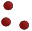
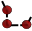
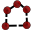
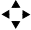
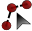
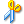

.. WCSP2012 Species Distribution Modelling Workshop documentation master file, created by
   sphinx-quickstart on Mon Apr  2 11:35:11 2012.
   You can adapt this file completely to your liking, but it should at least
   contain the root `toctree` directive.

=======================================
Using QGIS to view your model output
=======================================

Open QGIS
-------------

Open QGIS and load your previous  ``sdmqgisproject.qgs`` project.

Load you model output
------------------------

1. To load your MaxEnt output map, select `Layer` `>` |mActionAddRasterLayer| `Add Raster Layer`.

2. Click `Browse` and double-click to your `geodata` directory. Select ``Gallirallus_calayanensis.asc``.  Click `OK`.

.. image:: images/raster_output.png
   :align: center
   :width: 300 pt

Similar to the previous section, perform the display contrast enhancement.  But this time, select the `Pseudocolor` as the `Color map`.

.. image:: images/raster_pseudocolor.png
   :align: center
   :width: 300 pt

3. Select the `Transparency` tab and adjust the `Global transparency` slider to ``30%``. Click `Apply` then, `OK`.

.. image:: images/output_enhancedcolor.png
   :align: center
   :width: 300 pt 

Provide context by adding more data layers
----------------------------------------------

1.  Add more geographical context in your map by adding the vector layers available in your ``vector`` directory.  To add vector layers, in the `Menu`, select `Layer` `>` |mActionAddOgrLayer| `Add Vector Layer`.

2. To change the vector layer properties like color and symbolization. Select the any vector layer and right-click on the layer and select `Properties` from the pop-up menu.  An example of the display with additional vector layers is shown below.

.. image:: images/vectorsmap.png
   :align: center
   :width: 300 pt

.. |mActionAddOgrLayer| image:: images/qgis_icons/mActionAddOgrLayer.png
                          :width: 20 pt

.. |mActionFileSave| image:: images/qgis_icons/mActionFileSave.png
                     :width: 20 pt

