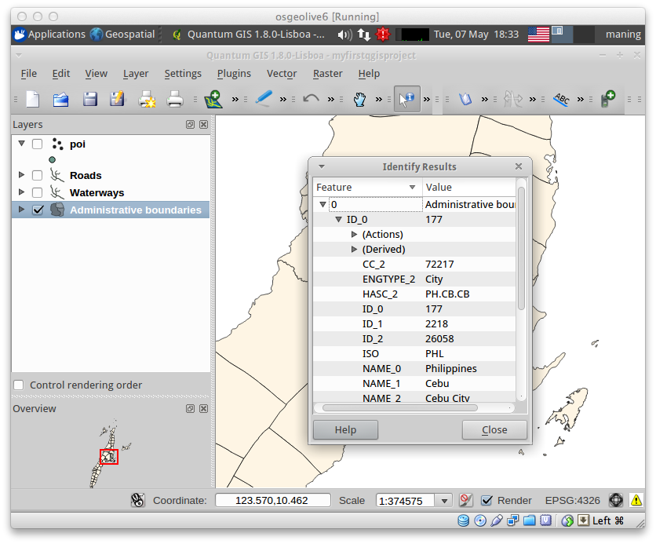
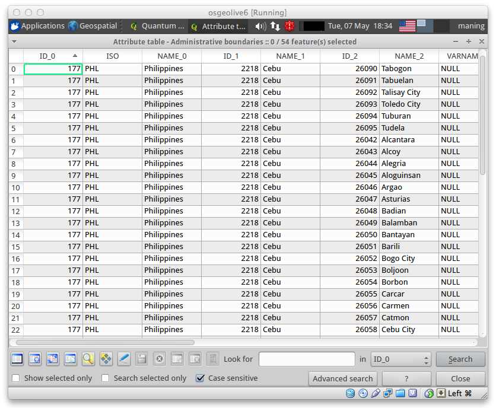
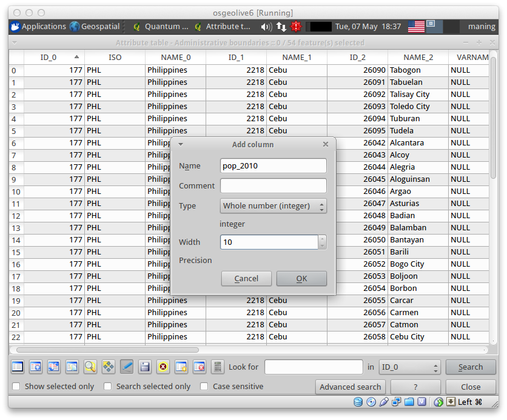
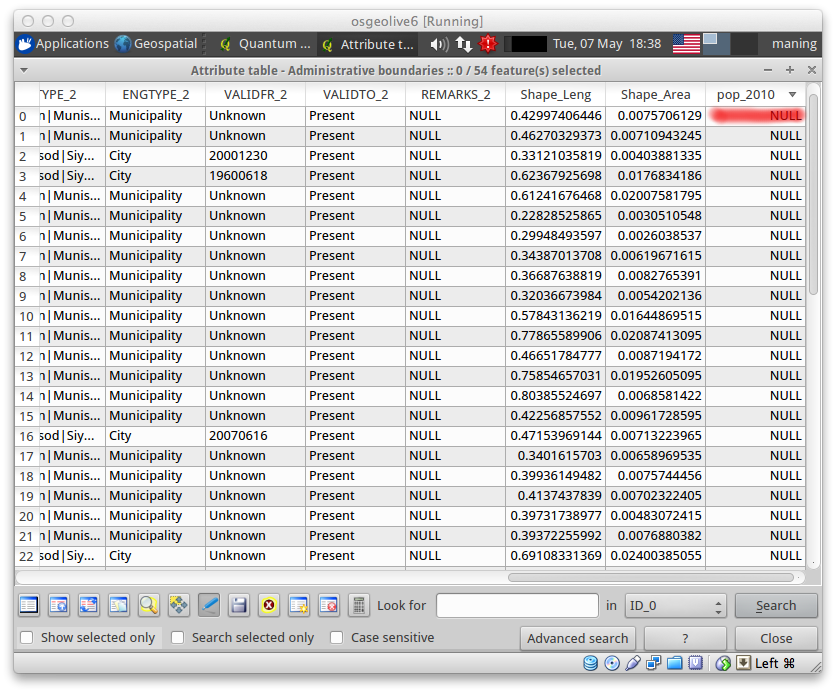
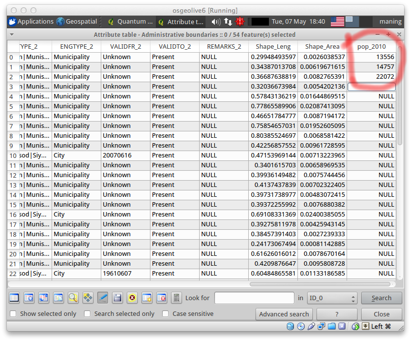
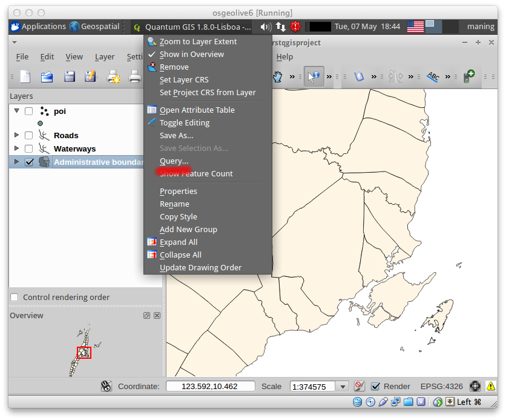
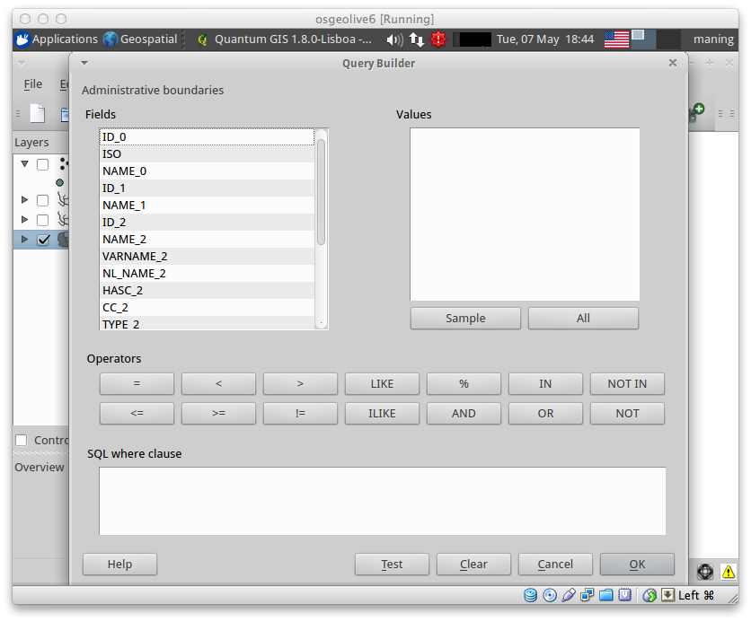
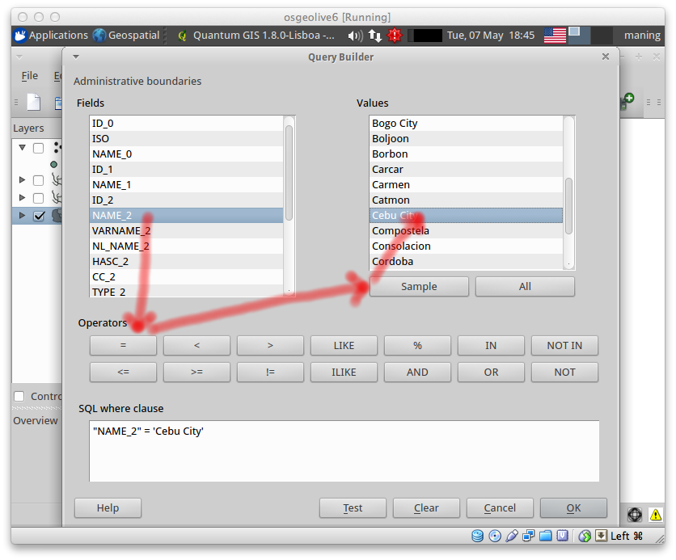
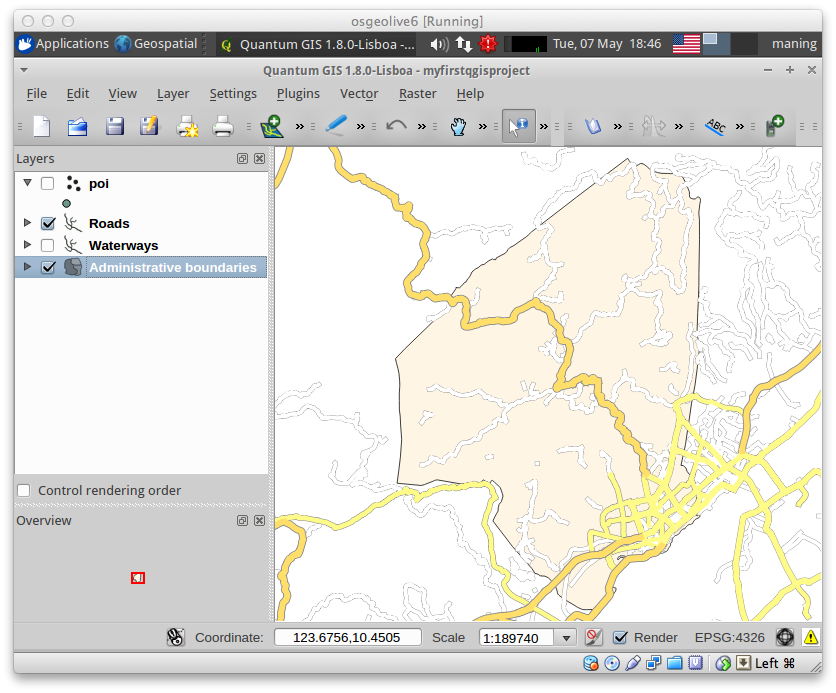

.. proofread (mark as complete when complete)
.. todo add screenshots

==================================================
Viewing and Editing Data Attributes
==================================================

:term:`Attribute` s for vector data are stored in a table.  (In a 
:term:`Shapefile` vector format, this is contained in a separate file with 
``dbf`` extension). A table is like a spreadsheet. Each column in the table is 
called a field. Each row in the table is a record. Each of the records in the 
attribute table in a GIS corresponds to one feature. The application "links" 
the attribute records with the feature geometry so that you can find records 
in the table by selecting features on the map, and find features on the map by 
selecting features in the table. Each field in the attribute table contains 
contains a specific type of data such texts, numbers or date.

:index:`Viewing vector layer attributes`
--------------------------------------------

In QGIS you can easily view data attributes by either selecting the feature 
within the layer of interest or opening the full table.

1. To display the attribute table , select the ``admin_bnd`` 
layer in :guilabel:`Map Legend` panel.  In the Menu, select 
:menuselection:`View -->` |mActionIdentify| :guilabel:`Identify Features`. 
Or just click the |mActionIdentify| :guilabel:`Identify Features` in the 
toolbar.

2. Click on any polygon in the map to show the 
feature attributes. 

3. To view the attribute table similar to a spreadsheet, select the 
``Administrative boundaries`` layer in the :guilabel:`Map Legend`. 
Right-click the layer and select :guilabel:`Open Attribute Table`.

.. image:: images/open_table_annot.png
   :align: center
   :width: 300 pt

4. A new window will appear showing the full table of the data layer. You can 
browse and edit the attribute table within this window.

A full explanation of the tools within the :guilabel:`Attribute table` window 
is presented below:

+-----------------------------+---------------------------------------+-------------------------------+
| **Icon**                    | **Tool**                              | **Purpose**                   |
+=============================+=======================================+===============================+
| |mActionUnselectAttributes| | :guilabel:`Unselect All`              | Remove selection from         |
|                             |                                       | previous selected records     |
+-----------------------------+---------------------------------------+-------------------------------+
| |mActionSelectedToTop|      | :guilabel:`Move Selection to Top`     | Move the selected records     |
|                             |                                       | to the top of the table       |
+-----------------------------+---------------------------------------+-------------------------------+
| |mActionInvertSelection|    | :guilabel:`Invert Selection`          |  Invert selection             |
+-----------------------------+---------------------------------------+-------------------------------+
| |mActionCopySelected|       | :guilabel:`Copy Selected Rows`        | Copy selected rows to         |
|                             |                                       | clipboard                     |
+-----------------------------+---------------------------------------+-------------------------------+
| |mActionZoomToSelected|     | :guilabel:`Zoom Map to Selected Rows` | Zoom map to selected rows     |
+-----------------------------+---------------------------------------+-------------------------------+
| |mActionToggleEditing|      | :guilabel:`Toggle Editing Mode`       | Toggle editing mode to edit   |
|                             |                                       | single values of attribute    |
|                             |                                       | table and to enable           |
|                             |                                       | functionalities described     |
|                             |                                       | below.                        |
+-----------------------------+---------------------------------------+-------------------------------+
| |mActionDeleteSelected|     | :guilabel:`Delete Selected Features`  | Delete selected features      |
+-----------------------------+---------------------------------------+-------------------------------+
| |mActionNewAttribute|       | :guilabel:`New Column`                | Adds a new column in the      |
|                             |                                       | attribute table.  You will be |
|                             |                                       | asked to provide attribute    |
|                             |                                       | details in a new window       |
|                             |                                       | (name, field type, etc.).     |
+-----------------------------+---------------------------------------+-------------------------------+
| |mActionDeleteAttribute|    | :guilabel:`Delete Column`             | Delete column                 |
+-----------------------------+---------------------------------------+-------------------------------+
| |mActionCalculateField|     | :guilabel:`Open Field Calculator`     | Open field calculator to      |
|                             |                                       | update attribute data based on| 
|                             |                                       | arithmetic, logical and others| 
+-----------------------------+---------------------------------------+-------------------------------+

Explore the different tools to understand how each one works.

.. tip::
   :term:`Shapefile` store attribute data in a separate file with a ``dbf`` 
   extension.  This is a widely used GIS database format. You can edit the dbf 
   file outside QGIS using a spreadsheet application such as MS Office Excel 
   and OpenOffice Calc, however, caution should be taken in order not to 
   corrupt the files. Make sure you create a backup before editing the data 
   outside QGIS.

:index:`Creating and editing attributes`
----------------------------------------------

We will update the ``admin_bnd`` layer by adding population 
for each polygon for the census year 2010.

1. Open the attribute table by selecting the ``admin_bnd`` 
layer in the :guilabel:`Map Legend`. Right-click the layer and select 
:guilabel:`Open Attribute Table`.

.. image:: images/open_table_annot.png
   :align: center
   :width: 300 pt

2. To enable editing the attribute table, click 
the |mActionToggleEditing| :guilabel:`Toggle editing mode` within the 
:guilabel:`Attribute table` window.

3. Create a new attribute column by clicking the |mActionNewAttribute|
:guilabel:`New Column`.  A new dialog will appear.

.. image:: images/add_column.png
   :align: center
   :width: 300 pt

4. In the :guilabel:`Name`, type ``pop_2010``.
In the :guilabel:`Type`, select :guilabel:`Whole number (integer)`.
In the :guilabel:`Width`, type ``10``.

Click :guilabel:`OK` to add a new column in the attribute table.

2. We will add the population data in the ``pop_2010`` column.  
Start adding the population of each municipality following the table 
below:  

.. raw:: latex

   \pagebreak[4]

.. include:: data/vector/population.txt
   :literal:

3. Click again the |mActionToggleEditing| :guilabel:`Toggle editing mode` to 
   save your edits.  

Subset displayed data using table queries
------------------------------------------

QGIS can also limit the display of features to a subset of your data using 
attribute queries.  It follows the standard 
:term:`Structured Query Language (SQL)` 
used by other applications for managing databases.   We will subset our data to 
display only the barangays within a specific district.

1. Select ``admin_bnd``.  
Right-click and select ``Query...``

A new window :guilabel:`Query Builder` will appear.

2. In the :guilabel:`Query Builder`, double-click ``NAME_2`` in the 
:guilabel:`Field` section, then, click the ``=`` in the :guilabel:`Operators` 
section, then click 
the :guilabel:`Sample` in the :guilabel:`Values` section and finally, 
double-click ``Cebu City``.  

The result will be displayed in the :guilabel:`SQL where clause` text box 
as, ::

      "NAME_2" = 'Cebu City'

This SQL simply means that within the ``NAME_2`` attribute column, we 
will select and display only the polygon of ``Cebu City``.

3. Click :guilabel:`Test`.  If there are no errors in your SQL, click 
:guilabel:`OK`.  The ``Administrative boundaries`` should show the subset of 
features in your :guilabel:`Map View`. 

4. Style your queried layer showing different colors base on the population for 
the year 2010. 

.. raw:: latex
   
   \pagebreak[4]
