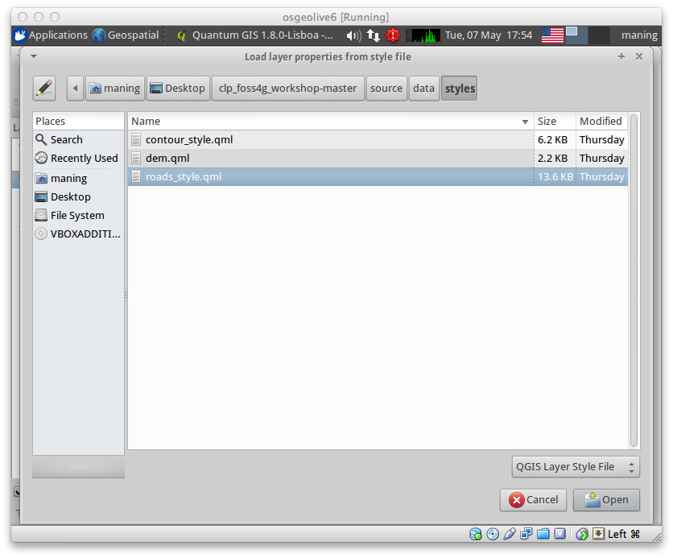
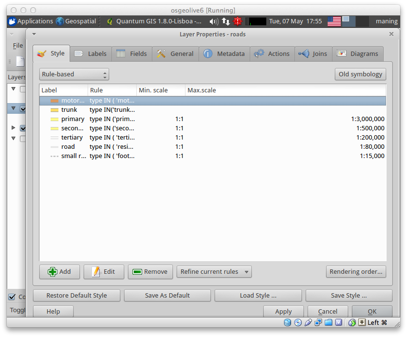
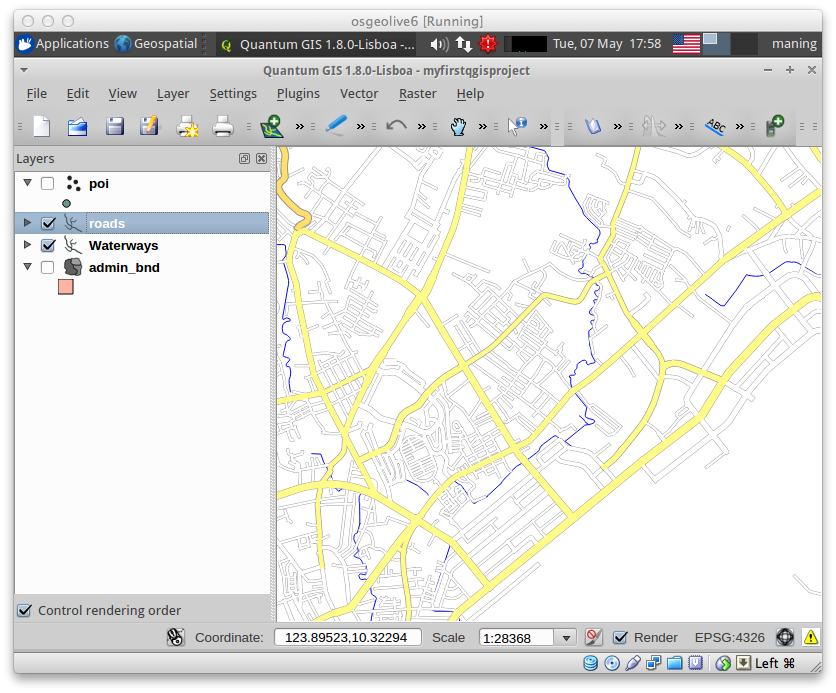

==================================
Using :index:`Custom Symbology`
==================================

QGIS provides many features for styling and improving the look of your maps.  The 
custom symbologies and scale-dependent rendering are possible for any vector 
type.  

Many of these customizations are available using the :guilabel:`New Symbology` 
feature in the layer :guilabel:`Properties`  window.  

.. note::
   There are three types of symbols: marker symbols (for points), line symbols 
   (for lines) and fill and outline symbols (for polygons) in 
   :guilabel:`New Symbology`. Symbols can consist of one or more symbol layers. 
   It is possible to define the color of a symbol and this color is then defined 
   for all symbol layers. Some layers may have the color locked - for those the 
   color can not be altered. This is useful when you define the color of a 
   multilayer symbol. Similarly, it is possible to define the width for line 
   symbols, as well as size and rotation for marker symbols. 
   
   More information is available in the QGIS User Guide.

For this exercise, we will use pre-defined custom symbols for several layers. The 
pre-defined symbols and styles are available in the ``vector`` 
directory.

:index:`Importing custom symbols`
------------------------------------

1. Select the ``Road`` layer and right-click on the layer and select 
:guilabel:`Properties`.

2. In the :guilabel:`Style` tab, click the :guilabel:`New Symbology`.  You will 
be asked to confirm the changes to use the New Symbology, click :guilabel:`OK`.
 
.. image:: images/properties_style_tab.png
   :align: center
   :width: 300 pt

3. The :guilabel:`Style` tab will have 
a new look.

.. image:: images/new_symbology_style_tab.png
   :align: center
   :width: 300 pt

4. Click the :guilabel:`Style manager...`.  Within this window, you can create 
new symbols or import/export existing symbols.  Select the :guilabel:`Line` tab.

.. image:: images/style_manager.png
   :align: center
   :width: 300 pt
 
5. Click the :guilabel:`Import...` button, open your ``vector`` directory and 
select ``custom_symbols.xml``.  Click :guilabel:`Open`.

.. image:: images/select_custom_symbols.png
   :align: center
   :width: 300 pt

6. In the :guilabel:`Styles import/export` window, click :guilabel:`Select all -->` 
:guilabel:`Import`.

.. image:: images/style_import_export.png
   :align: center
   :width: 300 pt

7. Your symbols will include more line styles.  Click :guilabel:`Close` to end 
the import process.

.. image:: images/style_import_export_2.png
   :align: center
   :width: 300 pt

:index:`Using custom styles`
-------------------------------------
1. Still within the :guilabel:`Style` tab of the ``Road`` layer, click 
:guilabel:`Load Style ...`.   Open your ``vector`` directory and select 
``road_style.qml``.  Click :guilabel:`Open`.

2. The ``Road`` layer is now styled according to different road types.  This 
custom style also uses the scale-dependent rendering.  Click :guilabel:`OK`.

.. tip:: 
   Scale dependent rendering allows you to set what features can be viewed at 
   certain scale.  This allows you to minimize "map clutter".  For example, in the 
   ``Roads`` layer, we set the scale for minor roads (``road, small 
   road``) to appear only on larger scales over the other road types.

3. Zoom in and out of the :guilabel:`Map View` to see the scale-dependent 
rendering in action.

4. A custom style is also available for the ``Landuse`` layer in the 
``vector`` directory.  Use the file ``landuse.qml``.

5. Create custom styles for the ``POIs`` and 
``Buildings`` layer.

.. raw:: latex
   
   \pagebreak[4]
