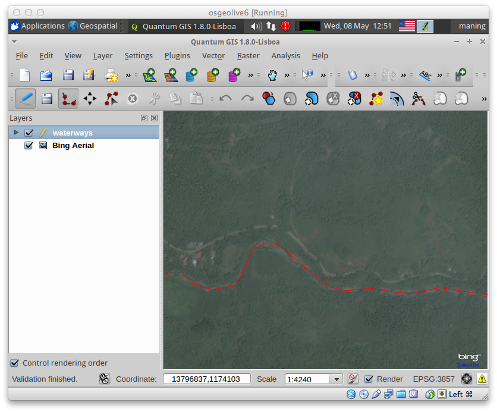

.. draft (mark as complete when complete)

===================================
:index:`Digitizing Vector` Layers
===================================

QGIS provides easy-to-use yet very powerful digitizing tools. 
:index:`Digitizing` or digitization is a process of encoding map coordinates 
and attributes in digital form. This allows you to create and edit vector data 
using various data sources such as text files, paper maps, or satellite 
imagery. This exercise will guide you through the basic interface of vector 
digitizing using QGIS.

Creating a new project
-----------------------
1. Open QGIS and create a new project. In the Menu, select 
:menuselection:`File -->` 
|mActionFileNew| :guilabel:`New Project`.

2. Open :guilabel:`Project Properties` and click the 
:guilabel:`Coordinate Reference System (CRS)` tab.  
Set the following options.

* Check the :guilabel:`Enable 'on-the-fly' CRS Transformation`.

.. note::
   On the fly CRS transformation allows you to combine various data layers with 
   different reference system into a single map view.

Loading Vector data
---------------------

1. Add the ``waterways.shp`` 
vector.

2. Zoom to the extent of ``waterways.shp``. Right click on the layer, 
select |mActionZoomToLayer| :guilabel:`Zoom to Layer Extent`.

3. Create a suitable symbology and color scheme for the 
layer.

:index:`Loading raster data`
-------------------------------

1. To load raster data, select 
:menuselection:`Plugins --> OpenLayers plugin -->` 
|mActionAddBingLayer| :guilabel:`Add Bing Aerial layer`.

.. image:: images/digitizing_ordered_layers.png
   :align: center
   :width: 300 pt

We will use the ``Bing Aerial layer`` raster as our primary source 
for digitizing new features in the vector layer.  

.. commenting out for now, we focus this section on editing existing
   vectors 
.. Creating a new vector layer
.. -----------------------------------------

:index:`Setting options for digitizing`
------------------------------------------

Before we can begin digitizing, we must set the snapping tolerance to a value 
that allows us an optimal editing of the vector layer geometries.

.. tip::
   Snapping tolerance is the distance QGIS uses to search for the closest vertex 
   and/or segment you are trying to connect when you set a new vertex or move 
   an existing vertex. If it is not within the snap tolerance, QGIS will leave
   the vertex where you release the mouse button, instead of snapping it to an 
   existing vertex and/or segment.

1. To set the snapping tolerance, select :menuselection:`Settings -->` 
:guilabel:`Snapping options`. Within the :guilabel:`Snapping options` window, 
activate the :guilabel:`Enable topological editing` by adding a check mark.

2. In the list of layers, add a check mark to the ``waterways``.  This 
activates snapping in respective layer.  Set the snapping :guilabel:`Tolerance` 
to ``10`` 
:guilabel:`pixels` . Select 
:menuselection:`Apply -->` 
:guilabel:`OK`.  

.. image:: images/snapping_options.png
   :align: center
   :width: 300 pt

When you start editing the layer, new vertices will snap if it is within 
10 pixels of another vertex within the current :guilabel:`Map View`.

3. Save your 
project.  

:index:`Digitizing vectors`
----------------------------------

We will now start digitizing roads.

.. note::
   This process is called heads-up or :index:`on-screen digitizing`. This is 
   an interactive process, in which a map is created using a previously 
   digitized or scanned information. It is called "heads-up" digitizing 
   because the attention of the user is focused on the screen.

1. Make sure the ``waterways`` and ``Bing Aerial`` layers are 
visible.

2. Zoom-in to a smaller area, where the rivers on the 
image are visible.

3. Select the ``waterways`` layer, right-click and select 
|mActionToggleEditing| 
:guilabel:`Toggle Editing`.  Once the layer is in edit mode, additional tool 
buttons on the editing toolbar previously greyed-out will become available.

.. image:: images/toggle_editing_annot.png
   :align: center
   :width: 400 pt

For each feature, you first digitize the geometry, then encode the attributes. 

4. To digitize the geometry, click the |mActionAddFeatureLine| 
:guilabel:`Add Feature`, left-click on the map area to create the first 
point/vertex of your new feature.

For lines and polygons, keep on left-clicking for each additional vertex you 
wish to capture. When you have finished adding vertices, right-click anywhere 
on the :guilabel:`Map View` to confirm you have finished entering the 
geometry of that feature.

The attribute window will appear, allowing you to enter the information for the 
new feature. Add the type of feature in the ``type`` field and the name of the 
feature in the ``name`` field.

.. image:: images/add_attributes.png
   :align: center
   :width: 300 pt

To save your editing session, |mActionToggleEditing| :guilabel:`Toggle Editing` 
and click :guilabel:`Save`.

.. tip::
   In some cases, you will reach the edge of the :guilabel:`Map View` but you 
   would like to continue adding new vertices.  When this happens, use the 
   arrow keys or press the spacebar while using your mouse to pan across the 
   :guilabel:`Map View`.

**The Node Tool**

The |mActionNodeTool| :guilabel:`Node Tool` provides manipulation capabilities 
of feature vertices similar to CAD programs. It is possible to simply select 
multiple vertices at once and to move, add or delete them all together. The 
node tool also works with on-the-fly projection turned on and supports the 
topological editing feature. 
This tool is, unlike other tools in Quantum GIS, persistent, so when 
some operation is done, selection stays active for this feature and tool.

.. image:: images/node_tool.png
   :align: center
   :width: 300 pt

**Basic operations** 

Start by activating the Node Tool and selecting some features by clicking on 
it. Red boxes appear at each vertex of this feature. Functionalities are:

* **Selecting vertex**: Selecting is easy: just click on vertex and the color 
  of this vertex will change to blue. When selecting more vertices, the 
  :guilabel:`Shift` key can be used to select more vertices. Or the :kbd:`Ctrl` 
  key can be used to invert selection of vertices: if selected already then it 
  will be unselected and when not selected, the vertex will be selected. More 
  vertices can be selected at once when clicking somewhere outside feature and 
  opening a rectangle where all vertices inside will be selected. Or just 
  click on an edge and both adjacent vertices should be selected.

* **Adding vertex**: Just double click near some edge and a new vertex will 
  appear on the edge near the cursor. Note that the new vertex will appear on 
  one side, not necessarily on the cursor's position.  Move it as necessary.

* **Deleting vertex**: After selecting vertices for deletion, click the 
  :guilabel:`Delete` key and vertices will be deleted. 

The rest of the basic editing tools are explained below:

+----------------------------+---------------------------------+-------------------------------+
| **Icon**                   | **Tool**                        | **Purpose**                   |
+============================+=================================+===============================+
| |mActionToggleEditing|     | :guilabel:`Toggle editing`      | Enable editing of the         |
|                            |                                 | selected vector layer.        |
+----------------------------+---------------------------------+-------------------------------+
| |mActionFileSave|          | :guilabel:`Save Edits`          | Save your editing session in  |
|                            |                                 | the currently selected layer. |
|                            |                                 | This is different from saving |
|                            |                                 | your project.                 |
+----------------------------+---------------------------------+-------------------------------+
| |mActionAddFeaturePoint|   | :guilabel:`Add Feature-Point`   | Add point  features.          |
+----------------------------+---------------------------------+-------------------------------+
| |mActionAddFeatureLine|    | :guilabel:`Add Feature-Line`    | Add line features.            |
+----------------------------+---------------------------------+-------------------------------+
| |mActionAddFeaturePolygon| | :guilabel:`Add Feature-Polygon` | Add polygon features.         | 
+----------------------------+---------------------------------+-------------------------------+
| |mActionMoveFeature|       | :guilabel:`Move Feature`        | Move location of a selected   |
|                            |                                 | feature.                      |
+----------------------------+---------------------------------+-------------------------------+
| |mActionNodeTool|          | :guilabel:`Node Tool`           | Activate Node tool functions. |
+----------------------------+---------------------------------+-------------------------------+
| |mActionDeleteSelected|    | :guilabel:`Delete Selected`     | Delete selected one or        |
|                            |                                 | more features.                |
+----------------------------+---------------------------------+-------------------------------+
| |mActionEditCut|           | :guilabel:`Cut Features`        | Delete a selected feature(s)  |
|                            |                                 | from the existing layer and   |
|                            |                                 | place it on a                 |
|                            |                                 | "spatial clipboard".          |
+----------------------------+---------------------------------+-------------------------------+
| |mActionEditCopy|          | :guilabel:`Copy Features`       | Place selected feature(s)     |
|                            |                                 | into the "spatial clipboard". |
+----------------------------+---------------------------------+-------------------------------+
| |mActionEditPaste|         | :guilabel:`Paste Features`      | Paste feature(s) from the     | 
|                            |                                 | "spatial clipboard" to the    |
|                            |                                 | currently selected and        |
|                            |                                 | editable layer.               |
+----------------------------+--  -----------------------------+-------------------------------+

Full description of the editing tools and other advanced features available in 
the QGIS User's Manual.

5. Finish editing the 
layer.

6. Save your 
project.

.. tip::
   Remember to toggle |mActionToggleEditing| :guilabel:`Toggle Editing` off 
   regularly. This allows you to save your recent changes, and also confirms 
   that your data source can accept all your changes.

.. raw:: latex
   
   \pagebreak[4]
