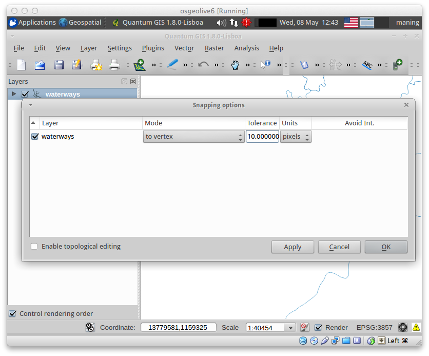

=========================
Digitizing Vector Layers
=========================

QGIS provides easy-to-use yet very powerful digitizing tools. :index:`Digitizing` 
or digitization is a process of encoding map coordinates and attributes in digital 
form. This allows you to create and edit vector data using various data sources 
such as text files, paper maps, or satellite imagery. This exercise will guide you 
through the basic interface of vector digitizing using QGIS.

Creating a new project
-----------------------
1. Open QGIS and create a new project. In the Menu, select :menuselection:`File -->` 
|mActionFileNew| :guilabel:`New Project`.

2. Open :guilabel:`Project Properties` and click the :guilabel:`Coordinate Reference System (CRS)` tab.  
Set the following options.

* Check the :guilabel:`Enable 'on-the-fly' CRS Transformation`.
* In the Coordinate Reference System, choose 
  :guilabel:`Projected Coordinate System --> Universal Transverse Mercator --> WGS 84 / UTM Zone 51N`. 

.. note::
   On the fly CRS transformation allows you to combine various data layers with 
   different reference system into a single map view.

:index:`Loading raster data`
-------------------------------

1. To load raster data, select :menuselection:`Plugins --> OpenLayers plugin -->` 
|mActionAddBingLayer| :guilabel:`Add Bing Aerial layer`.

.. note::
   A :term:`Raster` dataset is composed of rows (running across) and columns 
   (running down) of :term:`Pixel` s (also know as cells). Each pixel represents a 
   geographical region, and the value in that pixel represents some characteristics 
   of that region.

   Images with a pixel size covering a small area are called 'high resolution' 
   images because it is possible to make out a high degree of detail in the image. 
   Images with a pixel size covering a large area are called 'low resolution' 
   images because the amount of detail the images show is low.

   Some raster data have two files included.  For example, a file with the `tif` 
   extension is the image and the file with the extension `tfw` is the world file.  
   World files describe the location, scale and rotation of the map. By adding a 
   world file in any image, GIS applications can read and georeference almost any 
   image. However, the world file does not give the proper coordinate reference 
   system of the raster. More information 
   `here <http://en.wikipedia.org/wiki/World_file>`_. In QGIS, you have to 
   properly set the CRS for raster with world file.

Loading Vector data
---------------------

1. Open the following 
``admin_bnd.shp`` vector.

2. Zoom to the extent of ``admin_bnd.shp``. Right click on the layer, 
select |mActionZoomToLayer| :guilabel:`Zoom to Layer Extent`.

3. Create a suitable symbology and color scheme for the 
layer.

We will use the ``Bing Aerial layer`` raster as our primary source for a roads layer.  

:index:`Creating a new vector layer`
-----------------------------------------

We will now create a new vector layer, to digitize roads. We will use a line 
layer to represent this data.

1. To create a new vector layer select :menuselection:`Layer -->` 
:guilabel:`New -->` 
|mActionNewVectorLayer| :guilabel:`New Shapefile Layer`.

2. In the :guilabel:`Type` option, 
choose :guilabel:`Line`.

3. In the :guilabel:`Specify CRS`, select 
:guilabel:`WGS 84 / UTM Zone 51N`.

4. In the :guilabel:`New attribute`, add ``name`` in the :guilabel:`Name` field 
and choose :guilabel:`Text data` as the data type. Then, click 
:guilabel:`Add to attributes list`.  The newly added attribute field is 
added in the list.

5. Add another attribute column. In the :guilabel:`New attribute`, add ``type`` in 
the :guilabel:`Name` field and choose :guilabel:`Text data` as the data type. Then, 
click :guilabel:`Add to attributes list`.

In the ``name`` attribute field, we will encode the name of the feature. In the 
``type`` attribute field we encode the type of road (either primary, secondary, residential, etc.).  
Click :guilabel:`OK`.

.. image:: images/new_vector_layer.png
   :align: center
   :width: 300 pt

.. tip::
   Limit field names to a maximum of 10 characters and avoid special characters 
   (such as ``&, #, @ {`` ) and spaces.

6. A new window will appear for the filename and location of the data within your 
directory. Use the filename, ``quiapo_roads.shp``.  

.. image:: images/new_vector_filename.png
   :align: center
   :width: 300 pt

Click :guilabel:`Save`.  You now have a blank roads layer. 

:index:`Setting options for digitizing`
------------------------------------------

Before we can begin digitizing, we must set the snapping tolerance to a value that 
allows us an optimal editing of the vector layer geometries.

.. tip::
   Snapping tolerance is the distance QGIS uses to search for the closest vertex 
   and/or segment you are trying to connect when you set a new vertex or move an 
   existing vertex. If you aren’t within the snap tolerance, QGIS will leave the 
   vertex where you release the mouse button, instead of snapping it to an existing 
   vertex and/or segment.

1. To set the snapping tolerance, select :menuselection:`Settings -->` 
:guilabel:`Snapping options`. Within the :guilabel:`Snapping options` window, 
activate the :guilabel:`Enable topological editing` by adding a check mark.

2. In the list of layers, add a check mark to the ``quiapo_roads``.  This activates 
snapping in respective layer.  Set the snapping tolerance to ``10`` map units for 
``quiapo_roads`` layer. Select :guilabel:`Apply` --> :guilabel:`OK`.  

When you start editing the roads layer, new vertices will snap if it is within 
10 map units or 10 meters of another vertex.

3. Save your 
project.  

:index:`Digitizing vectors`
----------------------------------

We will now start digitizing roads.

.. note::
   This process is called heads-up or :index:`on-screen digitizing`. This is an 
   interactive process, in which a map is created using a previously digitized or 
   scanned information. It is called "heads-up" digitizing because the attention 
   of the user is focused on the screen.

1. Make sure the ``quiapo_roads`` and ``Bing Aerial`` layers are visible. Click the 
checkbox preceding the name of the layer in the :guilabel:`Map Legend` view to 
hide/show layers.

2. Zoom-in to an area, where the roads on the 
image are visible.

3. Select the ``quiapo_roads`` layer, right-click and select |mActionToggleEditing| 
:guilabel:`Toggle Editing`.  Once the layer is in edit mode, additional tool 
buttons on the editing toolbar previously greyed-out will become available.

.. image:: images/toggle_editing_annot.png
   :align: center
   :width: 300 pt

For each feature, you first digitize the geometry, then encode the attributes. 

4. To digitize the geometry, click the |mActionAddFeatureLine| :guilabel:`Add Feature`, 
left-click on the map area to create the first point/vertex of your new feature.

.. image:: images/editing_session_annot.png
   :align: center
   :width: 300 pt

For lines and polygons, keep on left-clicking for each additional vertex you wish 
to capture. When you have finished adding vertices, right-click anywhere on the 
:guilabel:`Map View` to confirm you have finished entering the geometry of that 
feature.

The attribute window will appear, allowing you to enter the information for the 
new feature. Add the type of road in the ``type`` field and the name of the 
feature in the ``name`` field.

To save your editing session, |mActionToggleEditing| :guilabel:`Toggle Editing` 
and click :guilabel:`Save`.

.. tip::
   In some cases, you will reach the edge of the :guilabel:`Map View` but you 
   would like to continue adding new vertices.  When this happens, use the arrow 
   keys or press the spacebar while using your mouse to pan across the 
   :guilabel:`Map View`.

**The Node Tool**

The |mActionNodeTool| :guilabel:`Node Tool` provides manipulation capabilities of 
feature vertices similar to CAD programs. It is possible to simply select multiple 
vertices at once and to move, add or delete them all together. The node tool also 
works with on-the-fly projection turned on and supports the topological editing 
feature. This tool is, unlike other tools in Quantum GIS, persistent, so when some 
operation is done, selection stays active for this feature and tool.

.. image:: images/node_tool.png
   :align: center
   :width: 300 pt

**Basic operations** 

Start by activating the Node Tool and selecting some features by clicking on it. 
Red boxes appear at each vertex of this feature. Functionalities are:

* **Selecting vertex**: Selecting is easy: just click on vertex and the color of 
  this vertex will change to blue. When selecting more vertices, the 
  :guilabel:`Shift` key can be used to select more vertices. Or the :kbd:`Ctrl` 
  key can be used to invert selection of vertices: if selected already then it will 
  be unselected and when not selected, the vertex will be selected. More vertices 
  can be selected at once when clicking somewhere outside feature and opening a 
  rectangle where all vertices inside will be selected. Or just click on an edge 
  and both adjacent vertices should be selected.

* **Adding vertex**: Just double click near some edge and a new vertex will appear 
  on the edge near the cursor. Note that the new vertex will appear on one side, 
  not necessarily on the cursor's position.  Move it as necessary.

* **Deleting vertex**: After selecting vertices for deletion, click the 
  :guilabel:`Delete` key and vertices will be deleted. 

The rest of the basic editing tools are explained below:

* |mActionToggleEditing| :guilabel:`Toggle editing` - Enable editing of the 
  selected vector layer.

* |mActionFileSave| :guilabel:`Save Edits` - save your editing session in the 
  currently selected layer.  This is different from Saving your project.

* |mActionAddFeaturePoint| :guilabel:`Add Feature - Point` - add point features.

* |mActionAddFeatureLine| :guilabel:`Add Feature - Line` - add line features.

* |mActionAddFeaturePolygon| :guilabel:`Add Feature - Polygon` - add polygon features.

* |mActionMoveFeature| :guilabel:`Move Feature` - move location of a selected 
  feature.

* |mActionNodeTool| :guilabel:`Node Tool` - activate Node tool functions.

* |mActionDeleteSelected| :guilabel:`Delete Selected` - delete selected one or 
  more features.

* |mActionEditCut| :guilabel:`Cut Features` - delete a selected feature(s) from 
  the existing layer and place it on a "spatial clipboard".

* |mActionEditCopy| :guilabel:`Copy Features` - place selected feature(s) into 
  the "spatial clipboard".

* |mActionEditPaste| :guilabel:`Paste Features` - paste feature(s) from the 
  "spatial clipboard" to the currently selected and editable layer.

Full description of the editing tools and other advanced features available in the 
QGIS User's Manual.

5. Finish editing the 
roads layer.

6. Save your 
project.

.. tip::
   Remember to toggle |mActionToggleEditing| :guilabel:`Toggle Editing` off 
   regularly. This allows you to save your recent changes, and also confirms that 
   your data source can accept all your changes.

.. raw:: latex
   
   \pagebreak[4]

