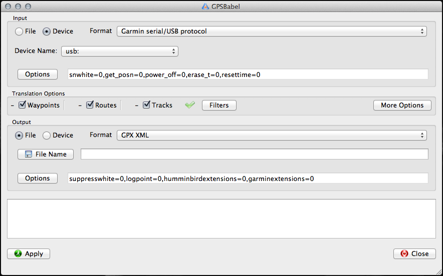
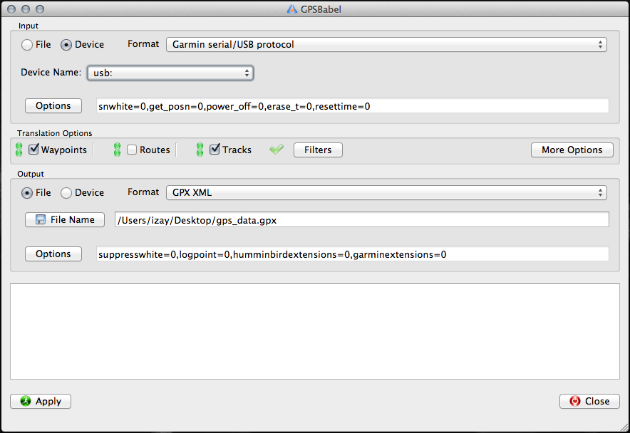
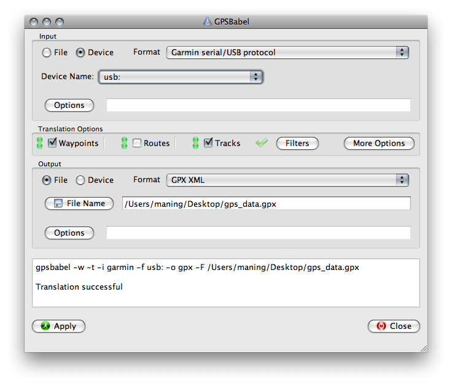
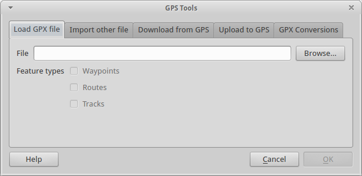
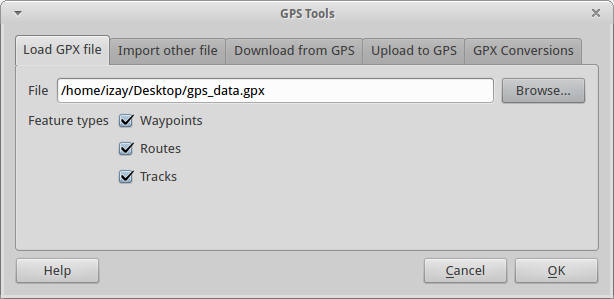
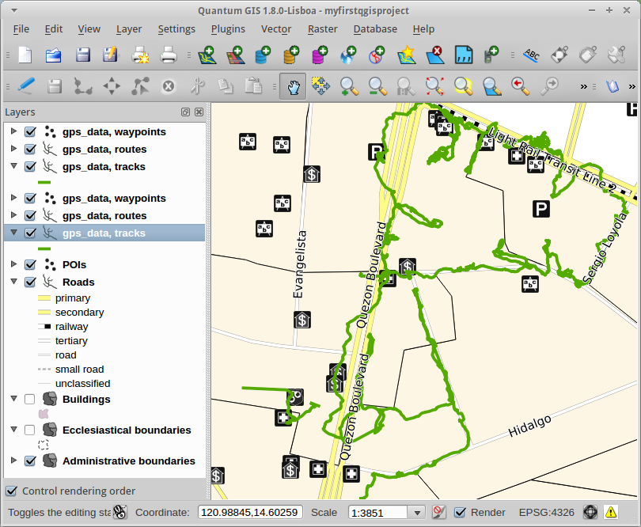

.. proofread (mark as complete when complete)

================
Using GPS data
================

QGIS can utilize data collected from common :term:`Global Positioning System` 
receivers. The standard format of GPS data is GPX (file extension ``.gpx``).  

This exercise will show you how to display GPS data in QGIS.  We will use the 
GPSBabel application to download the data directly from your GPS receiver and 
then display it in QGIS.

You need `GPSbabel <http://www.gpsbabel.org/>`_ installed in your machine.  To 
download GPSbabel for your operating system,  go to the the website's 
`download section <http://www.gpsbabel.org/download.html>`_.

Downloading GPS data from the device using GPSbabel
-----------------------------------------------------

.. note::
   Instructions provided are for Garmin devices.  

1. Connect your GPS device into your computer using either a serial port or USB 
and turn it on. 

2. Open 
:guilabel:`GPSBabel`.

3. In the :guilabel:`Input` section, select :guilabel:`Device` and choose 
:guilabel:`Garmin serial/USB` as the :guilabel:`Format`.

4. In the :guilabel:`Translations` section, check the :guilabel:`Waypoints` and 
:guilabel:`Tracks`.

5. In the :guilabel:`Output` section, select :guilabel:`File` and choose 
:guilabel:`GPX XML` as the :guilabel:`Format`.

6. Encode your preferred filename in the 
:guilabel:`File Name` field.

7. Click :guilabel:`Apply`.  Once the download finishes, a message will appear 
in the bottom text box.  The GPS data is now saved in your computer.
  

  
Loading GPS data in QGIS
-------------------------------------------

1. Open your QGIS 
project.

2. Activate the :guilabel:`GPS Tools` plugin. In the Menu, select 
:menuselection:`Plugins -->` 
|mActionShowPluginManager| :menuselection:`Manage Plugins`. 
In the :guilabel:`Plugin Manager`, 
enable the :guilabel:`GPS Tools` plugin. Click 
:guilabel:`OK`. 

3. To display GPS data, in the Menu select :menuselection:`Vector -->` 
:menuselection:`GPS -->` 
|mActionGPSTools| :guilabel:`GPS Tools`. A new window will 
appear for the :guilabel:`GPS Tools` plugin.  

Click the :guilabel:`Load GPX file` tab. 

4. In the :guilabel:`File` section, click :guilabel:`Browse` and choose your 
GPX file.  Click :guilabel:`OK`.

5. The GPS data should display in your :guilabel:`Map View`. You can now use 
the GPS data as reference for creating or updating your data layers.

.. tip::
   The :guilabel:`GPS Tools plugin` can only load GPX file one at a time.  
   You have to repeat the process to load several GPX files.

.. raw:: latex
   
   \pagebreak[4]
