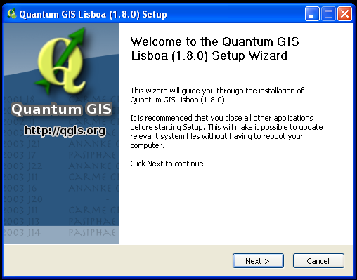
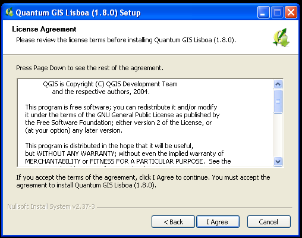
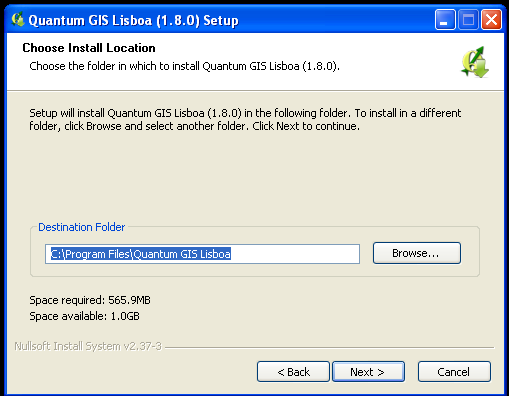
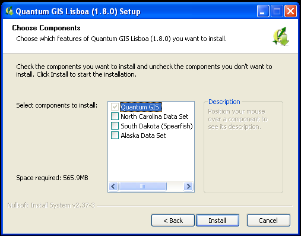
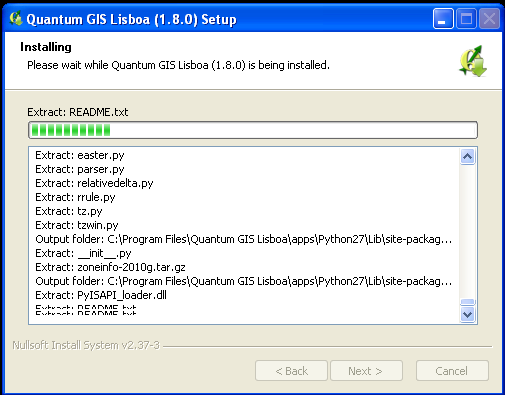
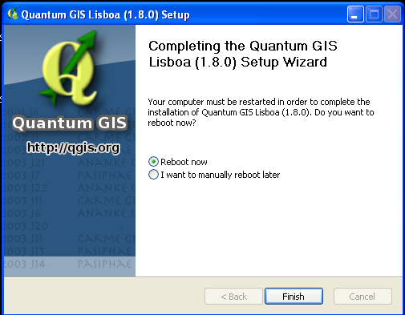
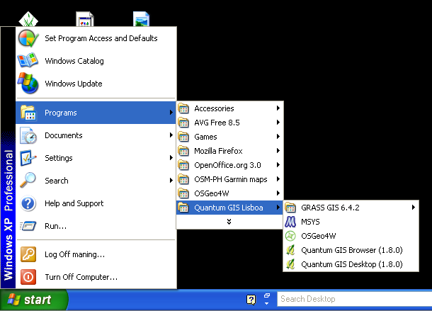
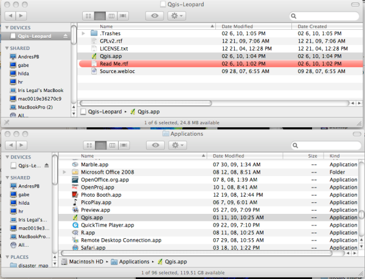
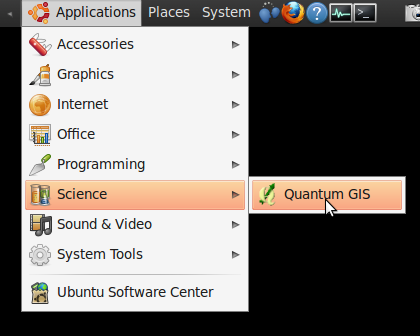

.. draft (mark as complete when complete)

==========================================================
QGIS Installation for MS Windows, Mac OSX and Ubuntu Linux
==========================================================

.. Note: make sure to include installer directory.

This guide walks through the installation of QGIS depending on your operating system. 

.. note::
   The current version of Quantum GIS available is QGIS 1.8.0 'Lisboa'. You can download the 
   installers from the QGIS `download page <http://hub.qgis.org/projects/quantum-gis/wiki/Download>`_.

MS Windows
----------
.. note::
   The screen-shots provided is the install process under Windows XP. It is 
   assumed that you have administrative privilege in your system. The process 
   is similar to later versions of Windows. However, there maybe occasions that 
   you will be prompted to provide administrative account details.  To run the 
   installer as administrator, `right-click` the installer and choose 
   `Run as administrator`. 

1. Download the QGIS installer from the QGIS download page link given above.

* QGIS 1.8.0 Standalone Installer - :file:`QGIS-OSGeo4W-1.8.0-2-Setup.exe`

2. Double-click the downloaded installer file.  
Click :guilabel:`Next`.

3. Accept the License Agreement by clicking 
:guilabel:`I Agree`. 

4. You can choose where to install QGIS in your system by selecting the 
appropriate directory using the :guilabel:`Browse` button. We accept the 
default for now by hitting :guilabel:`Next`. 

5. Aside from the main QGIS application, you have an option to download sample 
datasets provided by the QGIS developers. These data will be downloaded during 
the install process. Some of the data are several hundreds of Megabytes, we 
will not use them for now. Un-mark any of the optional sample datasets and 
click :guilabel:`Install`. 

Installation will take a couple of minutes depending on your hardware specs. 

6. Click :guilabel:`Finish` to complete your install 
process. 

7. You can now start QGIS by hitting :guilabel:`Start -->` 
:guilabel:`All Programs -->` :guilabel:`Quantum GIS -->` 
:guilabel:`Quantum GIS`. 

8. To uninstall QGIS, simply choose :guilabel:`Start -->` 
:guilabel:`All Programs` --> :guilabel:`Quantum GIS -->` 
:guilabel:`Uninstall Quantum GIS`. 

Mac OSX
--------
1. Download the frameworks and 
installer from the QGIS download page link given above:

* GSL Framework - :file:`GSL_Framework-1.15-2.dmg`
* GDAL Complete Framework - :file:`GDAL_Complete-1.9.dmg`
* QGIS 1.8.0 'Lisboa' installer - :file:`QGIS-1.8.0-2.dmg`

.. note::
   The frameworks and installer above are for Mac OS X Lion (10.7) and 
   Snow Leopard (10.6).  For other OSX versions, visit 
   `KyngChaos Qgis download page  <http://www.kyngchaos.com/software/qgis>`_.  
   To get version information about your Mac, click :guilabel:`Apple Icon -->` 
   :guilabel:`About This Mac`.

2. Install all the required frameworks by double-clicking the 
``.dmg`` files.

3. To install QGIS, double-click the downloaded "dmg".  A new finder window 
will open. Copy or drag the :guilabel:`Qgis.app` to your 
:guilabel:`Applications` folder 

4. Launch QGIS by double-clicking the :guilabel:`Qgis.app` from your 
:guilabel:`Applications` directory 

5. To remove QGIS, drag the :guilabel:`Qgis.app` from your 
:guilabel:`Applications` directory to the :guilabel:`Trash` icon in 
your :guilabel:`Dock` 

.. image:: images/nix.png
   :height: 30 pt

GNU/Linux Ubuntu
-----------------

.. warning::
   Command line instructions are outlined from hereon. It is assumed you know 
   basic command line interface (CLI) and you have administrative privilege to 
   install applications in your Ubuntu Linux machine. Depending on your Ubuntu 
   version, installation may vary. The instructions below are for Ubuntu Karmic 
   Koala version.

1. Update your Ubuntu machine. Open :guilabel:`Terminal` and update all 
security updates::

      sudo apt-get update
      sudo apt-get upgrade

2. Install QGIS using UbuntuGIS repository.  Open :guilabel:`Terminal` and edit 
your repository list::

      nano /etc/apt/sources.list

3. Add the UbuntuGIS repository (replace the `karmic` to your distribution 
version)::

      deb http://ppa.launchpad.net/ubuntugis/ubuntugis-unstable/ubuntu karmic main 
      deb-src http://ppa.launchpad.net/ubuntugis/ubuntugis-unstable/ubuntu karmic main 

4. Add PPA key to your system so Ubuntu can verify the packages from the 
PPA::

      sudo apt-key adv --keyserver keyserver.ubuntu.com --recv-keys 314DF160

This will now pull down the PPA's key and add it to your system.

5. Install 
QGIS::
      
      sudo apt-get update
      sudo apt-get install qgis qgis-common python-qgis

6. Start QGIS by hitting :guilabel:`Applications -->` :guilabel:`Science -->` 
:guilabel:`Quantum GIS` 

7. To remove QGIS, open :guilabel:`Terminal` and remove the qgis application by 
typing::

      sudo apt-get remove qgis
 

.. raw:: latex
   
   \pagebreak[4]
