.. draft (mark as complete when complete)
.. todo: add new screenshots

==============================
The :index:`QGIS Interface`
==============================

QGIS provides an easy to use :term:`Graphical user interface (GUI)` to explore, 
create and edit geospatial data. Commands and functions are activated using a 
combination of menu, toolbar and keyboard shortcut actions within the 
application.

This exercise will explore the basic interface of QGIS. You will create your 
first QGIS project, load various data layers, customize the appearance of your 
map using various data symbology and colors.

**Interface Overview**

.. image:: images/qgis_interface_overview.png
   :align: center
   :width: 450 pt

* **1. Map Legend/Layers** - where you add layers and interact with them, such 
  as grouping them, setting symbology, and such.
* **2. Map View/Canvass** - the main map area where the layers show up and all
  your visualization is done.
* **3. Tool Bar** - button bars. Like most modern windows applications you can 
  drag your button bars around and move them between layers. Hover over each 
  button and you will get a short description of what it is for.
* **4. Menu Bar** - most of the functionality in the Toolbar are up here as 
  well.  Don’t forget the all-important :guilabel:`Help` . QGIS has good 
  documentation so use it.
* **5. Status Bar** - shows status, coordinates and scale of the Map View. 
  Sometimes map display updates also called rendering can be slow when using 
  large data files.  You can turn off rendering when dealing with large files 
  until you want to see the layers. 

:index:`Creating a new project`
----------------------------------

1. Launch QGIS in Windows by clicking :menuselection:`Start -->` 
:menuselection:`All Programs -->` 
:menuselection:`Quantum GIS -->` 
:menuselection:`Quantum GIS`.

2. Create a new project. :menuselection:`File -->` |mActionFileNew| 
:guilabel:`New Project`.

A QGIS session is considered a Project. QGIS works on one project at a time. 
Settings are considered as being per-project or as a default for new projects.  
The kinds of information saved in a project file include:

* Layers added;
* Layer properties, including symbolization;
* Projection for the map view and;
* Last viewed extent.

.. warning:: 
   The project file is saved in XML format (with a ``.qgs`` file extension), 
   it is possible to edit the file outside QGIS if you **know what you are 
   doing**.

3. Open the project properties. In the Menu, select 
:menuselection:`Settings -->` :guilabel:`Project Properties`.

.. image:: images/project_properties.png
   :align: center
   :width: 300 pt

* In the :guilabel:`General` tab you can define the project title, selection 
  and background color, layer units, precision, and the option to save 
  relative paths to layers.
* The :guilabel:`Coordinate Reference System (CRS)` tab enables you to choose 
  the CRS for this project, and to enable on-the-fly re-projection of layers
  when displaying layers from a different CRS. 
* The :guilabel:`Identifiable Layers` tab you set (or disable) which layers 
  will respond to the :guilabel:`Identify` tool. 

4. Select the :guilabel:`Coordinate Reference System (CRS)` tab. Click the 
small :guilabel:`triangle` on the left side of the 
:guilabel:`Geographic Coordinate System`. This shows another list of CRS. 
Choose :guilabel:`WGS 84`. Click :guilabel:`Apply` then, :guilabel:`OK`.

.. note::
   There is no need to set the CRS of the project if the layers to be loaded 
   are of the same projection because QGIS will draw the coordinates using 
   the data source. However, the :guilabel:`On The Fly transformations` needs 
   to be enabled and the projection to be followed selected if the layers are 
   of different projections.

.. image:: images/set_crs.png
   :align: center
   :width: 300 pt

.. tip::
   Many GIS application opens any geospatial data (vector or raster) without 
   asking for the coordinate referencing systems. QGIS follows a similar 
   behavior. However, it is good practice to select the correct CRS whenever 
   you start a new project. This habit can help you with problems in the 
   future. 

:index:`Opening Vector data`
-------------------------------
1. Add vector layers. In the Menu, select :menuselection:`Layer -->` 
|mActionAddOgrLayer| :guilabel:`Add Vector Layer`.

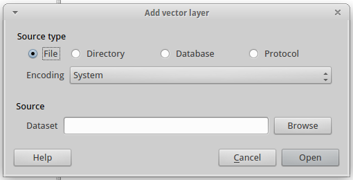

In the :guilabel:`Source type`, choose :guilabel:`File`. Click 
:guilabel:`Browse` and select your :file:`data` directory.

Select multiple vector layers by holding the :kbd:`Ctrl` button of your 
keyboard while selecting files. Select the following files::

      buildings.shp
      waterways.shp
      pois.shp
      roads.shp

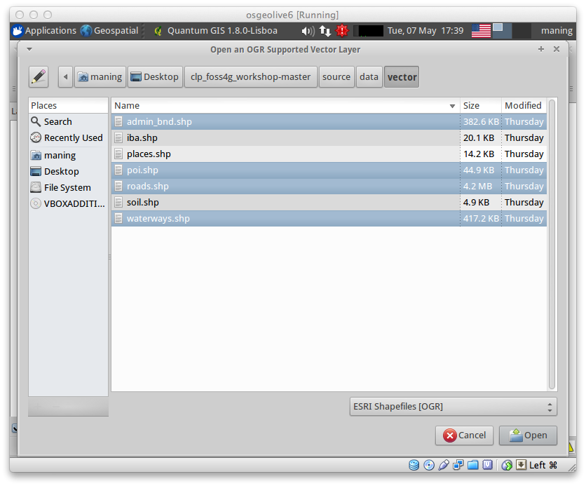

Once all the files are selected, Click :guilabel:`Open`. All vector layers will 
be loaded within your :guilabel:`Map View` area.

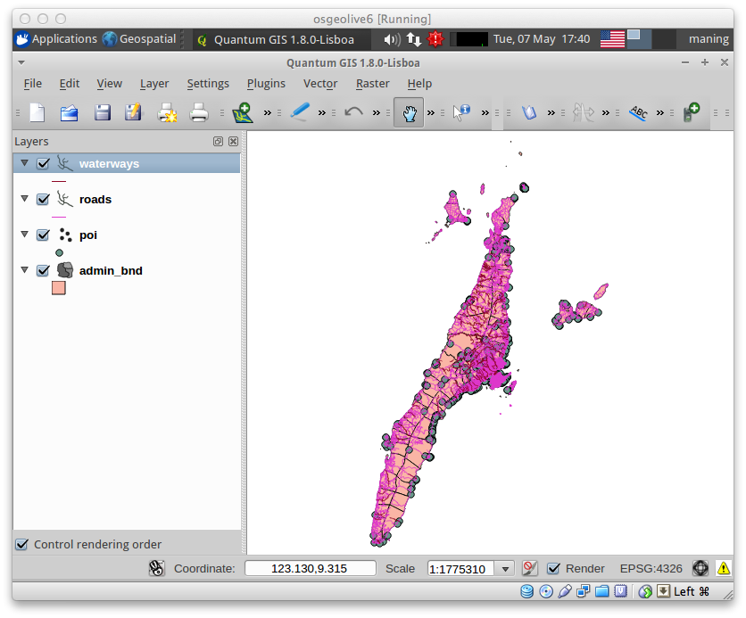

:term:`Vector` data are represented as either point, line or polygon. The type 
of vector depends on what information you wish to convey.

* Points - represented by a single X,Y coordinate. A point normally represents 
  a geographic feature that is too small to be displayed as a line or area. 
  For example, oil wells and fire hydrants.
* Lines - A set of ordered coordinates that represent the shape of geographic 
  features too narrow to be displayed as an area at the given scale or linear 
  features with no area (county boundary lines). For example, railways, roads, 
  rivers.
* Polygons - A feature used to represent areas. A polygon is defined by the 
  lines that make up its boundary and a point inside its boundary for 
  identification. 
  Polygons have attributes that describe the geographic feature they represent. 
  For example, forest stands, lakes. 

2. Arrange the display order of layers by selecting a layer in the 
:guilabel:`Map Legend` and then drag to either above or below the other layers.

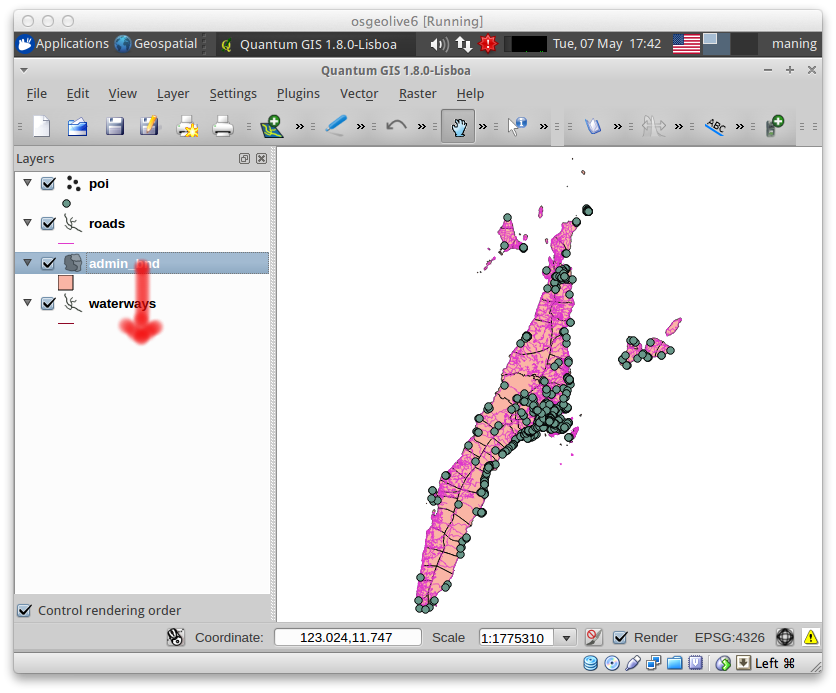

Arrange the data according to this list from top to bottom::

      pois.shp
      roads.shp
      buildings.shp
      waterways.shp 

.. tip::
    Mapping standards suggest that points layers should be on top followed by 
    lines and finally polygons.

:index:`Navigating around your map`
--------------------------------------
Basic tools for navigating around the :guilabel:`Map View` involve the use of 
the zoom and pan functions. Each tool is explained below:

+-------------------------+-------------------------------+-------------------------------+
| **Icon**                | **Tool**                      | **Purpose**                   |
+=========================+===============================+===============================+
| |mActionPan|            | :guilabel:`Pan`               | Interactively move the center |
|                         |                               | of the map                    |
+-------------------------+-------------------------------+-------------------------------+
| |mActionZoomIn|         | :guilabel:`Zoom In`           | Zoom in                       |
+-------------------------+-------------------------------+-------------------------------+
| |mActionZoomOut|        | :guilabel:`Zoom Out`          | Zoom out                      |
+-------------------------+-------------------------------+-------------------------------+
| |mActionZoomFullExtent| | :guilabel:`Zoom Full`         | Zooms to the full view of     |
|                         |                               | all the layers                |
+-------------------------+-------------------------------+-------------------------------+
| |mActionZoomToLayer|    | :guilabel:`Zoom to Layer`     | Zoom to the active or         |
|                         |                               | selected vector               |
+-------------------------+-------------------------------+-------------------------------+
| |mActionZoomToSelected| | :guilabel:`Zoom to Selection` | Zoom to the selected          |
|                         |                               | object within a vector layer  |
+-------------------------+-------------------------------+-------------------------------+
| |mActionZoomLast|       | :guilabel:`Zoom Last`         | Goes back and forth           |
|                         | :guilabel:`Zoom Next`         | to the previous zoom          |
+-------------------------+-------------------------------+-------------------------------+
| |mActionDraw|           | :guilabel:`Refresh`           | Redraw all data layers        |
+-------------------------+-------------------------------+-------------------------------+

**Zooming and panning with the mouse wheel.** Press the mouse wheel 
to pan inside of the main window and you can roll the mouse wheel to zoom in 
and out. For zooming, place the mouse cursor inside the map area and 
roll it forward (away from you) to zoom in and backwards (towards you) to 
zoom out. The mouse cursor position will be the center of the zoomed area of 
interest.

**Zooming and panning with the keyboard.** Place the mouse cursor inside the 
map area and click on the right arrow key to pan east, left arrow key to pan 
west, up arrow key to pan north and down arrow key to pan south. The 
:kbd:`PgUp` and :kbd:`PgDown` keys on your keyboard will cause the map display 
to zoom in or out.

.. tip::
   While you can do most navigation using the mouse, using the arrow keys on 
   the keyboard for map navigation is very useful in many cases especially 
   during digitizing.

Use the navigation tools to move in and around your map.

:index:`Changing the look of your layers`
-----------------------------------------------

.. change this using the new symbology

1. Changing vector layer properties like color and symbolization. Select the 
``waterways`` layer and right-click on the layer and select 
:guilabel:`Properties` from the pop-up menu.

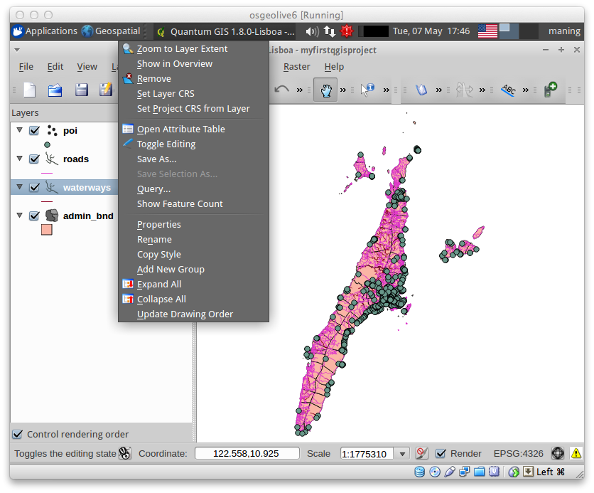

The :guilabel:`Layer Properties` dialog for a vector layer provides information 
about the layer, such as style settings and labeling options and other. 

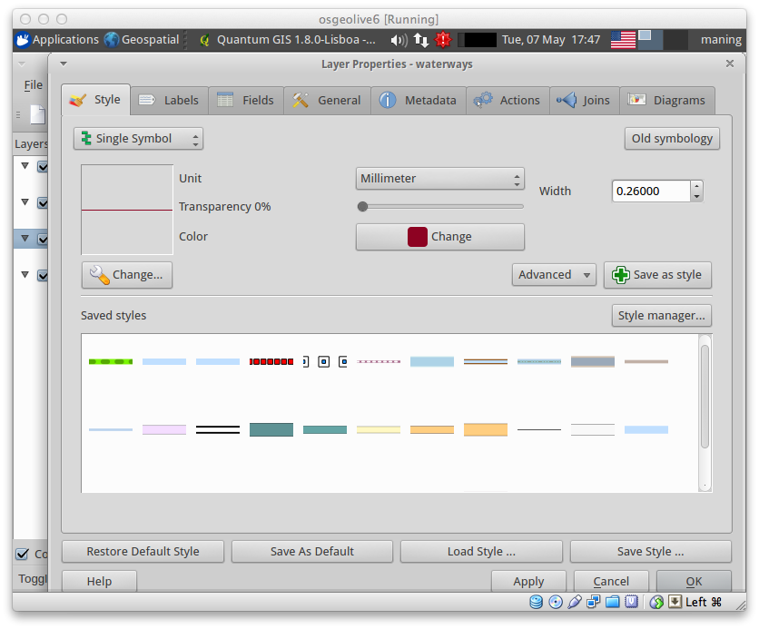

2. Select the :guilabel:`Style` tab. The :guilabel:`Style` tab provides you 
several ways to control how vector features are displayed.  For this layer, we 
will change the line color. 
In the Legend type drop-down, select :guilabel:`Single Symbol`.

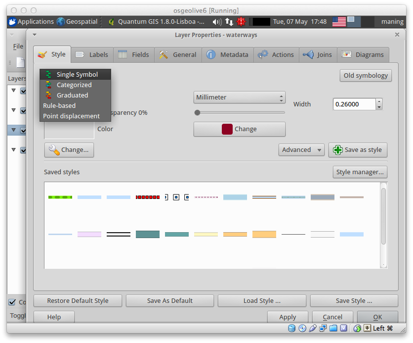

3. To access the the :guilabel:`Symbol Properties` dialog, click the 
|mActionOptions| :guilabel:`Change`.

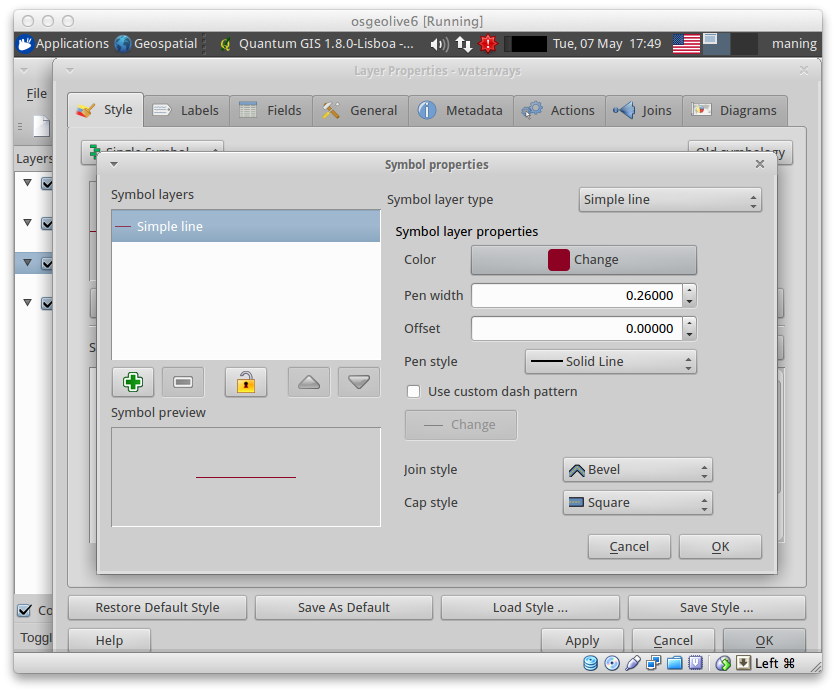

In the :guilabel:`Symbol Properties` dialog, 
click the :guilabel:`Change` button next to :guilabel:`Color`.
 
Another window showing the :guilabel:`Select Color` will then appear. 
Choose the color ``Blue`` or set the Red,Green, Blue (R:G:B) values to 
`0:0:255` respectively and click :guilabel:`OK`.

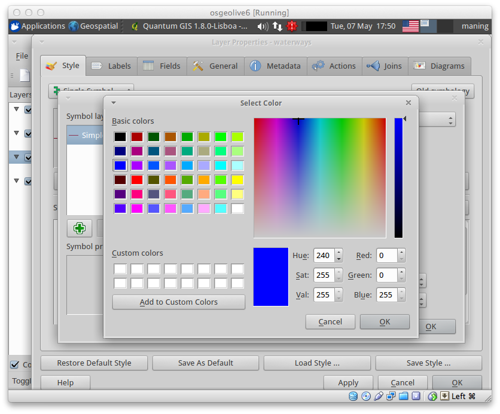

4. Select the :guilabel:`General` tab. This provides ways to change the display 
name, set scale dependent rendering options, create a spatial index of the 
vector file and view or change the projection of the specific vector layer.  
Change the :guilabel:`Display name` to ``Waterways``.

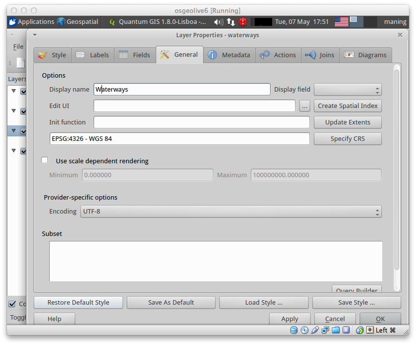

5. Click :guilabel:`Create Spatial Index`. A spatial index will improve the 
speed of both zooming and panning. Spatial index used by QGIS have a ``.qix`` 
extension.
Click :guilabel:`Apply` --> :guilabel:`OK`.

6. Repeat all the steps above to change layer properties of each vector layer.

7. Explore the other options of the vector properties. The 
:guilabel:`Layer Properties` provides several options to customize the look and 
feel of your layers. Use the other options until you're satisfied with the 
look.  

Try the following:

* Legend types
* Outline/Line options
* Fill options
* Different markers for points
* Transparency 

Saving your first project
,,,,,,,,,,,,,,,,,,,,,,,,,,,,,

1. In the :menuselection:`File` menu, select |mActionFileSave| 
:guilabel:`Save Project`. In the :guilabel:`Filename` field, type::

     myfirstqgisproject.qgs

2. Click :guilabel:`Save`. 
You have saved your first QGIS project.

Using custom styles
,,,,,,,,,,,,,,,,,,,,,,

QGIS provides many features for styling and improving the look of your maps.  
The custom symbologies and scale-dependent rendering are possible for any 
vector type.  

Many of these customizations are available using the :guilabel:`New Symbology` 
feature in the layer :guilabel:`Properties`  window.  

.. note::
   There are three types of symbols: marker symbols (for points), line symbols 
   (for lines) and fill and outline symbols (for polygons) in 
   :guilabel:`New Symbology`. Symbols can consist of one or more symbol layers. 
   It is possible to define the color of a symbol and this color is then 
   defined for all symbol layers. Some layers may have the color locked - 
   for those the color can not be altered. This is useful when you define the 
   color of a multilayer symbol. Similarly, it is possible to define the 
   width for line symbols, as well as size and rotation for marker symbols. 
   
   More information is available in the QGIS User Guide.

For this exercise, we will use several pre-defined styles available in the 
``data/styles`` directory.

1. Select the ``roads`` layer and right-click 
:guilabel:`Properties`.

.. image:: images/vector_properties.png
   :align: center
   :width: 300 pt

2. Within the :guilabel:`Style` tab of the ``roads`` layer, click 
:guilabel:`Load Style ...`.   Open your ``~/data/styles`` directory and select 
``roads.qml``.  Click :guilabel:`Open`.

.. image:: images/select_custom_style.png
   :align: center
   :width: 300 pt

3. The ``road`` layer is now using a rule-based style according to different 
road types.  This custom style also uses the scale-dependent rendering.  
Click :guilabel:`OK`.

.. image:: images/roads_style.png
   :align: center
   :width: 300 pt

.. tip:: 
   Scale dependent rendering allows you to set what features can be viewed at 
   certain scale.  This allows you to minimize "map clutter".  For example, 
   in the ``roads`` layer, we set the scale for minor roads 
   (``tertiary, road, small road``) 
   to appear only on larger scales over the other road types.

4. Zoom in and out of the :guilabel:`Map view` to see the scale-dependent 
rendering in action.

.. image:: images/roads_style_view.png
   :align: center
   :width: 300 pt

5. You can further customize the styles according to your preference by 
selecting any of the road style definition then, click :guilabel:`Edit`.  
This opens new window for the :guilabel:`Rule properties`.

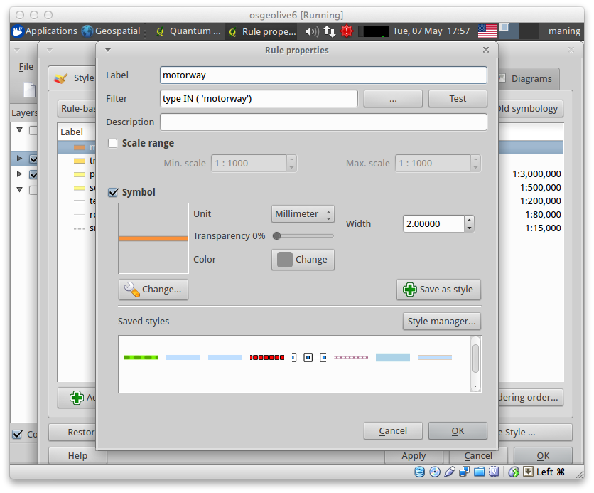

5. Create custom styles for the other layers 
in your project.

:index:`Using the Labeling Tool`  
,,,,,,,,,,,,,,,,,,,,,,,,,,,,,,,,,,,,,,

The Labeling tool provides smart labeling for vector point, line and polygon 
layers and only requires a few parameters.

Select the ``Roads`` layer. Open the labeling plug-in, in the Menu, select 
:menuselection:`Layer -->` 
|mActionLabeling| :guilabel:`Labeling`.

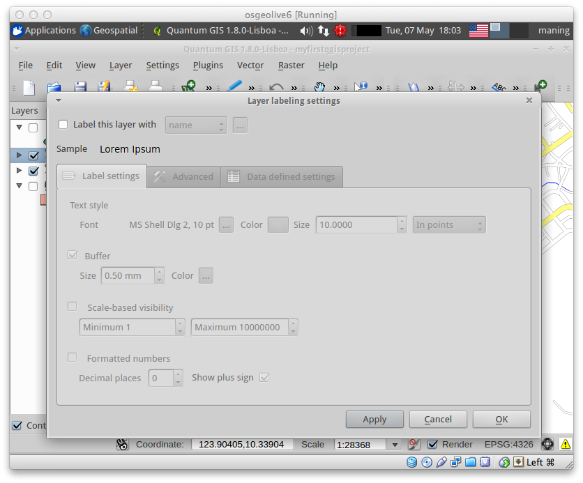

A new window will appear for the :guilabel:`Layer labeling settings`. Mark the 
following options shown in the screenshots below:

.. image:: images/smart_label_properties.png
   :align: center
   :width: 300 pt

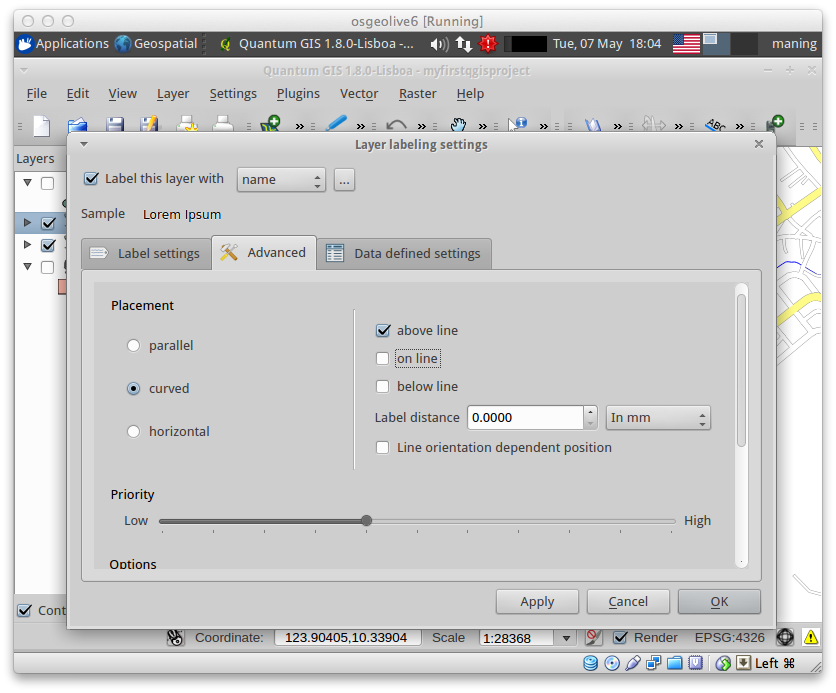

Select :guilabel:`OK`. The label for ``Roads`` should be placed above the road 
line. As you pan around the map, you'll find that labels are placed nicely.

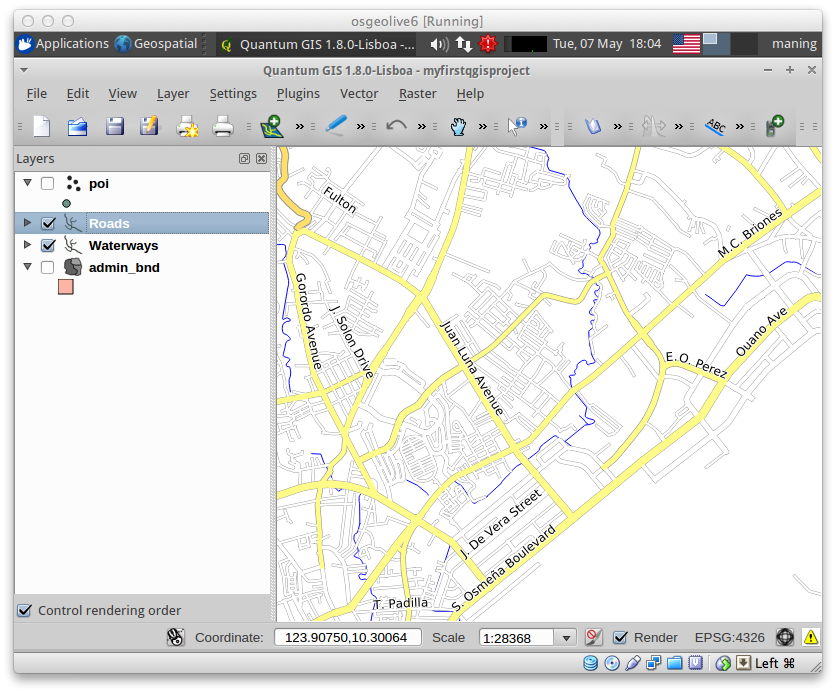

Other tips
-----------

:index:`Map Overview` 
,,,,,,,,,,,,,,,,,,,,,,,,,,
  
The map overview panel provides a full extent view of layers added to it. 
Within this panel is a red box showing the current :guilabel:`Map View` 
extent. This allows you to quickly determine which area of the map you are 
currently viewing.

To activate the :guilabel:`Map Overview`, in the Menu, select 
:menuselection:`View -->` 
:menuselection:`Panels -->` 
:menuselection:`Overview`. 
A new panel will be added below the :guilabel:`Map Legend` 
(no map is displayed at the moment).

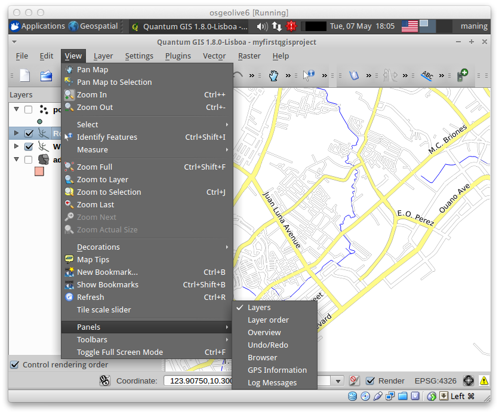

Select any layer, then right-click and select 
:guilabel:`Show in Overview`.

The selected layer should appear in the 
:guilabel:`Overview` panel.

.. image:: images/overview_panel.png
   :align: center
   :width: 300 pt

You can also add more layers or remove them. If you click and drag the red 
rectangle in the overview that shows your current extent, the main 
:guilabel:`Map View` will update accordingly.

.. warning::
   Do not add too many layers into the :guilabel:`Overview` panel, this can 
   slow down rendering of the overview map.

:index:`Line and Area Measurements`  
,,,,,,,,,,,,,,,,,,,,,,,,,,,,,,,,,,,,,,,,

To interactively measure length and area, use the:

* |mActionMeasure| :guilabel:`Measure Line`
* |mActionMeasureArea| :guilabel:`Measure Area` 

The tool then allows you to click points on the map. Each segment-length as 
well as the total shows up in the measure-window. To stop measuring click 
your right mouse button. Areas can also be measured. The accumulated 
area-size will be visible in the measure window.

.. warning::
   Length and area results inherit the default projection and ellipsoid units! 
   If you are using the Decimal Degrees (which is the case in our current 
   project) as the layer units, the length and area results will be in decimal 
   degrees as well.

Importing Image  
,,,,,,,,,,,,,,,,,,,,,,,,
 
In the Menu, select :menuselection:`File -->` 
|mActionSaveMapAsImage| :guilabel:`Save as image`.

Select your preferred filename and image type. Click :guilabel:`Save`. You now 
have you first map image which you can add in any document or report.

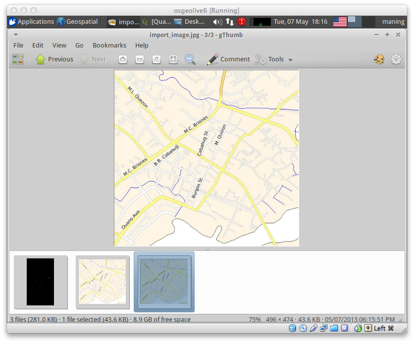

Save your project. 
,,,,,,,,,,,,,,,,,,,,,,,

To save your project, select 
:menuselection:`File -->` 
:guilabel:`Save Project`.

.. tip::
   It is good practice to save your project after every major editing activity. 
   Make sure you save your project frequently. Or better, practice the keyboard 
   shortcut to save projects: :kbd:`Ctrl + S`.

.. raw:: latex
   
   \pagebreak[4]
