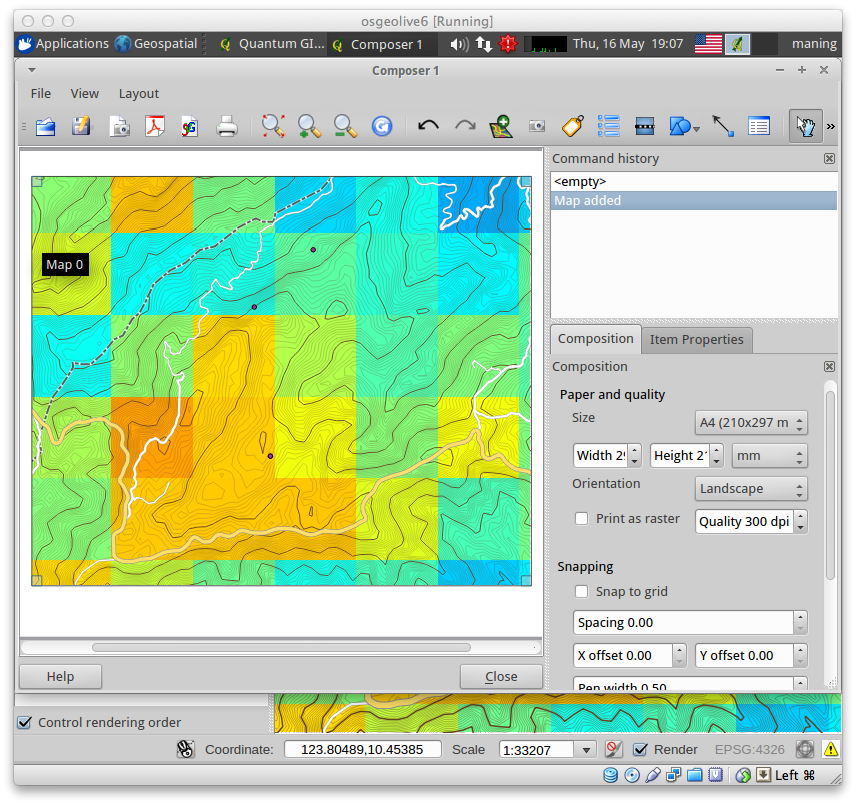
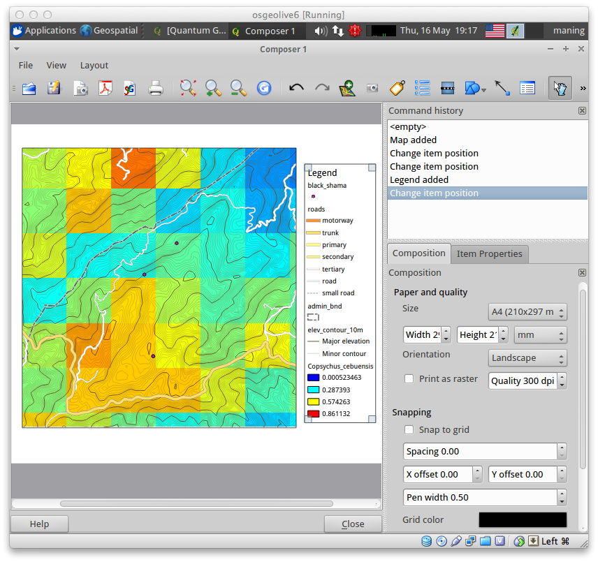

=========================================
Map Design with :index:`Print Composer`
=========================================

.. Note: add more screenshots

This exercise will show you the basic map layout capabilities of QGIS. It will 
simply show how to use the provided tools. Designing maps requires a series of 
review and evaluation of the map message, intended readers and a balance of 
applying cartographic rules and violating them! Any state-of-the-art GIS 
application cannot compensate for a good map design.

It is assumed that you have prepared the data layer symbology in main QGIS 
application before using the print composer.

Before we begin, a list of commonly used pieces of a map layout is explained 
succinctly by `Krygier and Wood's Making Maps <http://makingmaps.owu.edu/>`_ book.

**Elements of a typical map layout**

* **1. Title** - map titles vary, but should attempt to include the what, where 
  and when of the map. Type size should be 2 or 3 times the size of the map type 
  itself. A subtitle, in smaller type, is appropriate for longer or more complex 
  map subjects.

* **2. Legend** - this is the key to interpreting the map. If it fails, your 
  goals for the map will fail. However, don't insult your map's readers by 
  including obvious symbols in the legend.

* **3. Scale** - large- and medium-scale maps should include a scale indicator, 
  particularly if readers need to make measurements in the map. If your map's 
  users want to reduce or increase the size of the map the visual scale is the 
  best option (it will remain accurate even if scaled). Small-scale maps (of the 
  entire earth or substantial portion of it) should not include a simple visual 
  scale because such maps contain substantial scale variations.

* **4. Explanatory text** - you may not be able to  express everything you need 
  your map's readers to understand with the map itself. Use text blocks on the 
  map to communicate information about the map content, its broader context, and 
  your goals. Explain your interpretations of your map's patterns with text: tell 
  your map's readers (in addition to showing them with the map) what you think 
  about the mapped data. Readers may agree or disagree with your interpretation, 
  but your interpretation and intent will be clearly communicated.

* **5. Directional indicator** - only needed if: 1) the map is not oriented to 
  the north; 2) the map is of an area unfamiliar to your intended audience. 
  Directional indicators can often be left off the map. If included, avoid large 
  and complex directional indicators: they are relatively unimportant and should 
  not be visually prominent.

* **6. Sources, credits** - each map should include: data source(s), map maker 
  and date when it was made, map projection and coordinate system information.

* **7. Border** - a border drawn around the map, title, legend scale, and 
  directional indicator to put together your map. If you add a border, make it 
  narrow, preferably in grey: so that it won't be too noticeable.  Or, a border 
  may not be necessary. 

Print Composer Interface
--------------------------

To open the :guilabel:`Print Composer`, select :menuselection:`File -->` 
|mActionNewComposer| :guilabel:`New Print Composer`.

Opening the :guilabel:`Print Composer` provides you with a blank canvass. The 
components of the map composer are explained below:

* **1. Menu and Toolbar** - all tools for adding and arranging map elements, 
  map navigation, export options.

* **2. Map Canvass** - where you compose your map.

* **3. Composition** and **Item Properties** tabs and **Command history** window - 
  where you customize various rendering option for your map elements. The 
  :guilabel:`Composition` tab allows you to set paper size, orientation, output 
  file resolution and other printing options. The :guilabel:`Item Properties` tab 
  displays properties for the selected map element. Click |mActionSelectPan| 
  :guilabel:`Select/Move item` to activate options of the element in the 
  :guilabel:`Item Properties` tab. 

:index:`Adding a map`
-------------------------

To add the QGIS map canvas, click the |mActionAddMap| :guilabel:`Add Map` 
from toolbar and drag a rectangle on the map canvas with the left mouse 
button to add the map.

 
General options for the :guilabel:`Map Item Properties` tab are as follows:

* **Map Dialog** - the :guilabel:`Preview` defines preview modes either 
  :guilabel:`Cache`, :guilabel:`Render`, and :guilabel:`Rectangle`. The 
  :guilabel:`Map` dialog allows you to resize the map according to width, height or 
  scale. You can also set map :guilabel:`Rotation` in degree increment clockwise. 

* **Extents Dialog** - map extents area allows you to specify the map extent using 
  Y and X min/max values (depending on your project's CRS) or clicking the 
  :guilabel:`Set to map canvass extent` button. Click the 
  :guilabel:`Update preview` in the :guilabel:`Map` dialog if you changed the view of your map in the main 
  :guilabel:`Map View` of QGIS.

* **Grid dialog** - allows option to add or disable grid in the map. You can 
  specify grid type (line or cross), increment, annotation, colors and font types.

.. image:: images/add_new_map_grid.png
   :align: center
   :width: 150 pt

* **General options dialog** - you can define color and outline width for the 
  element frame, set a background color and opacity for the map item. 

.. image:: images/add_new_map_general.png
   :align: center
   :width: 150 pt

:index:`Adding a Legend`
--------------------------

Click the |mActionAddLegend| :guilabel:`Add Legend` for the legend.

**Legend Item Tab Properties**

* **General dialog** - you can specify legend title, font and colors, legend 
  symbol size and spaces. 

* **Legend items dialog** - you can specify changing item order, edit layer 
  names, remove and restore items of the list. 

* **General options dialog** - define color and outline width for the element frame, 
  set a background color and opacity for the map canvas. 

.. tip::
   While you can change legend items title and order within the 
   :guilabel:`Print Composer` :guilabel:`Legend items` dialogs, it is better to change 
   them within the main QGIS :guilabel:`Map Legend` view. This is very useful 
   especially when your are creating several map layouts of the same data layers.

:index:`Adding a Scale Bar`
-------------------------------

Click the |mActionScaleBar| :guilabel:`Add Scalebar` for the scale bar.

:guilabel:`Scalebar` options allow you to specify segment size, bar units, 
style, height and width, scale bar units, font and other options.

Title and other text boxes
----------------------------

Click the  |mActionLabel| :guilabel:`Add Label` for various elements. You 
can specify font type, size and colors. Use this tool for adding title and other 
explanatory text.

Other options
--------------

:guilabel:`Print Composer` offers additional layout tools similar to other drawing 
applications.  Among these are:

* |mActionAddBasicShape| adding basic shape (useful for borders and frames);

* |mActionRaiseItems| element render ordering (raise or lower element draw order);

* |mActionAlignLeft| aligning several elements;

* |mActionGroupItems| grouping and |mActionUngroupItems| ungrouping elements and;

* |mActionAddImage| adding external images (useful for adding logos and photos).

Explore these tools in composing your map. Full descriptions are available in 
the QGIS manual.

:index:`Exporting your final map`
--------------------------------------

The options for importing your maps are:

* export to image or SVG - this is useful if you want your maps embedded in 
  other documents;

* print directly to a printer and;

* export as pdf.

To export your map to PDF, click the |mActionSaveAsPDF| :guilabel:`Export as PDF` 
button and provide a filename in the dialog. 

 
.. raw:: latex
   
   \pagebreak[4]
