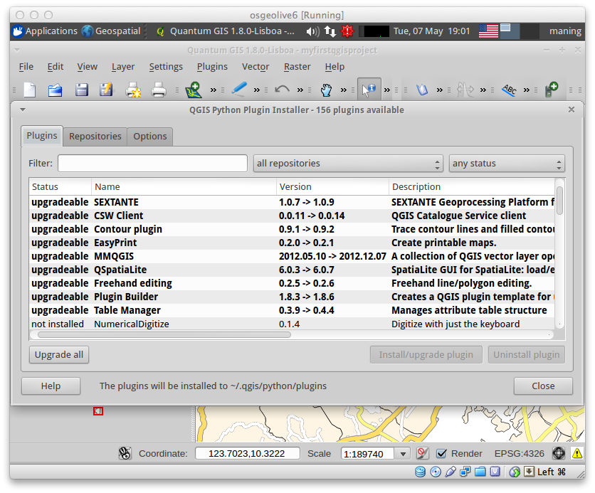
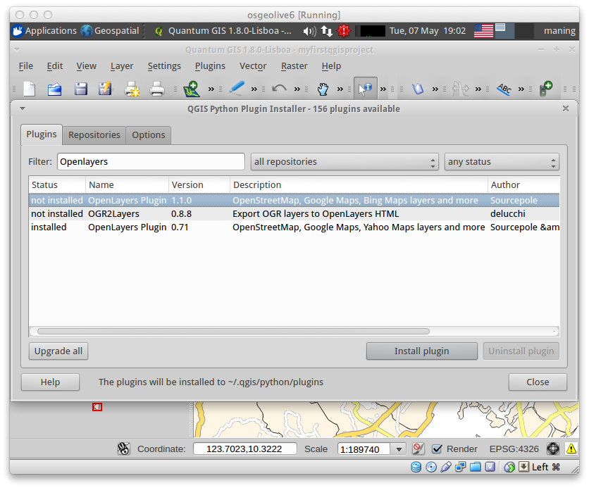

===============
QGIS Plugins
===============

QGIS was designed with a flexible and extensible plug-in architecture. This 
allows new features/functions to be easily developed and added to the 
application. Many of the features in QGIS are implemented as plug-ins. Many 
QGIS users are developing their own plug-ins and there is a wealth of plug-ins 
available in the QGIS website.

* **Core Plug-ins** are maintained by the QGIS Development Team and are 
  automatically part of every QGIS distribution.
* **External Plug-ins** are currently all written in Python. They are stored in 
  external repositories and maintained by the individual authors. 

.. note::
   You	need a working Internet	connection to download and update plugins.

Add new plugins using Python Plugin Installer 
-----------------------------------------------

1. In order to download and install an external Python plugin, click the menu 
:menuselection:`Plugins -->` |plugin_installer| 
:guilabel:`Fetch Python Plugins`
. 

2. Click the :guilabel:`Repositories` 
tab.

.. image:: images/plugin_repotab.png
   :align: center
   :width: 300 pt

**Repositories Tab** - contains a list of plugin repositories available. By 
default, only the QGIS Official Repository is enabled. You can add several 
user-contributed repositories, including the central QGIS Contributed 
Repository and other external repositories by clicking the 
:guilabel:`Add…` button and providing the repository details. 

.. verify if this repor is still working

3. Click the :guilabel:`Add…` button. In the :guilabel:`Name` field, type 
``QGIS Contributed Repository`` and type ``http://pyqis.org/repo/contributed`` 
in the :guilabel:`URL` field. Click :guilabel:`OK` to access the repository.

4. Go back to the list of plugins by clicking the 
:guilabel:`Plugins` tab.

**Plugins tab** - this tab list all available plugins.  Each plugin can be 
either: 

* **not installed** - the plugin is available in the repository, but is not 
installed yet. 
 
* **new** - the plugin is newly available in the repository. 

* **installed** - the plugin is already installed. If it is also available 
in any repository the :guilabel:`Reinstall plugin` button will be enabled.  

* **upgradeable** - the plugin is installed, but there is an updated version 
available. In this case, the :guilabel:`Upgrade plugin` button will be enabled.

* **invalid** - the plugin is installed, but is unavailable or broken. The 
reason will be explained in the plugin description field.  

5. Find and select the :guilabel:`Openlayers Plugin` in the list.  Click 
:guilabel:`Install plugin` button.

6. Do this for the following plugins 
as well::

      fTools
      Shaded Relief
      
7. Once installed, close the 
:guilabel:`Python Plugin Installer` window.

Loading the Plugins
--------------------

1. Open the Plugin manager by selecting :menuselection:`Plugins -->` 
|mActionShowPluginManager| :guilabel:`Manage Plugins`. 

The :guilabel:`Plugin Manager` lists all the available plug-ins and status 
(loaded or unloaded), including all core plug-ins and all external plug-ins 
that have been installed and automatically activated using the Python Plugin 
Installer. Plug-ins that are already loaded have a check mark to the left of 
the name.

2. Activate/enable the plugins by clicking its check box or 
description.  

.. image:: images/plugin_manager.png
   :align: center
   :width: 300 pt

If not yet enabled, select the following plugins in your list::

      Openlayers Plugin
      Add Delimited Text Layer
      fTools

3. You maybe prompted to restart QGIS, close then open 
QGIS.

.. warning::
   In some cases, 3rd party plug-ins (external plug-ins developed by other 
   users) can be unstable and can cause your QGIS instance to crash. These 
   plug-ins were designed for specific usage of the authors and may not work 
   as expected in your own system. Use experimental plug-ins at your own risk!

.. raw:: latex
   
   \pagebreak[4]
