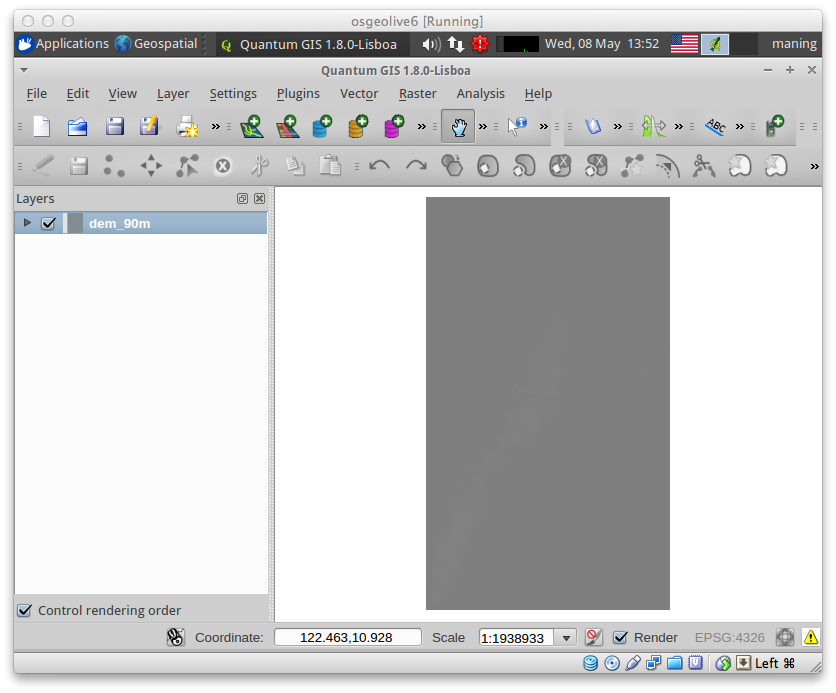
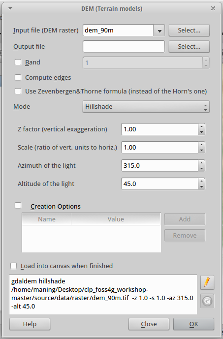

.. draft
.. todo: add screenshots

===========================
Using and Styling Rasters
===========================

QGIS can also display and manipulate raster data.  These are available in 
:menuselection:`Raster` menu. In this section, we will customize the style 
of our Terrain or Digital Elevation Model (DEM) using the custom symbology and,
create new raster and vector from the DEM.

.. note::
   A **Raster** data is composed of rows (running across) and columns 
   (running down) of pixels (also know as cells). Each pixel represents a 
   geographical region, and the value in that pixel represents some 
   characteristics of that region.

   Images with a pixel size covering a small area are called 'high resolution' 
   images because it is possible to make out a high degree of detail in the 
   image. Images with a pixel size covering a large area are called 
   'low resolution' images because the amount of detail the images show is low.

   Some raster data have two files included.  For example, a file with the 
   `tif` extension is the image and the file with the extension `tfw` 
   is the world file.  `World files <http://en.wikipedia.org/wiki/World_file>`_ 
   describe the location, scale and rotation of the map. 
   By adding a world file in any image, GIS applications can read 
   and georeference almost any image. However, the world file does not give 
   the proper coordinate reference system of the raster. In QGIS, you have to 
   properly set the CRS for raster with world file.

:index:`Loading a raster layer`
-----------------------------------

1. Open your previously created QGIS project/session or create a new 
project.

2. Add the DEM raster.  Select :menuselection:`Layer -->` 
|mActionAddRasterLayer| :guilabel:`Add Raster Layer` and load the 
``dem_90m.tif``.  Click :guilabel:`OK`.

When the DEM is first loaded, it may appear as an entirely black square with 
some slight grayish colors showing up in some locations.  This can be fixed by 
adjusting the stretch of the contrast enhancement to scale the shades of black 
and white to the values found within the data.  

3. To adjust the contrast enhancement, select the ``dem_90m.tif``, 
right-click and select :guilabel:`Properties`.  

4. In the :guilabel:`Style` tab, change the :guilabel:`Current` value of 
:guilabel:`Contrast Enhancement` from `No Stretch` to 
`Stretch And Clip to MinMax`.  In the 
:guilabel:`Load min/max values from band`, click the :guilabel:`Load` button.

This takes the minimum  and maximum value found within the data, and stretches 
the black to white gradient between the two values.  

A typical black to white gradient allows for 256 different levels of 
brightness, and stretching these 256 shades between the Min and Max 
values allows you to clearly view the different topography in the 
DEM data.

.. image:: images/dem_symbology.png
   :align: center
   :width: 300 pt

5. Click :guilabel:`Apply` and :guilabel:`OK` to improve the contrast of 
the layer.

.. image:: images/dem_enhanced.png
   :align: center
   :width: 300 pt 

The enhanced contrast of layer shows a wide variation of pixel 
brightness values across the grid area, with dark black pixels representing 
areas of low elevation and bright white pixels representing areas of high 
elevation. To get the values for each pixel, use the |mactionIdentify| 
:guilabel:`Identify` button.

.. note::
   :index:`Terrain` data is one of the most important data used in geospatial 
   analysis.  At the basic level, a terrain or surface is represented 
   as: given a location (X,Y), the height or elevation (Z) is computed 
   from a specific reference point.  
   
   Terrain data are represented in several of ways.  Depending on the 
   data source, it can be a set of points (Spot elevation) or lines 
   (:term:`Contour`).  Within GIS, these data are modelled either as 
   regular grids (known as 
   :term:`Digital Elevation Model` or 
   :term:`Altitude matrix`) or 
   :term:`Triangular Irregular Network (TIN)`.

:index:`Using a custom color map for rasters`
--------------------------------------------------

1. To use a custom color ramp for rasters, select the ``dem_90m.tif``,
right-click and select :guilabel:`Properties`. 

2. In the :guilabel:`Style` tab, choose :guilabel:`Colormap` in the 
:guilabel:`Color map` drop-down list.

3. To assign a new colormap, click the :guilabel:`Colormap` tab.  
Choose :guilabel:`Linear`
in the :guilabel:`Color interpolation` drop-down list.

.. todo: edit the dem.qml to use the full  range of values from the dem.

4. Click the :guilabel:`Load style ...` and use the ``dem.qml`` file in your 
``data/styles`` directory.

5. You can also adjust the layer transparency in the 
:guilabel:`Transparency` tab.

6. Finally, hit the :guilabel:`OK` to view the styled DEM in the 
:guilabel:`Map View`.

Loading the GDALTools plugin
-----------------------------------

1. Open the Plugin manager by selecting :menuselection:`Plugins -->` 
|mActionShowPluginManager| :guilabel:`Manage Plugins`. 

2. Activate/enable the :guilabel:`GDALTools` plugin 
by clicking its check box or description.  

:index:`Creating a shaded relief`
----------------------------------

With the GDALTools plugin, we will create a new relief layer using our DEM.

1. To create a new relief layers, select 
:menuselection:`Raster --> Analysis -->` 
|gdal_dem| :guilabel:`DEM (Terrain Models)`.  

A new window will appear for the 
:guilabel:`DEM (Terrain Models)` options.

2. In the :guilabel:`Output file`, click :guilabel:`Select` and create 
a new layer as ``shade.tif``.

3. In the :guilabel:`Mode`, select the :guilabel:`Hillshade` from the 
drop-down list.

4. Since we are using geographic coordinate system, we use a scale value of 
``111120``. Type this value in the :guilabel:`Scale` field.  We leave the 
other values to the default settings.

5. Put a check-mark in the 
:guilabel:`Load into canvas when finished`.  

6. Finally, click the :guilabel:`OK` to begin the process.
Close the GDALTools window when processing is completed. 

7. Move the shade layer below the dem layer to create shaded 
relief effect of the rendering.

The Shaded relief results provides the most visually appealing display of the 
DEM data. This analysis uses a fixed location of the sun and the horizon to 
accurately display areas of bright sun exposure as well as low dark areas that 
contain lots of shadow. Typically a shaded relief will be used in presentation 
of 3D GIS analysis as a thematic background layer that provides the user with 
pretty looking cartographic representation.

.. tip::
   You can improve vertical exaggeration of the output hillshade by 
   increasing the :guilabel:`Z Factor` value. A :guilabel:`Z Factor` 
   of ``5`` to ``7`` increases 
   the relief texture of the flatter areas.  

8.  Save you QGIS 
project.

:index:`Creating a vector contour`
-----------------------------------

We can also extract elevation contour lines from our DEM.

1. To extract contour lines, select 
:menuselection:`Raster --> Extraction -->` 
|gdal_contour| :guilabel:`Contour`.  A new window will appear 
for the :guilabel:`Contour` options.

2. In the :guilabel:`Output directory for contour lines`, click 
:guilabel:`Select` and type ``elev_contour_20m`` in the 
:guilabel:`File name`.

3. Put a check-mark in the :guilabel:`Attribute name` and add ``elev`` 
(the default label was in upper-case, change it to lower-case) as the 
attribute name column.  

4. Put a check-mark in the 
:guilabel:`Load into canvas when finished`.  

5. Finally, click the :guilabel:`OK` to begin the process.
Close the GDALTools window when processing is completed.  

6. Improve on the look of your map by exploring the other style and 
symbology options. Save your project.

.. raw:: latex
   
   \pagebreak[4]
