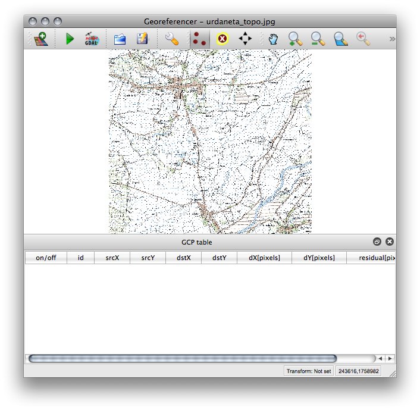

=========================
Rectifying Raster Data
=========================

.. change screenshots and sample data sto SouthCot

Georeferencing also known as `Rectification` is a process of defining the 
real world location of a set of data.  In GIS, when data from different sources 
need to be combined and then used, it is important to have a common referencing 
system.

This is used in both vector and raster GIS data.  Reference information can 
come from several sources such an existing reference map, GPS readings, etc; 
this commonly referred to as `Ground Control Point` or GCP.  Most 
georeferencing tasks are undertaken either because the user wants to produce a 
new map or because they want to link two or more different datasets together by 
virtue of the fact that they relate to the same geographic locations. 

We will use the Georeferencer Plugin in QGIS to reference rasters to geographic 
or projected coordinate systems by creating a new raster.

Creating a new project
-----------------------

1. Open QGIS and create a new project. In the menu, select 
:menuselection:`File -->` |mActionFileNew| 
:guilabel:`New Project`.

2. Open :guilabel:`Project Properties` and click the 
:guilabel:`Coordinate Reference System (CRS)` tab. Set the following options.

* Check the :guilabel:`Enable 'on-the-fly' CRS Transformation`.
* In the Coordinate Reference System, choose ``Luzon 1911`` or ``EPSG:4253``. 

Loading Vector data
---------------------

1. Open your ``roads.shp`` vector.  Improve the symbology of the road 
vector.  The road layer in the main :guilabel:`Map Canvass` will be used to 
get the georeferenced points.

Georeferencing images
-----------------------

Load the unreferenced image
,,,,,,,,,,,,,,,,,,,,,,,,,,,,,,

1. Load the Georeferencer plugin, click  
:guilabel:`Plugins --> Georeferencer --> Georeferencer`.

2.  Load the image file that will be rectified.  Within the Georeferencer 
<<<<<<< HEAD
window, click |mActionAddRasterLayer| 
=======
window, click 
.. mActionAddRasterLayer| 
>>>>>>> b481565... commented missing icon
:guilabel:`Open Raster` the image map.  
Select the ``nb51-7.jpg``, click `OK`. 

3.  A new window will appear for the :guilabel:`CRS` of the raster layer, 
select ``Luzon 1911`` or ``EPSG:4253``, click :guilabel:`OK`. 

The raster will show up in the main working area of the dialog. Once the raster 
is loaded, we can start to enter reference points.

4. Adjust the size and location of both the georeferencer window and the main 
QGIS map view.  Similar to the image below:

Add control points
,,,,,,,,,,,,,,,,,,

1. Using the |mActionCapturePoint| 
:guilabel:`Add Point button`, add a point to 
the main working area.  Click on a point in the raster image and click the 
button :guilabel:`From map canvas` to add the X and Y coordinates with the help 
of a georeferenced map already loaded in the QGIS map canvas. Use the zoom and 
pan to navigate around the map in the Georeferencer and main Map Canvass.

.. tip::
   When selecting GCPs, it is best to choose points from across the image, 
   balancing the distribution as much as possible; this will increase the 
   positional accuracy.  Since we are using the river data in this exercise, it 
   is best to use river junctions as your GCPs.

2. Continue entering points. You should have at least 4 points, and the more 
coordinates you can provide, the better the result will be. There are additional 
tools on the plugin dialog to zoom and pan the working area in order to locate a 
relevant set of GCP points. 

.. image:: images/georef_points_all.png
   :align: center
   :width: 300 pt

.. note::
   The points that are added to the map will be stored in a separate text file 
   ([filename].points) usually together with the raster image. This allows us 
   to reopen the Georeferencer plugin at a later date and add new points or 
   delete existing ones to optimize the result. The points file contains values 
   of the form: ``mapX, mapY, pixelX, pixelY``. 

   You can use the :guilabel:`Load GCP Points` and :guilabel:`Save GCP Points` 
   buttons to manage the files. Within the GCP table you can click on a column 
   header and therewith enable e.g. numerical sorting. The GCP list is 
   automatically updated. 

Defining the  transformation settings 
,,,,,,,,,,,,,,,,,,,,,,,,,,,,,,,,,,,,,,

After completing the selection of GCPs, we will define the transformation 
settings for the georeferencing process.  Various options are available and the 
determination of the appropriate settings will depend on the source of input 
data, number of GCPs and the ultimate objective of the exercise.

.. need more explanation

* Transformation type - Depending on how many ground control point you have 
  captured, you may want to use different transformation 9algorithms. Choice of 
  transformation algorithm is also dependent on the type and quality of input 
  data and the amount of geometric distortion that you are willing to introduce 
  to final result.

* `Resampling` method - this is the process of geometrically transforming 
  digital images.  Different resampling methods can provide varying degree of 
  "image" quality of the output.
 
* Compression - for very large images, you can define a compression option to 
  reduce the file size.

* Target resolution - the pixel resolution of the output raster.

1.  To define the transformation settings, click |mActionOptions| 
:guilabel:`Transformation settings`.  In the :guilabel:`Transformation setting` 
window, select the following options::

      Transformation type - Helmert
      Resampling method - Nearest neighbhor
      Compression - LZW
      Target resolution - keep it unchecked.
      Output raster - nb51-7_modified
      Target SRS - Luzon 1911

You can optionally generate a pdf map and also a pdf report. The report includes 
information about the used transformation parameters. An image of the residuals 
and a list with all GCPs and their RMS errors. 

 
Starting the georeferencing 
,,,,,,,,,,,,,,,,,,,,,,,,,,,,

1. After all GCPs have been collected and all transformation settings are 
defined, just press the button :guilabel:`Start georeferencing` to create the 
new georeferenced raster. 

2. The georeferenced image should be loaded into your map canvass.  If the 
output raster is mis-aligned, You can adjust the GCPs and re-run the process.

.. raw:: latex
   
   \pagebreak[4]
