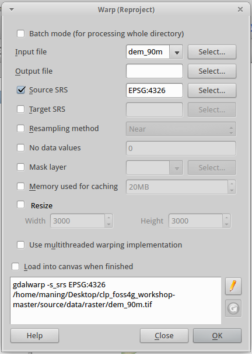
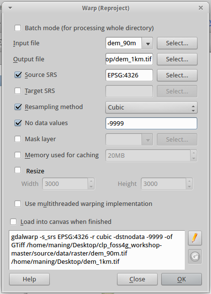
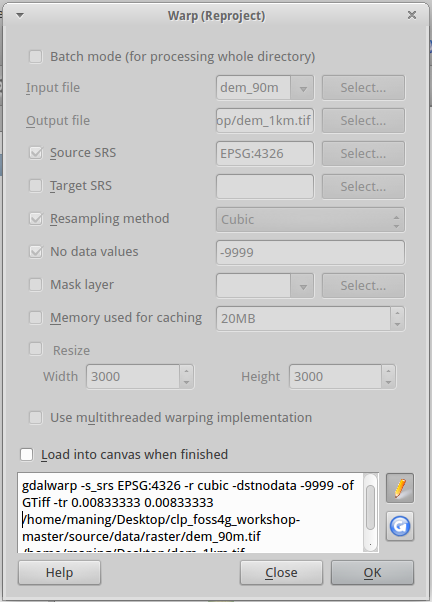
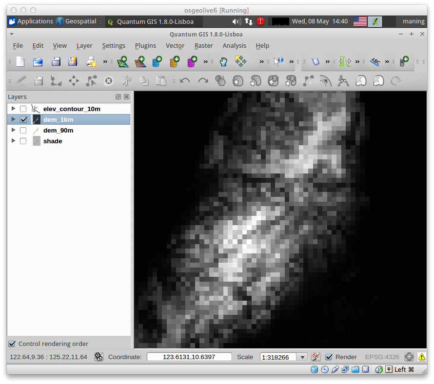
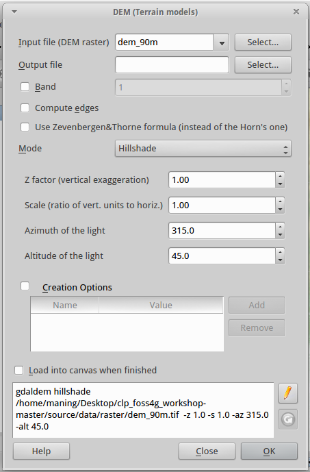
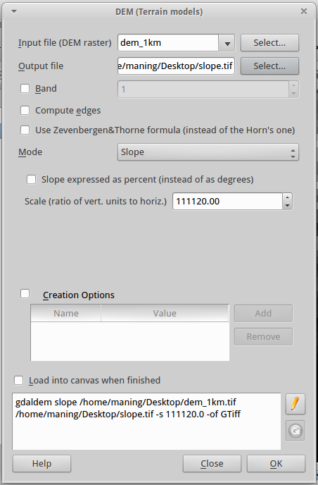
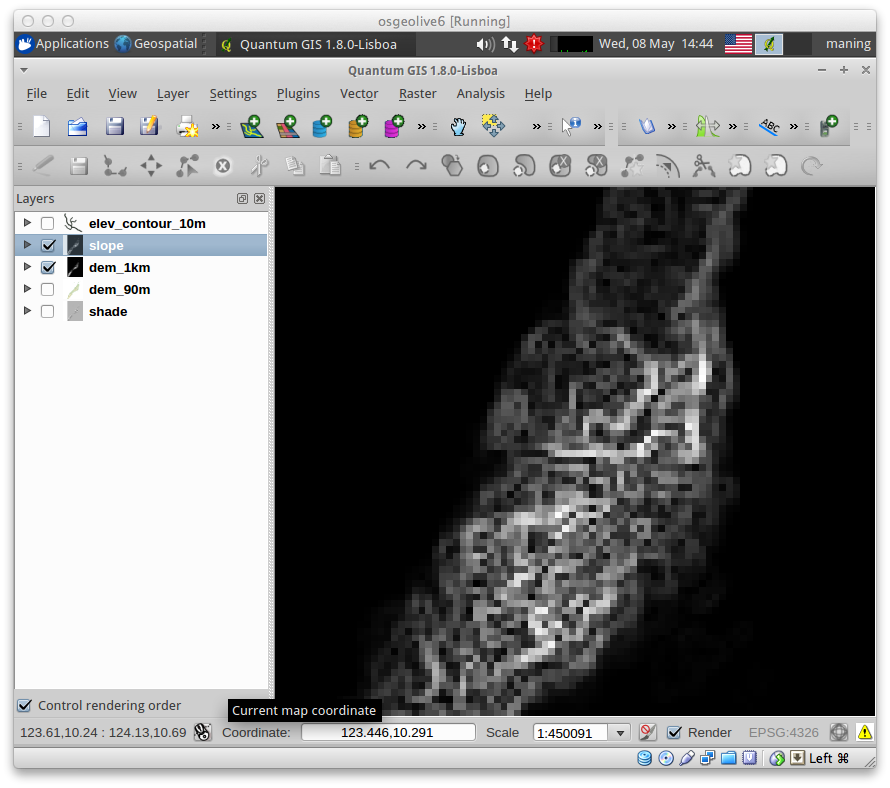
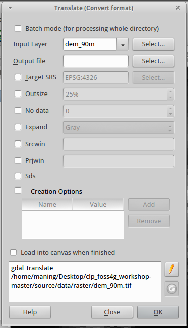
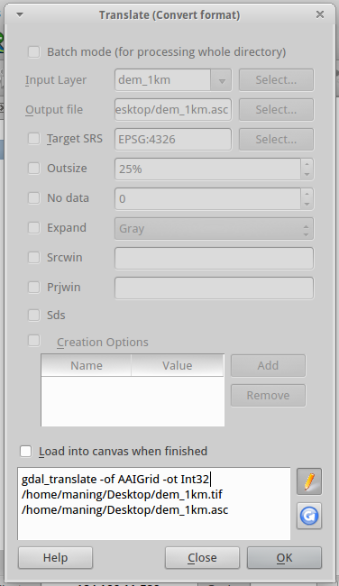

.. draft
.. add screenshots

============================================
Creating New Raster Layers with GDALTools
============================================

The GDALTools plugin offers a GUI to the collection of tools in the 
Geospatial Data Abstraction Library, http://gdal.osgeo.org . 
These are raster management tools to query, re-project, warp and merge a 
wide variety of raster formats. 

In this section, we will use several tools in the GDALTools plugin to 
resample, create new layers and convert rasters to another format. 

:index:`Resampling raster layers`
----------------------------------

The elevation layer we are using has a pixres of ~90 meters (0.000848 in 
decimal degrees) . We will convert the data to 1 km or (0.00833333 decimal 
degrees) similar to the other raster layers.

.. note::
   **Resampling** is a technique for transforming raster image from one particular 
   scale and projection to another. 

1. In the Menu, select :menuselection:`Raster --> Projections >` 
|gdalwarp| :guilabel:`Warp (Reproject)`.

2.  In the :guilabel:`Warp (Reproject)` window add the following 
parameters::

      Input file - dem_90m.tif
      Output file - dem_1km.tif 
      Target SRS - EPSG:4326
      Resampling method - Cubic
      No data values - -9999

3. The default `Warp` GUI does not include the pixel resolution resampling option.  
In order to add the pixel resolution settings we will edit the syntax shown at the 
bottom of the window.  Click the 
|gdaledit| :guilabel:`Edit` button.  

4.  Add the text ``-tr 0.00833333 0.00833333`` right after the ``GTiff`` command.

The full syntax is shown below (the path to the directories may vary depending on 
where you saved your ``data`` directory)::

      gdalwarp -s_srs EPSG:4326 -t_srs EPSG:4326 -r cubic -dstnodata -999 
      -of GTiff -tr 0.00833333 0.00833333 
      ~/data/raster/dem_90m.tif 
      ~/data/raster/dem_1km.tif
    
5.  Put a check-mark in the 
:guilabel:`Load into canvas when finished`.  
Click :menuselection:`OK --> Close`.

6.  Perform contrast enhancement 
similar to the previous section.

:index:`Creating a slope layer`
----------------------------------

With the GDALTools plugin, we will a new slope layer using our DEM.

1. To create a new relief layers, select 
:menuselection:`Raster --> Analysis -->` 
|gdal_dem| :guilabel:`DEM (Terrain Models)`.  

A new window will appear for the 
:guilabel:`DEM (Terrain Models)` options.

2. In the :guilabel:`Input file`, select ``dem_1km.tif`` in the 
drop-down box.

2. In the :guilabel:`Output file`, click :guilabel:`Select` and create 
a new layer as ``slope.tif``.

3. In the :guilabel:`Mode`, select the :guilabel:`Slope` from the 
drop-down list.

.. clarify whether we use slope as percent or degrees.

4. Put a check-mark in the 
:guilabel:`Load into canvas when finished`.  

5. Finally, click the :guilabel:`OK` to 
begin the process.

6.  Perform contrast enhancement 
similar to the previous section.

7.  Save you QGIS 
project.

.. note::
   **Slope** is used to describe the measurement of the steepness, incline, 
   gradient, or grade of a straight line. A higher slope value indicates a 
   steeper incline. The slope is defined as the ratio of the "rise" divided 
   by the "run" between two points on a line, or in other words, the ratio 
   of the altitude change to the horizontal distance between any two points 
   on the line. It is also always the same thing as how many rises in one run.
 
Convert the GeoTiff raster to ESRI ASCII Grid 
-------------------------------------------------------

1. To convert the resampled elevation data to ESRI ASCII raster, in the Menu, 
select :menuselection:`Raster --> Conversion -->` 
|gdaltranslate| :guilabel:`Translate (Convert format)`.

2. In the :guilabel:`Translate (Convert format)` window, add the following 
parameters::

      Input file - dem_1km.tif
      Output file - dem_1km.asc

.. image:: images/gdaltranslate_options.png
   :align: center
   :width: 300 pt

3. Again, we will edit the syntax shown at the bottom of the window.  Click 
the |gdaledit| `Edit` button. Change the text ``GTiff`` to ``AAIGrid``.

The full syntax is shown below (the path to the directories may vary depending on 
where you saved your ``geodata`` directory)::

      gdal_translate -of AAIGrid 
      ~/data/raster/dem_1km.tif 
      ~/data/raster/dem_1km.asc

.. Warning::
    Make sure that the output layer (i. e. ``dem_1km.asc``) is in the same 
    directory as the other raster ``.asc`` files.

4.  Repeat the above steps to convert the ``slope.tif``
to ``slope.asc``

5.  Save you QGIS project.

.. raw:: latex
   
   \pagebreak[4]
