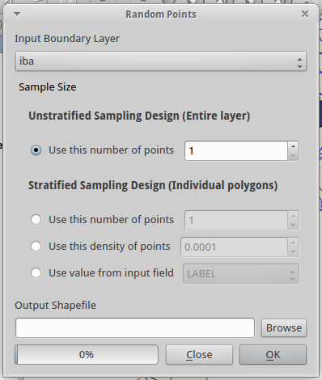
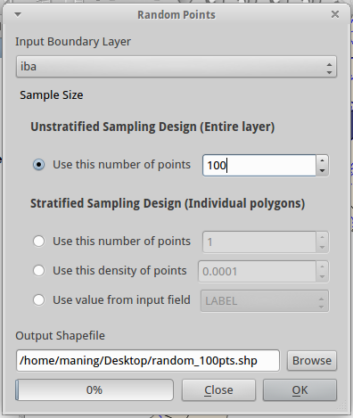
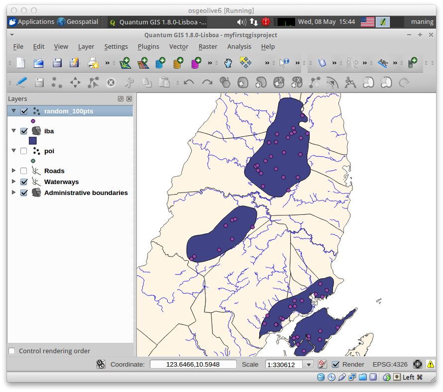
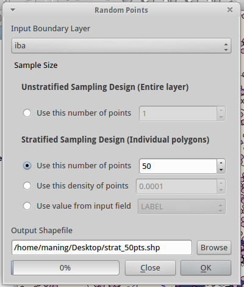
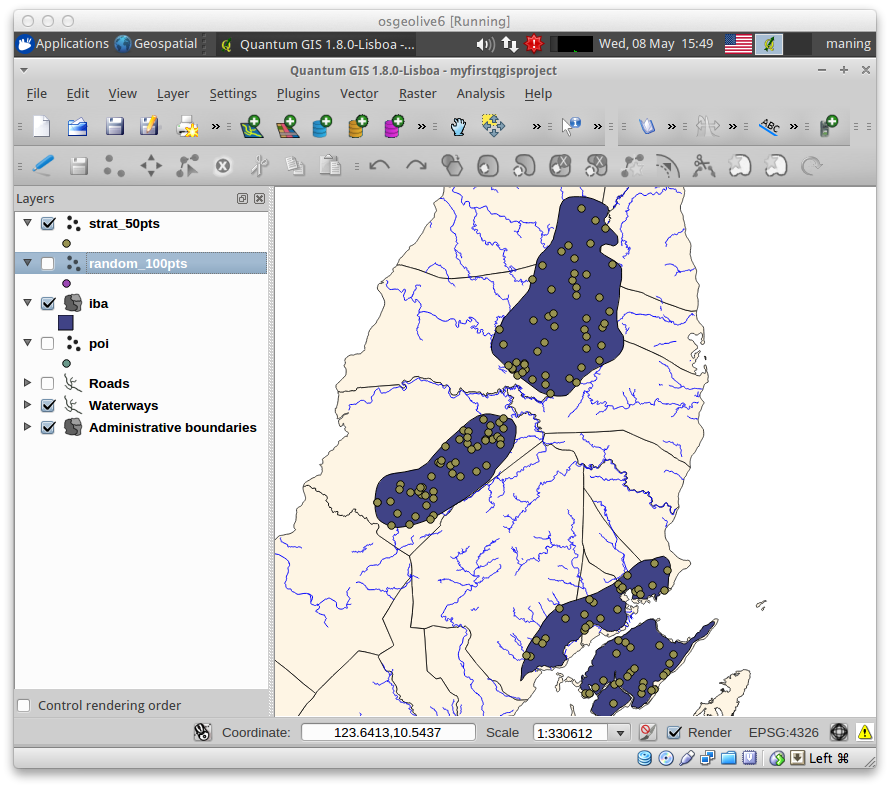

.. draft
.. todo: review by christian, add screenshots

==========================================
:index:`Creating Sampling Design in QGIS`
==========================================

.. Blurb on sampling design
.. http://en.wikipedia.org/wiki/Stratified_sampling

Random sampling of points
-------------------------------

1. Open QGIS and load the x polygon layer.  The x layer is the study area you 
will conduct the sampling, we will create a new point layer of 100 random 
points within the boundary of the polygon.

2. In the menu select 
:menuselection:`Vector --> Research Tools --> Sampling Points`.

3. Select x as your 
:guilabel:`Input Boundary Layer`.

4. Under the :guilabel:`Unstratified Sampling Design`, type ``100`` in the 
:guilabel:`Use this number of points`.

5. In the :guilabel:`Output Shapefile` click :guilabel:`Browse` and create a 
new Shapefile as ``random_100pts.shp``.  Click :guilabel:`OK`.

6. Click :guilabel:`Yes` to add the new layer to your :guilabel:`Map Canvas`. 
Click :guilabel:`Close` to close the :guilabel:`Random Points` window.

The created point layer has 100 randomly placed points within the boundary of 
the polygon.

Stratified random sampling
-------------------------------

The same tool can also create a stratified sample of points based on the input 
boundary layer. 

1. In the menu select
:menuselection:`Vector --> Research Tools --> Sampling Points`.

2. Under the :guilabel:`Stratified Sampling Design`, type ``50`` in the
:guilabel:`Use this number of points`. Click :guilabel:`OK`.

This option will create 50 points for each polygon in the input boundary layer

The :guilabel:`Use this density of points` option is for a fixed density. 
The third :guilabel:`Use value from input field` option will use the value in 
a column in your attribute table to determine the number of sample points.

3. Click :guilabel:`Yes` to add the new layer to your :guilabel:`Map Canvas`. 
Click :guilabel:`Close` to close the :guilabel:`Random Points` window.

.. raw:: latex
   
   \pagebreak[4]
