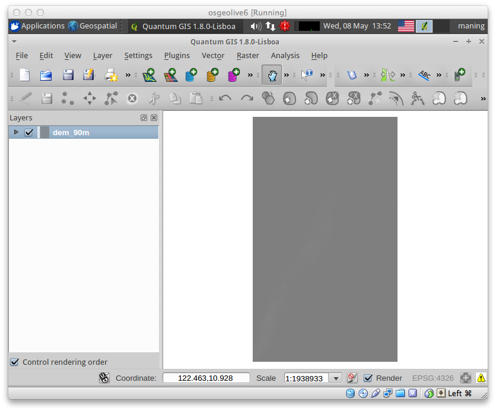
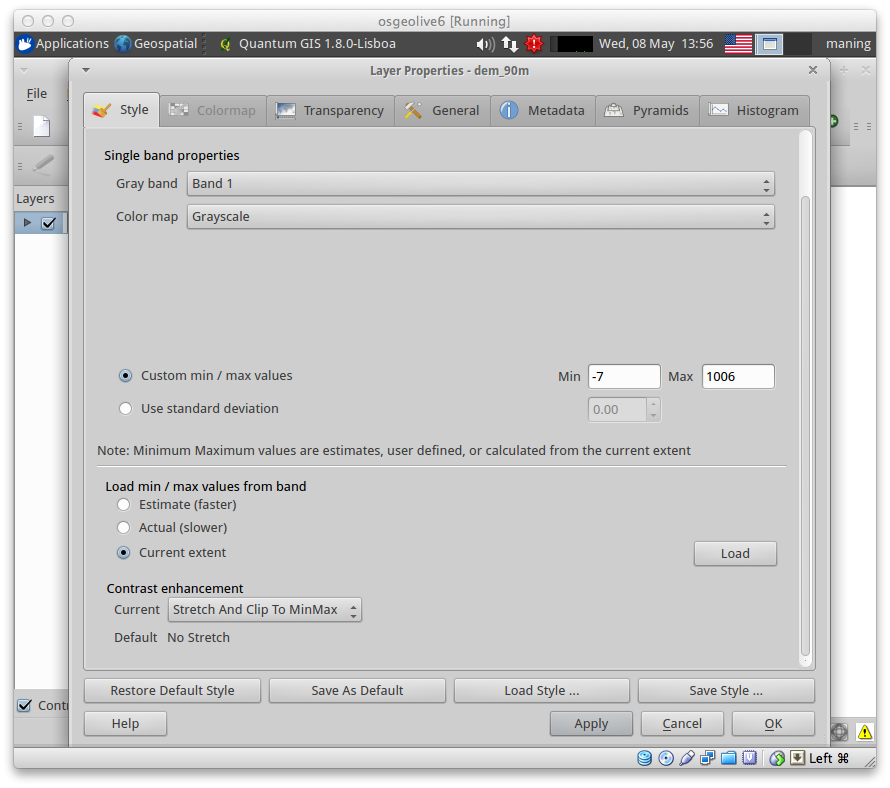
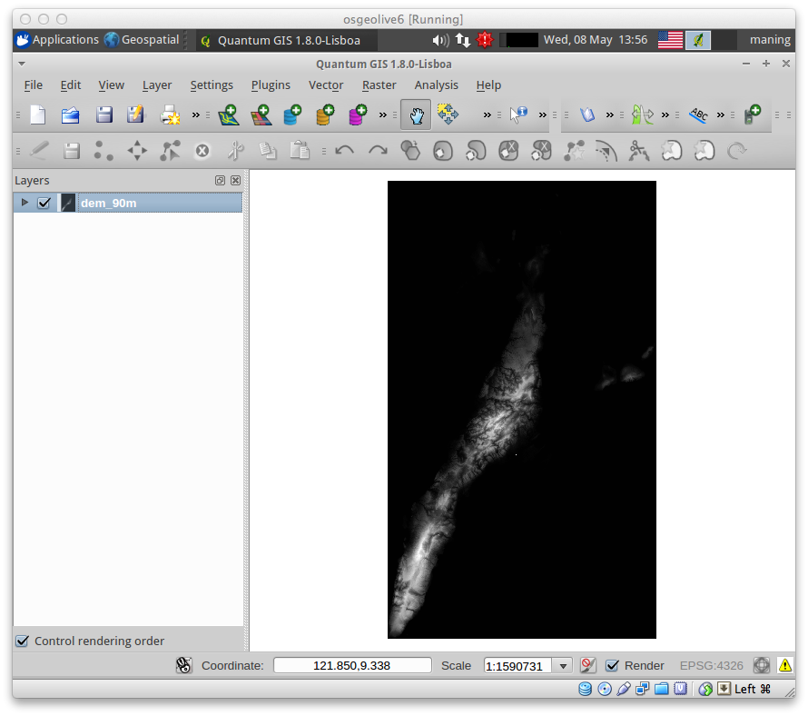

============================================================
:index:`Raster Based Terrain Analysis`
============================================================

Terrain data is one of the most important data used in geospatial analysis.  At 
the basic level, a terrain or surface is represented as: given a location (X,Y), 
the height or elevation (Z) is computed from a specific reference point.  
Terrain data are represented in several of ways.  Depending on the data source, 
it can be a set of points (Spot elevation) or lines (:term:`Contour`).  Within 
GIS, these data are modelled either as regular grids (known as 
:term:`Digital Elevation Model` or :term:`Altitude matrix`) or 
:term:`Triangular Irregular Network (TIN)`.
 
Out this type of data, we can conduct spatial analysis in a number of different 
applications. Burrough (1998) enumerated some common uses of surface data: 

* Storage of elevation data for digital :term:`Topographical map` s.
* Creation of digital and analogue :term:`Orthophoto` s maps.
* Cut and fill problems in road design and other civil and military 
  engineering projects.
* "Three-dimensional" display of landforms.
* For analysis of cross-country visibility (:term:`Witched` or line-of-sight 
  applications).
* For planning routes of roads, location of dams, etc.
* For statistical analysis and comparison of different kinds of terrain.
* Source data of derived maps of maps, aspect, profile curvature, shaded relief,
  insolation and hydrological and ecological modelling.
* As a a background for displaying thematic information or for combining relief 
  data with thematic data such as soils, landuse, or vegetation. 
* Provide data for simulation models of landscapes and landscape processes.

This exercise will demonstrate using Digital Elevation Model (DEM) to analyze 
and visualize terrain properties.

.. note::
   This exercise is principally based on GisTutor's 
   `QGIS Raster Based Terrain Analysis Techniques <http://www.gistutor.com/quantum-gis/20-intermediate-quantum-gis-tutorials/48-quantum-gis-qgis-raster-based-terrain-analysis-techniques.html>`_  . 

.. use the gdaldem tools plugin isntead of the terrain plugin

Load plugin
-----------
1. Open the Plugin manager by selecting :guilabel:`Plugins` --> 
|mActionShowPluginManager| :guilabel:`Manage Plugins`. 

2. Activate/enable the :guilabel:`Raster Terrain Analysis plugin` 
by clicking its check box or description.  

.. image:: images/enable_raster_terrain_plugin.png
   :align: center
   :width: 300 pt

Open and load the DEM layer
-----------------------------

1. Open your previously created QGIS project/session or create a new 
project.

2. Add the DEM raster.  Select :menuselection:`Layer -->` |mActionAddRasterLayer| 
:guilabel:`Add Raster Layer` and load the ``dem_30m.tif``.  Click :guilabel:`OK`.

When the DEM is first loaded, it may appear as an entirely black square with 
some slight grayish colors showing up in some locations.  This can be fixed by 
adjusting the stretch of the contrast enhancement to scale the shades of black 
and white to the values found within the data.  

3. To adjust the contrast enhancement, select the ``dem_30m.tif``, 
right-click and select :guilabel:`Properties`.  

4. In the :guilabel:`Style` tab, change the :guilabel:`Current` value of 
:guilabel:`Contrast Enhancement` from `No Stretch` to `Stretch And Clip to MinMax`.  
This takes the minimum  and maximum value found within the data, and stretches 
the black to white gradient between the two values.  

A typical black to white gradient allows for 256 different levels of brightness, 
and stretching these 256 shades between the Min and Max values allows you to 
clearly view the different topography in the DEM data. 

5. Click :guilabel:`Apply` and :guilabel:`OK` to improve the contrast of 
the DEM.

6. Looking at the DEM data, you can see that there is a wide variation of pixel 
brightness values across the grid area, with dark black pixels representing 
areas of low elevation and bright white pixels representing areas of high 
elevation. To get the values for each pixel, use the Identify button.

Performing terrain analysis
----------------------------

We will know perform some basic terrain analysis using the analysis plugin.  
To load the plugin, select :menuselection:`Raster --> Terrain analysis -->`.

.. image:: images/raster_terrain_analysis.png
   :align: center
   :width: 300 pt

Slope
,,,,,,,,,,,,,,

1. To calculate the :term:`Slope`, select the ``dem_30m.tif`` 
in the Legend View.  

2. Select 
:menuselection:`Raster --> Terrain analysis --> Slope`

.. image:: images/terrain_plugin_slope.png
   :align: center
   :width: 300 pt

3. Click the browse button (``...``) next to :guilabel:`Output Layer`, navigate to the 
same folder as your DEM data and call the output ``slope.tif``.  Leave 
:guilabel:`Output format` set to `GeoTIFF`.  Use a :guilabel:`Z Factor` of ``111120`` and check 
:guilabel:`Add result to project`, click :guilabel:`OK`. 

Navigate around the output slope map use the |mactionIdentify| 
:guilabel:`Identify features` tool to explore the pixel values of light and 
dark areas.  

:ref:`Slope` is calculated with the first order derivative of the elevation at a 
location, to determine the steepness relative to the 8 surrounding pixel values.
  
4. To improve the display contrast, right click the Slope layer and 
select :guilabel:`Properties`. Again, in the :guilabel:`Style` tab, 
change the :guilabel:`Current` value of :guilabel:`Contrast Enhancement` from 
`No Stretch` to `Stretch And Clip to MinMax`.

.. image:: images/slope_symbology.png
   :align: center
   :width: 300 pt

.. The units of the slope analysis have been measured in degrees of inclination, 
   with a minimum value of 0 degrees and a maximum value of 48.76374 degrees. 
   (double check the values)

.. image:: images/slope.png
   :align: center
   :width: 300 pt

5. Open the :guilabel:`Histogram` to 
view the frequency and distribution of the different values.  

The :term:`Histogram` shows that there is an abundance of relatively flat areas, 
but there is also a steady increase in frequency for the higher angles of 
degree within the data.

.. image:: images/slope_histo.png
   :align: center
   :width: 300 pt

.. (check if this is true for urdaneta_dem)  

The Slope map can be used to determine the flat and mountainous areas.  The dark 
pixel values represent the relatively flat bottom of the valley and the bright 
pixels represent the steep peaks of the mountain tops.

.. (check if this is true for urdaneta_dem) 

Aspect
,,,,,,,,,,,,,,,

1. To calculate :term:`Aspect`, again, select the ``dem_30m.tif`` in the 
Legend View. 

2. Select  
:menuselection:`Raster --> Terrain analysis --> Aspect`

3. Click the browse button next to :guilabel:`Output Layer` and enter 
``aspect.tif`` for the output name.  Again keep the :guilabel:`Output format` set 
to `GeoTIFF` . Use a :guilabel:`Z Factor` of ``111120`` and check
:guilabel:`Add result to project`, click :guilabel:`OK`.

.. image:: images/aspect.png
   :align: center
   :width: 300 pt

5. Improve the display contrast using the same layer properties enhancement 
procedure with the ``slope`` layer.

Using the layer properties you can see that the minimum and maximum range from 
around 0 – 360.  The aspect units are expressed in terms of degrees of cardinal 
direction co-related to the direction a hillside is facing.  This scale starts 
with 0 degrees as North, and continues in a counter-clockwise direction all the 
way to 360 degrees.  

You can determine the appropriate aspect for each hillside in the area, 
allowing you to identify North (~ 0 or 360 degrees), South (~ 180 degrees), 
East (~270 degrees) or West (~90 degrees) facing hillsides.  Values found in 
between these ranges assume a mixture of cardinal direction, ex. 225 degrees 
would represent a hillside with a South-East facing aspect.

Ruggedness Index (TRI)
,,,,,,,,,,,,,,,,,,,,,,,,

The :ref:`Ruggedness Index` value is calculated for every location, by 
summarizing the change in elevation within the 3x3 pixel grid.  The ruggedness 
index is used as a measurement of terrain heterogeneity as described by 
`Riley et al. (1999) <http://www.fw.msu.edu/~rileysh2/Terrain%20Ruggedness%20Index.pdf>`_.

Ruggedness index values have been classified into categories to describe the 
different types of terrain.  The classifications are as follows:

+-------------------------+----------------------+
|Ruggedness Classification|Ruggedness Index Value|
+=========================+======================+
|Level                    |0 – 80m               |
+-------------------------+----------------------+
|Nearly Level             |81 – 116m             |
+-------------------------+----------------------+
|Slightly Rugged          |117 – 161m            |
+-------------------------+----------------------+
|Intermediately Rugged    |162 – 239m            |
+-------------------------+----------------------+
|Moderately Rugged        |240 – 497m            |
+-------------------------+----------------------+
|Highly Rugged            |498 – 958m            |
+-------------------------+----------------------+
|Extremely Rugged         |959 – 4397m           |
+-------------------------+----------------------+

1. To calculate the ruggedness index values, again, select the ``dem_30m.tif`` 
in the Legend View.

2. Select :menuselection:`Raster --> Terrain analysis --> Ruggedness index`.  
Keep :guilabel:`Input Layer` set to ``dem_30m.tif``.

3. Click the browse button next to :guilabel:`Output Layer` and enter
``ruggedness.tif`` for the output name.  Again keep the :guilabel:`Output format` set
to `GeoTIFF` . Use a :guilabel:`Z Factor` of ``111120`` and check
:guilabel:`Add result to project`, click :guilabel:`OK`.

4.  Improve the the display contrast using the same layer properties enhancement 
procedure with the ``slope`` layer.

.. image:: images/ruggedness.png
   :align: center
   :width: 300 pt

At first glance it seems that the calculation for ruggedness index is identical 
to the slope calculation.  However, upon further inspection you will note that 
the minimum and maximum value range is different indicating that different units 
have been used.  The ruggedness index value uses meters as the measurement 
unit.  Right click the Ruggedness index layer and select :guilabel:`Properties` 
to view the min and max values.  

Inspecting the results shows that the maximum value of 270.059m is classified as 
Moderately rugged according to the classification system above.  Scroll down on 
the left hand side once again to view the :guilabel:`Histogram`.  The histogram 
shows that the majority of the data falls into the Level classification, but a 
fair amount of locations exhibit some of the higher classification ranges.  
These areas of ruggedness are likely found around the peaks of the highest 
mountains and in areas with large cliffs, where changes in elevation are more 
dramatic.

Shaded Relief
,,,,,,,,,,,,,

The final technique describes how to produce a shaded relief.  Shaded relief 
can be used to calculate the amount of sun or shade for a 3D surface.

1. Select :menuselection:`Raster --> Terrain analysis --> Relief`.
Keep :guilabel:`Input Layer` set to ``dem_30m.tif``.

2. Click the browse button next to :guilabel:`Output Layer` and enter
``relief.tif`` for the output name.  Again keep the :guilabel:`Output format` set
to `GeoTIFF` . Use a :guilabel:`Z Factor` of ``111120`` and check
:guilabel:`Add result to project`.  

3. For the :guilabel:`Relief colors`, 
click the :guilabel:`Create automatically`.

.. image:: images/shaded_relief_win.png
   :align: center
   :width: 300 pt

4. Click 
:guilabel:`OK`.  

.. image:: images/shaded.png
   :align: center
   :width: 300 pt

The :ref:`Shaded relief` results provides the most visually appealing display 
of the DEM data.  This analysis uses a fixed location of the sun and the 
horizon to accurately display areas of bright sun exposure as well as low dark 
areas that contain lots of shadow.  Typically a shaded relief will be used in 
presentation of 3D GIS analysis as a thematic background layer that provides 
the user with pretty looking cartographic representation.

Visualizing terrain profile
--------------------------------

Another useful plugin to visualize elevation is the :guilabel:`Terrain Profile` plugin.

1. Use the :guilabel:`Terrain Profile` by activating the plugin in the 
:guilabel:`Plugins --> Manage Plugins`.

.. image:: images/terrain_profile_plugin.png
   :align: center
   :width: 300 pt

2. To use the plugin, select the ``dem_30m.tif`` in the :guilabel:`Legend View` and,
click the :guilabel:`Terrain Profile` icon.  A new window/dialog will appear 
showing the plugin features.

.. image:: images/terrain_profile_plugin_win.png
   :align: center
   :width: 300 pt

3. Click on the :guilabel:`Map View`.  The cursor becomes a cross that you use to create 
the profile line. 

4. Click at the start point, move to the end and click again.  
Double-click to end the transect line.  The :guilabel:`Profile` tab shows the elevation 
along the transect plot.

.. image:: images/terrain_profile_plugin_profile_view.png
   :align: center
   :width: 300 pt

Explore the other tabs of the plugin.
 

.. raw:: latex
   
   \pagebreak[4]

..  LocalWords:  insolation
