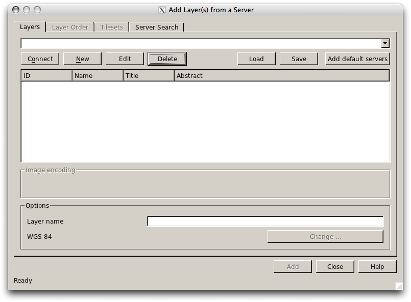
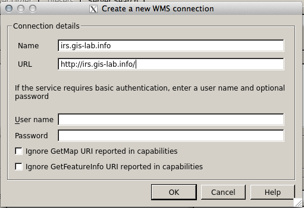
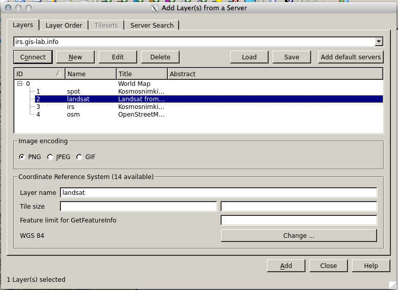
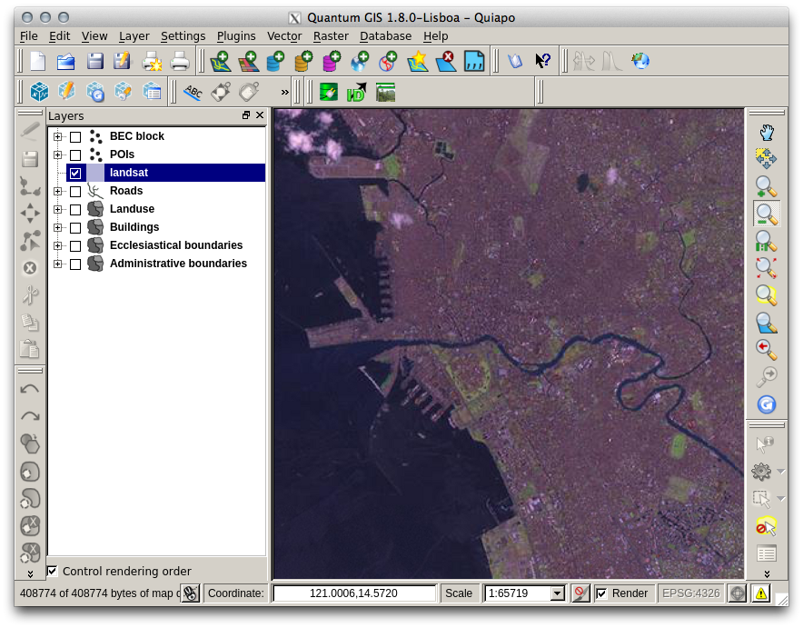
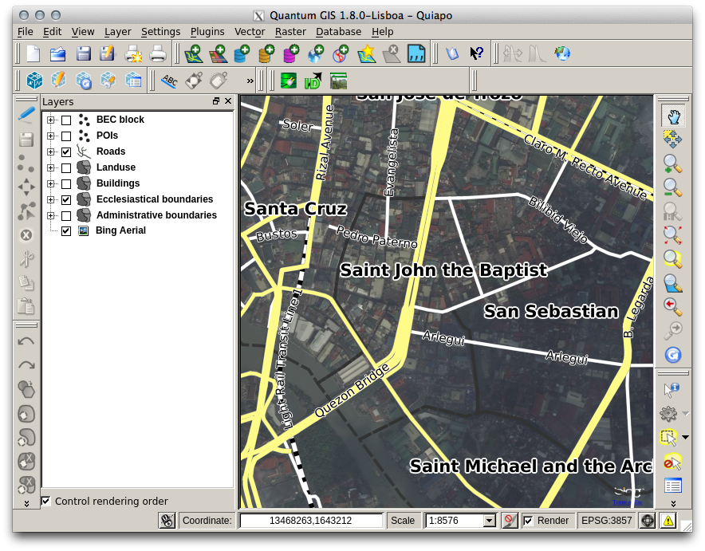

.. draft (mark as complete when complete)
.. todo: update screenshot for binglayer.

=======================================
Using External Map Services
=======================================

QGIS is a standard compliant application, thus, many external mapping data and 
services can be "consumed" within the application.  The most popular external 
service for map data is Web Map Service (WMS), this is a standard 
protocol for consuming georeferenced data over the web.  

In this exercise, we will use several web-based mapping services and integrate 
them in your QGIS project.

.. Note::
    You	need a working Internet	connection in this section.

Loading WMS 
----------------

1. To add WMS layer, click :menuselection:`Layer -->` |mActionAddWmsLayer| 
:guilabel:`Add WMS Layer`.  A new window will appear as 
:guilabel:`Add Layer(s) from a Server`.

2. To add a new WMS server, click :guilabel:`New`.  In the 
:guilabel:`Create a new WMS connection` window, type ``irs.gis-lab.info`` 
in the :guilabel:`Name` field.  In the :
guilabel:`URL` field, type (the value below should be in a single 
line)::

      http://irs.gis-lab.info/ 

.. warning::
    External WMS is not always available, hence, reliability is not guaranteed.

.. is there a WMS that shows ecology based data? Another WMS we can use is the 
   OpenWeatherMaps http://wms.openweathermap.org/service

3. Click :guilabel:`OK`. A new WMS service is now 
available.

4. Back to the :guilabel:`Add Layer(s) from a Server` window, select 
``irs.gis-lab.info`` 
--> 
:guilabel:`Connect`.  The list of available layers will be 
shown.  Select the ``landsat`` layer and click :guilabel:`Add`.  QGIS 
will start downloading the map from the WMS server (this will take some time 
depending on your connection speed and the current load from the server).

5. Once downloaded, :guilabel:`Close` the  
:guilabel:`Add Layer(s) from a Server` window.  
A new layer will be displayed in your :guilabel:`Map Canvas`.

6.  Zoom the map to larger area to see the `Landsat` layer.  Drag the WMS layer 
below the points and line layers.

Using the Openlayers plugin
--------------------------------

Another way to display external map services is through the Openlayers plugin. 
The plugin allows you to use several map tiles available from OpenStreetMap, 
Google Maps, Bing and others.

1. Zoom in to a small area.

2. In the Menu, select :menuselection:`Plugins -->` 
:menuselection:`Openlayers plugin -->` 
|mActionAddBingLayer| 
:guilabel:`Add Bing Aerial layer`.  A new layer will appear showing 
the Bing Aerial layer, zoom in closer to view the higher resolution images.

3. Load the other layers available in the 
:guilabel:`Openlayers plugin`.

.. note::
   The :guilabel:`Openlayers plugin` uses a custom CRS.  You can see this in 
   the bottom-right corner of the :guilabel:`Status bar`.  The CRS is labeled 
   as ``EPSG:3857`` or the Google Mercator projection.

.. warning::
   Each time you use an external web service such as a WMS or the layers 
   available in the :guilabel:`Openlayers plugin`, make sure to check the 
   Terms of Use of each service.  Most web services have usage restrictions. 
   For example, Google does not allow saving the imagery for offline use.  

.. raw:: latex
   
   \pagebreak[4]
